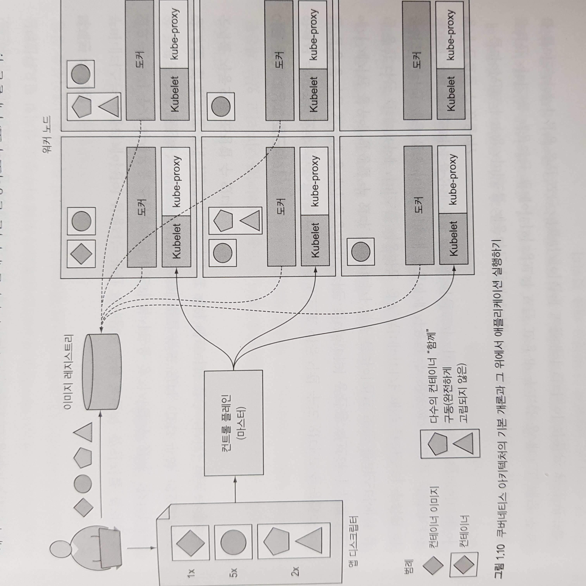

# Week 01 - Introduction to k8s

쿠버네티스는 컨테이너 시스템 상에서 컨테이너를 쉽게 배포하고 관리할 수 있게 해주는 소프트웨어 시스템입니다. 개발자가 특정 인프라 관련 서비스를 애플리케이션에서 구현하지 않아도 되며 여기에는 서비스 디스커버리, 오토스케일링, 로드 밸런싱, 자가 치유 등이 포함됩니다. 쿠버네티스의 아키텍처를 소개하기에 앞서, 쿠버네티스가 왜 등장하게 되었는지 그 이유에 대해 알아보겠습니다.

## 모놀리식에서 마이크로서비스로의 전환

모놀리식 서비스는 모든 것이 서로 강하게 결합돼 있고, 전체가 하나의 프로세스로 실행되기 때문에 애플리케이션의 한 부분만 변경하더라도 전체 애플리케이션을 재배포해야 하며, 구성요소 간의 경계가 불분명해지고 상호의존성의 제약이 커지면서 전체 시스템의 복잡성이 증가하는 문제가 있습니다.

또한 모놀리식 서비스는 애플리케이션의 일부만을 수평 확장하기 매우 어렵거나 불가능하고, 결국 전체 애플리케이션을 확장할 수 밖에 없습니다. 이는 결과적으로 불필요한 컴퓨팅 리소스를 낭비하게 됩니다.

그러한 이유로 모놀리식 서비스를 마이크로서비스라는 독립적으로 배포가능한 작은 구성요소로 분할하게 되었고, 각 마이크로서비스는 독립적인 프로세스로 실행되며 각 서비스는 프로그래밍 언어에 종속적이지 않고 해당 서비스를 구현하는데 가장 적합한 언어로 만들어질 수 있습니다.

### 마이크로서비스의 한계

그러나 마이크로서비스라고 해서 단점이 없는 것은 아닙니다. 시스템이 소수의 구성요소로만 구성된다면 구성요소를 쉽게 관리할 수 있습니다. 각 구성요소를 어디에 배포할지 결정하는 일이 간단해지죠. 그러나 마이크로서비스는 구성 요소가 많아지고 이로 인한 구성 요소 간의 상호 종속성 수가 더 많아져 배포 관련 결정이 어려워지게 됩니다. 즉, 시스템에 배포 가능한 애플리케이션 구성 요소의 수가 많아짐에 따라 모든 구성요소의 관리가 더 어려워 지는 것입니다.

## 쿠버네티스의 등장

구글은 오래 전 부터 이러한 문제를 직면하게 되었고, 수천 개의 소프트웨어 구성 요소를 관리하고 비용 효율적으로 개발, 배포할 수 있는 자체 솔루션(보그, Borg)을 개발하고 있었습니다. 그러다 2014년에 보그를 개발하여 얻은 경험을 기반으로 '쿠버네티스'를 오픈소스로 공개하게 되었죠.

쿠버네티스는 컨테이너화된 애플리케이션을 쉽게 배포하고 관리할 수 있게 해주는 소프트웨어 시스템입니다. 쿠버네티스를 사용하면 모든 노드가 하나의 거대한 컴퓨터인 것 처럼 수천 대의 컴퓨터 노드에서 애플리케이션을 실행할 수 있습니다. 기본 인프라를 추상화하고 개발과 운영 팀 모두의 개발, 배포, 관리를 단순화시키죠. 클러스터에 노드가 몇 개가 있든 수 천개가 있든, 쿠버네티스에 애플리케이션을 배포하는 방식은 항상 동일합니다.

## 쿠버네티스 클러스터 아키텍처

쿠버네티스는 크게 두 가지 유형의 노드로 구성됩니다.

- 마스터 노드
  - 전체 쿠버네티스 시스템을 관리하고 통제하는 `컨트롤 플레인(Control Plan)` 을 관장합니다.
- 워커 노드
  - 실제 배포하고자 하는 어플리케이션의 실행을 담당합니다.

## 컨트롤 플레인(마스터 노드)

컨트롤 플레인(마스터 노드)은 클러스터를 관리하고 특정 기능을 실행하며, 다음과 같은 구성요소를 포함하고 있습니다.

- `API Server` - 사용자와 컨트롤 플레인이 통신하는 쿠버네티스 API 서버
- `Scheduler` - 애플리케이션을 워커 노드에 할당하는 스케줄러
- `Controller Manager` - 구성 요소 복제, 워커 노드 추적, 노드 장애 처리 등 클러스터 수준의 기능을 실행하는 컨트롤러 매니저
- `etcd` - 클러스터 구성을 지속적으로 저장하는 분산 데이터 스토리지

## 워커 노드

워커 노드는 애플리케이션의 실행을 담당하는 시스템입니다. 워커노드는 다음과 같은 구성요소를 포함하고 있습니다.

- 컨테이너를 실행하는 도커 또는 컨테이너 런타임
- `Kuberlet` - API Server 와 통신하고 노드에서 컨테이너를 관리
- `kube-proxy` - 애플리케이션 구성 요소 간에 네트워크 트래픽을 분산하는 쿠버네티스 서비스 프록시

## 쿠버네티스 동작 원리

쿠버네티스에서 애플리케이션을 실행하려면 먼저 하나 이상의 컨테이너 이미지를 레지스트리에 푸시한 후 쿠버네티스 API 서버에 애플리케이션의 디스크립션을 게시해야 합니다.

**Note**: 디스크립션에는 컨테이너 이미지 또는 애플리케이션 컴포넌트가 들어 있는 이미지가 있고, 컴포넌트 간 관련성 및 노드 배치 정보도 포함되며 복제본 수를 지정할 수도 있습니다. 뿐만 아니라 내부 클라이언트나 외부 클라이언트에 서비스를 제공하는 컴포넌트가 들어 있고, 단일 IP 주소로 노출해 다른 컴포넌트에서 검색할 수 있어야 합니다.

스케줄러는 API 서버가 디스크립션을 처리할 때 사용 가능한 워커 노드로 컨테이너의 지정 그룹을 예약합니다. 그런 다음 해당 노드의 Kubelet 은 필요한 컨테이너 이미지를 가져와 컨테이너를 실행하도록 런타임(도커)에 지시합니다. 아래 그림은 이러한 과정을 잘 나타내고 있습니다.

<figure>
  
  <figcaption style="color: grey;">쿠버네티스 아키텍처 & 애플리케이션 실행 과정</figcaption>
</figure>

앱 디스크립터에는 네 개의 컨테이너를 세 개의 세트(포드)로 묶어 나열합니다. 각 포드의 옆에는 병렬로 실행해야 하는 복제본 수를 나타내고 있습니다. 쿠버네티스에 디스크립터를 요청하면, 사용 가능한 워커 노드에 지정된 수의 복제본을 예약합니다. 그런 다음 워커 노드의 kubelet 이 이미지 레지스트리에서 컨테이너 이미지를 가져와 컨테이너를 실행하도록 도커에 알려줍니다.

쿠버네티스는 애플리케이션이 배포된 이후의 상태가 사용자가 제공한 디스크립션과 일치하는지 지속적으로 확인합니다. 만약 특정 인스턴스 중 하나가 제대로 동작하지 않는 경우 자동으로 다시 시작하도록 해줍니다. 또 복사본의 수를 늘릴지, 줄일지를 결정할 수 있으며 최적의 복제본 수를 결정하는 메트릭을 CPU 부하, 메모리 사용량, 초당 쿼리, 그 외 애플리케이션에서 노출하는 메트릭에 따라 자동으로 조절할 수 있습니다.

## 쿠버네티스의 장점

쿠버네티스는 시스템 관리자의 도움 없이 애플리케이션을 실행할 수 있으며, 다음과 같은 장점을 가지고 있습니다.

### 애플리케이션 배포 단순화

쿠버네티스는 모든 워커 노드를 단일 배포 플랫폼으로 제공하므로 개발자가 클러스터를 구성하는 서버에 대해 깊이 들여다 볼 필요를 없애줍니다.

### 높은 하드웨어 활용도

쿠버네티스에 애플리케이션을 실행하도록 지시하면 리소스 요구사항에 대한 설명과 각 노드에서 사용 가능한 리소스에 따라 애플리케이션을 실행할 가장 적합한 노드를 선택하게 됩니다. 또한 클러스터를 중심으로 애플리케이션이 언제든지 이동할 수 있으므로 인프라를 훨씬 효율적으로 활용할 수 있습니다.

### 상태 확인 및 자가 치유

쿠버네티스는 노드에 장애가 발생하면 다른 노드로 일정을 자동으로 재조정합니다. 즉, 운영팀이 수동으로 애플리케이션을 이전하지 않아도 되게 됩니다.

### 오토스케일링

쿠버네티스는 애플리케이션에 급격한 부하가 발생하면 이를 대응하기 위해 전체 클러스터 크기를 자동으로 확대 또는 축소할 수 있습니다.

## Recap

쿠버네티스의 구성요소와 애플리케이션 배포 흐름을 간단하게 살펴보았는데, 배운 내용을 정리하면 다음과 같습니다.

- 모놀리식서비스는 구축하기 쉽지만 시간이 지남에 따라 유지, 관리하기와 확장이 어렵습니다.
- 마이크로서비스 기반 아키텍처는 각 구성 요소의 개발을 용이하게 하지만 하나의 시스템으로 작동하도록 배포하고 구성하기가 어렵습니다.
- 쿠버네티스는 전체 데이터 센터를 애플리케이션 실행을 위한 단일 컴퓨팅 리소스로 제공합니다.
- 개발자는 시스템 관리자의 도움 없이 쿠버네티스를 통해 애플리케이션을 배포할 수 있습니다.

## References

- Kubernetes in Action
