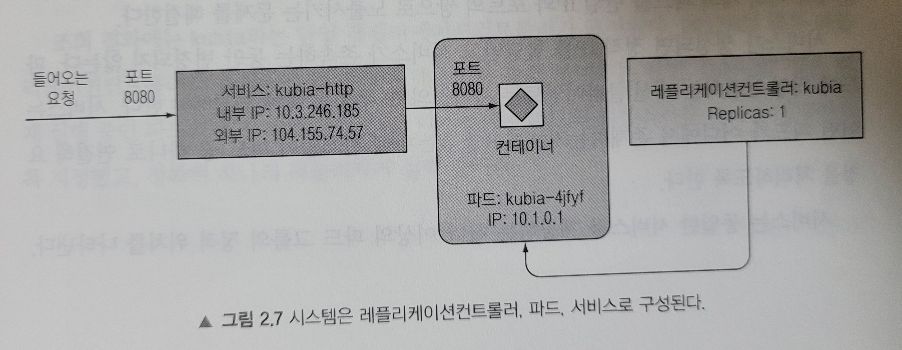

### 2.1 도커를 사용한 컨테이너 이미지 생성, 실행, 공유하기
 - busybox 이미지 : 표준 Unix 명령줄 도구를 합쳐놓은 단일 실행파일
 - docker run <image>:<tag> : <image>에 해당하는 이미지의 <tag> 버전을 실행한다는 의미다.
 - 특정 애플리케이션을 이미지로 패키징하기 위해서는 Dockerfile이라고 부르는 파일을 생성해야 함.
 - docker build <name> <path> : 해당 <path>에 있는 Dockerfile을 보고 <name>이라는 도커 이미지를 빌드한다.
 - docker run --name <name> -p <in-port>:<out-port> -d <image> : <image> 이미지를 <name> 이름으로 컨테이너를 실행한다. 이때 로컬머신의 <in-port>와 컨테이너의 <out-port>가 서로 매핑되도록 하며, -d 옵션을 통해 백드라운드에서 재생된다.
 - docker images : 로컬에 저장된 이미지 리스트 조회
 - docker ps : 실행중인 모든 컨테이너 조회
 - docker inspect <container> : <container>의 상세 정보 조회
 - docker exec -it <container> bash : <container>의 bash 셸 실행
 - docker stop <container> : <container> 삭제
 - docker rm <container> : <container> 제거
 - 이미지 레지스트리에 이미지를 푸시하려면 이미지 태그를 지정해야 함.

### 2.2 쿠버네티스 클러스터 설치
 - Minikube : 로컬에서 쿠버네티스를 테스트하고 애플리케이션을 개발하는 목적으로 단일 노드 클러스터를 설치하는 도구
   - minikube start로 쿠버네티스 실행 후 kubectl cluster-info로 클러스터 정상 동작 확인하기
 - 구글 쿠버네티스 엔진을 통해 쿠버네티스를 만들 수도 있음

### 2.3 쿠버네티스에 첫 번째 애플리케이션 실행하기
 - kubectl run 명령어를 사용해 JSON이나 YAML을 사용하지 않고 필요한 모든 구성 요소를 생성할 수 있음.
 - 파드(Pod) : 하나 이상의 밀접하게 연관된 컨테이너의 그룹. 같은 워커 노드에서 같은 리눅스 네임스페이스로 실행됨.
 - kubectl get pods : 파드 조회하기

 
  
 레플리케이션컨트롤러, 파드, 서비스의 관계

 - 외부에서 파드에 접근하려면 서비스 오브젝트를 생성해야 함.
 - kubectl expose rc 명령어를 이용해 레플리케이션컨트롤러를 노출하도록 명령한다.
 - kubectl get services 명령어를 통해 서비스 오브젝트 확인, kubectl get svc 명령어로 외부 IP를 확인
 - kubectl scale rc 명령어를 통해 파드 인스턴스 갯수를 변경할 수 있다.
 - kubectl get pods -o wide : 파드 조회하면서 파드 IP와 실행중인 노드를 표시할 수 있다.
 - kubectl describe pod <pod-name> : <pod-name> 파드의 세부정보를 알 수 있음.
 - 쿠버네티스는 명령줄 외에 대시보드로도 관리할 수 있음.
