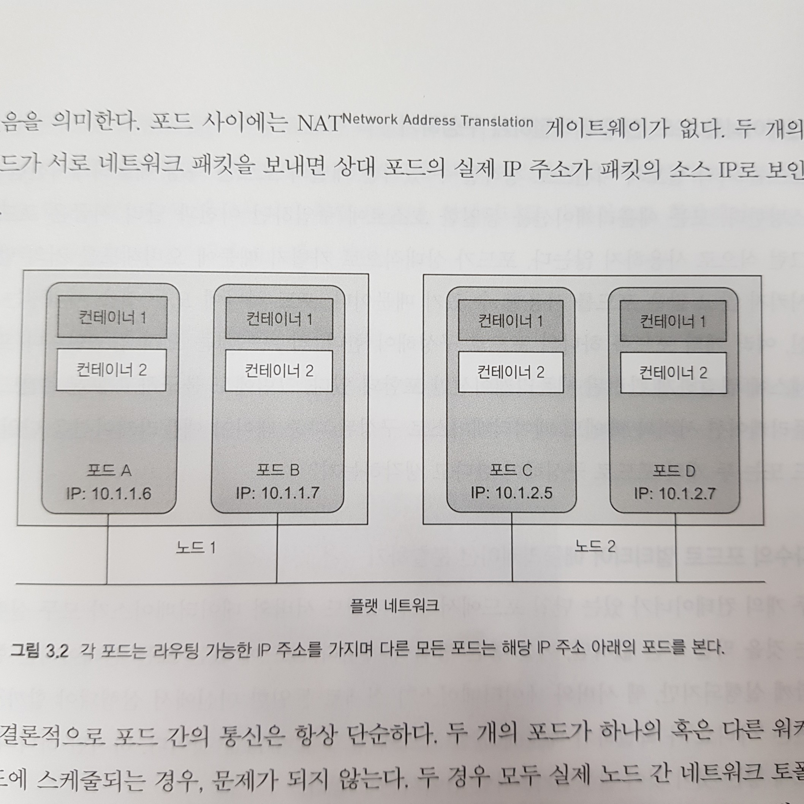

# Week 02 - Kubernetes Pods

포드는 쿠버네티스의 빌딩 블록으로, 컨테이너의 공동 배포 그룹을 의미합니다. 즉, 쿠버네티스 상에서 컨테이너를 직접 노드에 배포하는 대신 포드를 배포하여 운영하게 됩니다. 포드의 핵심은 포드에 여러 컨테이너가 포함돼 있을 때 포드가 여러 노드에 걸쳐 있지 않고 단일의 워커 노드에서 실행된다는 것입니다.

## 포드를 사용하는 이유

컨테이너를 바로 노드에 배포하지 굳이 포드를 사용해야 되나? 란 생각이 들 수 있습니다. 포드에 컨테이너를 포함시켜 사용하는 이유는 동일한 포드 안의 위치한 컨테이너들은 네트워크 어댑터와 파일 시스템을 공유할 수 있기 때문입니다. 그리하여 사이드카, 어댑터, 앰배서더 등의 패턴을 적용할 수 있습니다. 각 패턴이 어떠한 역할을 하는지는 [이 포스팅](https://arisu1000.tistory.com/27863)을 참고하세요.

## 포드와 컨테이너

포드의 모든 컨테이너는 동일한 네트워크 및 UTS 네임스페이스에서 실행되기 때문에 모두 같은 호스트 이름 및 네트워크 인터페이스를 공유하고, 동일한 IPC 네임스페이스 아래에 실행되어 IPC 를 통해 통신할 수 있습니다. 그리하여 같은 포드에 포함된 컨테이너들은 같은 IP 주소와 포트 공간을 공유합니다. 즉, 동일한 포드의 컨테이너에서 실행중인 프로세스는 동일한 포트 번호에 바인딩 되지 않도록 주의해야 합니다.

또 포드 간 통신은 플랫 인터 포드 네트워크 상에서 이뤄지는데, 쿠버네티스 클러스터의 모든 포드는 단일 플랫, 네트워크 주소 공간에 위치하기 때문에 모든 포드는 다른 포드의 IP 주소에 액세스 할 수 있습니다. 하나의 LAN 을 공유하는 것과 같은 맥락입니다.

<figure>
  
  <figcaption style="color: grey;">쿠버네티스 포드 네트워크</figcaption>
</figure>

그리하여 포드는 가상머신과 매우 유사하게 작동합니다. 동일한 포드에서 실행되는 프로세스(컨테이너)는 각 프로세스가 컨테이너에 캡슐화 된다는 점을 제외하면 동일한 물리적 또는 가상머신에서 실행되는 프로세스와 같습니다.

## 포드에서 다수의 컨테이너를 사용할 때 주의할 점

포드가 여러 컨테이너를 포함할 수 있는 것은 사실이지만, 개별 포드는 특정 어플리케이션만 호스팅해야 합니다. 왜냐하면 우선 포드는 상대적으로 가벼워 오버헤드를 거의 발생시키지 않아서 많은 포드를 사용할 수 있기 때문입니다. 또 만약 두 개의 컨테이너가 한 포드에 존재하면 해당 포드가 위치한 워커 노드를 제외한 다른 노드들이 놀기 때문에 포드를 두 개로 분할하면 인프라 활용도가 향상됩니다.

하나의 포드에 두 개의 컨테이너를 넣지 말아야 하는 또 다른 이유는 스케일링입니다. 포드는 스케일링의 기본 단위로, 쿠버네티스는 개별 컨테이너를 수평적으로 확장하는 것이 아닌 전체 포드의 크기를 조정함으로써 확장합니다. 만약 한 포드에 프론트, 백엔드 컨테이너가 포함된다면 백엔드 부하로 인해 스케일링을 할 때 프론트도 덩달아 확장하게 되어 불 필요하게 컴퓨팅 리소스를 사용하게 됩니다.

그래서 포드에 컨테이너를 포함시킬 때 다음과 같은 질문을 스스로에게 해보는 것이 좋습니다.

- 컨테이너가 같이 실행돼야 할 필요가 있나? 다른 호스트에서 실행되면 안되나?
- 컨테이너의 함께 혹은 개별적으로 스케일링 되어야 하나?

## 파일 디스크립터에서 포드 생성하기

포드를 포함한 쿠버네티스 리소스는 일반적으로 JSON 또는 YAML 메니페스트를 활용하여 생성합니다. 이렇게 쿠버네티스 객체를 파일로 정의하면 편리할 뿐만 아니라 버저닝도 가능합니다. YAML 에서 정의하는 중요한 섹션은 다음과 같습니다.

- `metadata` - 포드와 관련된 이름, 네임스페이스, 라벨 등의 대한 정보
- `spec` - 컨테이너, 볼륨 등 같은 포드 내용에 대한 설명
- `status` - 포드의 상태, 각 컨테이너의 설명 및 상태, 포드 내부의 IP 등의 정보

위 내용이 포함된 디스크립터 `kubia-manual.yml` 파일을 다음과 같이 작성할 수 있습니다.

```yaml
apiVersion: v1 # 쿠버네티스 API 버전
kind: Pod # 쿠버네티스 리소스 종류
metadata:
  name: kubia-manual # 리소스(여기서는 포드) 이름
  labels: # 리소스에 붙여진 라벨
    env: dev
  namespace: custom-namespace # 리소스가 포함될 네임스페이스
  nodeSelector:
    gpu: "true" # gpu=true 라벨이 포함된 노드에만 배포되도록 지시
spec:
  containers:
    - image: eunsudev/kubia # 포드에 호스팅 될 컨테이너 이미지
      name: kubia # 컨테이너 이름
      ports:
        - containerPort: 8080
          protocol: TCP
```

위 파일을 활용해서 포드를 만들려면 `kubectl create` 명령을 활용하면 됩니다.

```bash
kubectl create -f kubia-manual.yml
```

그러면 포드가 생성되는 것을 확인할 수 있고, 실행중인 포드의 전체 디스크립터를 보려면 `get` 명령에 `-o yaml` 옵션을 부여해서 실행하면 됩니다.

```bash
kubectl get pod kubia-manual -o yaml
```

## 쿠버네티스 명령어 정리

`delete` 명령으로 특정 포드(또는 쿠버네티스의 다른 리소스)를 삭제할 수 있습니다.

```bash
# 주어진 이름의 pod 삭제
kubectl delete pod <pod_name>

# 라벨 셀렉터로 특정 포드를 삭제할 수도 있습니다
kubectl delete pod -l <label_name>=<label>

# 네임스페이스 포함된 모든 포드를 삭제할 수도 있습니다
kubectl delete ns <namespace_name>

# 모든 포드 삭제
kubectl delete pod --all
```

`log` 명령으로 포드의 로그를 확인할 수 있습니다(도커랑 비슷하죠?).

```bash
# 주어진 이름의 pod 로그 출력
kubectl logs <pod_name>

# 컨테이너가 여러 개 있는 포드의 경우 컨테이너의 이름을 지정합니다
kubectl logs <pod_name> -c <container_name>
```

`port-forward` 명령으로 로컬 머신의 포트를 특정 포드의 포트로 전달할 수 있습니다.

```bash
kubectl port-forward <pod_name> <local_port>:<pod_port>
# ex) kubectl port-forward kubia-manual 8888:80880
```

`label` 명령으로 특정 포드에 라벨을 추가하고 수정할 수 있습니다. 라벨은 식별 정보를 포함하며, 라벨을 셀렉터를 활용해서 특정 포드를 조회할 수도 있습니다.

```bash
kubectl label pod <pod_name> <label_name>=<label>

# 기존 라벨을 수정할 때는 --overwrite 옵션을 부여합니다
kubectl label pod <pod_name> <label_name>=<label> --overwrite

# 포드를 나열할 때 라벨 정보를 함께 보려면
kubectl get pods --show-labels

# 라벨 셀렉터로 특정 라벨의 포드를 나열하려면
kubectl get pods -l <label_name>=<label>
```

라벨은 포드 뿐만 아니라 노드 등 쿠버네티스 리소스에 붙일 수 있습니다. 그리하여 노드에 라벨을 붙이고, 포드 디스크립터에 특정 라벨이 붙은 노드에서만 해당 포드를 호스팅하라고 명시해줄 수도 있습니다.

`annotate` 명령으로 포드에 주석을 추가할 수 있습니다. 주석은 키/값 쌍으로 라벨과 유사하지만 식별 정보를 보유하지는 않습니다. 그래서 라벨 셀렉터 처럼 객체를 그룹화 하는데는 사용할 수 없습니다.

```bash
kubectl annotate pod <pod_name> <key>=<value>
```

## Recap

이번 포스팅에서는 쿠버네티스의 빌딩 블록인 포드에 대해 알아보았습니다. 다룬 내용을 정리하면 다음과 같습니다.

- 특정 컨테이너를 포드에 그룹화할지 여부를 결정하는 방법
- 포드는 컨테이너 세계가 아닌 물리적 호스트와 유사하며 여러 프로세스를 실행할 수 있다
- YAML(또는 JSON) 디스크립터를 작성해 포드 생성 시 활용할 수 있다
- 라벨 및 라벨 셀렉터를 활용해 포드를 구성하고 여러 포드를 지정할 수 있다
- 노드 라벨 및 셀렉터를 활용해 특정 노드에만 포드를 스케줄링 할 수 있다

## References

- Kubernetes in Action
- [쿠버네티스 pod 구성 패턴](https://arisu1000.tistory.com/27863)
