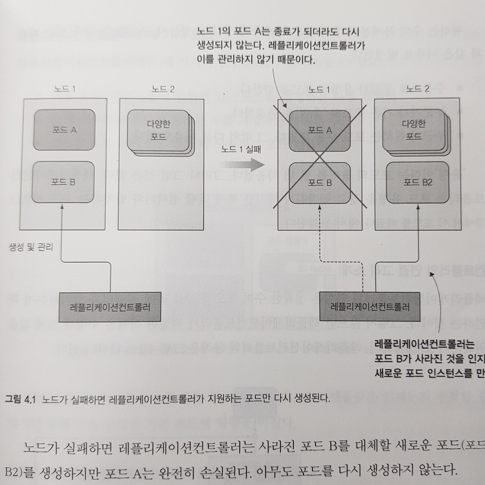
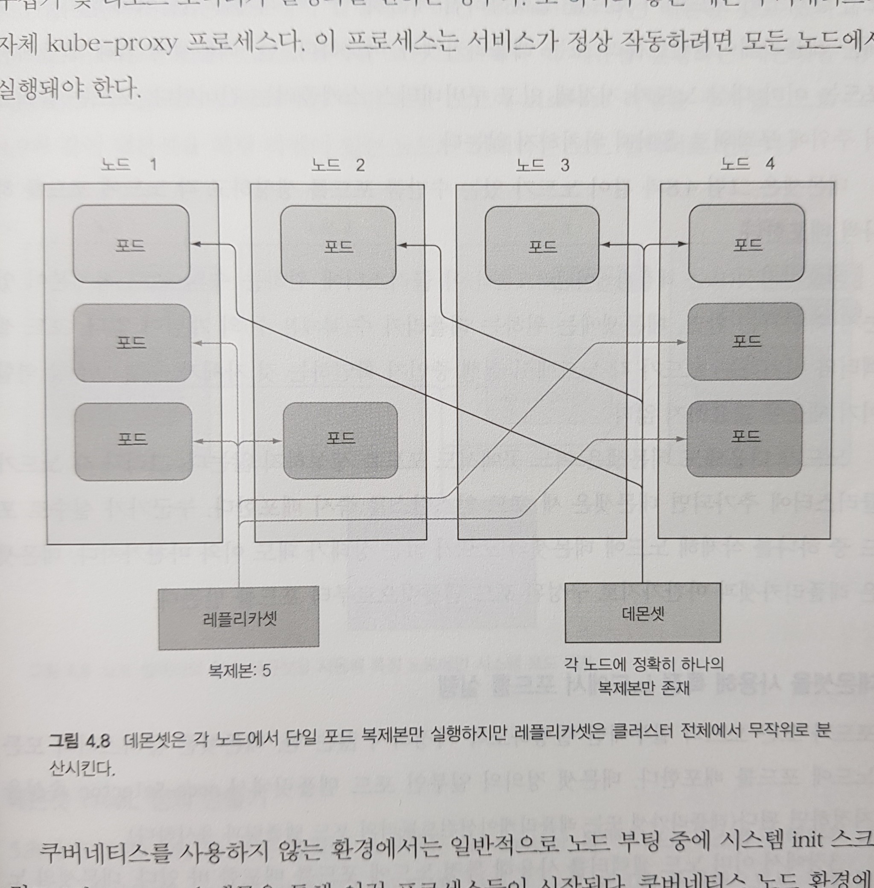

# Week 03 - Kubernetes Controllers

이번 포스팅에서는 노드가 다운되면 포드를 자동으로 다시 스케줄링하여 포드를 안정적으로 유지하는 컨트롤러에 대해서 알아보겠습니다. 또 수평으로 포드를 스케일링하고 배치 작업을 한 번 또는 주기적으로 실행하는 방법에 대해서도 알아보겠습니다.

## 컨테이너를 안정적으로 유지하는 방법

포드 상에서 돌아가는 컨테이너 중 하나가 다운되면 해당 노드의 kubelet 이 컨테이너를 다시 시작합니다. 그런데 kubelet 이 컨테이너가 다운됬다는 것을 인지하려면 컨테이너의 상태를 외부에서 체크하는 로직이 필요한데, 쿠버네티스는 라이브니스 프로브(Liveness Probe)를 통해 컨테이너가 살아있는지 확인합니다. 라이브니스 프로브는 주기적으로 다음 세 가지 메커니즘 중 하나를 사용해 컨테이너의 상태를 모니터링합니다.

- HTTP GET 프로브는 지정한 IP 주소, 포트, 경로에 HTTP GET 요청을 보내고, 응답 코드를 확인하여 오류 코드를 리턴하거나 응답하지 않으면 실패로 간주하고 컨테이너를 다시 시작합니다.
- TCP 소켓 프로브는 지정된 컨테이너 포트에 TCP 연결을 시도하고 연결되지 않으면 컨테이너를 다시 시작합니다.
- EXEC 프로브는 컨테이너 내부에 임의의 명령을 실행하고 종료 상태 코드를 확인한 뒤 상태 코드가 0이 아니면 컨테이너를 다시 시작합니다.

라이브니스 프로브는 다음과 같이 포드 디스크립터에 명세할 수 있습니다.

```yaml
apiVersion: v1
kind: Pod
metadata:
  name: kubia-liveness
spec:
  containers:
    - image: luksa/kubia-unhealthy # 다섯 번 째 요청 이후 500 Error 를 반환하는 이미지
      name: kubia
      livenessProbe: # 해당 컨테이너의 라이브니스 프로브를 함께 생성
        httpGet:
          path: / # 요청을 보낼 경로
          port: 8080 # 요청을 보낼 포트번호
```

위 디스크립터로 포드를 생성하고, `describe` 명령으로 해당 포드를 살펴보면 다음과 같이 `Liveness` 필드를 확인할 수 있습니다.

```yaml
Liveness: http-get http://:8080/ delay=0s timeout=1s period=10s #success=1 #failure=3
```

라이브니스 프로브는 `delay`, `timeout`, `period` 등과 같은 추가 속성을 포함합니다.

- `delay` - 컨테이너가 시작한 직후 프로브가 시작됨을 나타냅니다.
- `timeout` - 컨테이너가 특정 시간 내에 응답을 봔한하지 않으면 실패로 간주합니다.
- `period` - 특정 시간만큼 주기적으로 요청을 보냅니다.
- `failure` - 요청이 지정한 횟수 만큼 실패하면 컨테이너를 다시 시작합니다.

위 속성을 디스크립터에서 프로브를 생성할 때 정의할 수 있습니다. 예를 들어 프로브가 초기 지연 시간(delay) 를 갖도록 하려면 `initialDelaySeconds` 란 속성을 주면 됩니다.

그리하여 쿠버네티스는 크래시가 발생하거나 라이브니스 프로브가 실패한 경우 컨테이너를 다시 시작합니다. 이 작업은 포드를 호스팅한 노드에서 kubelet에 의해 수행됩니다.

그러나 만약 노드 자체에 크래시가 발생하는 경우 kubelet이 노드 자체에서 실행되기 때문에 노드가 실패하면 컨테이너를 다시 실행할 수 없습니다. 이 경우는 컨트롤 플레인이 해당 노드에 포함된 모든 포드의 복사본을 생성합니다.

## 포드를 안정적으로 유지하는 방법

쿠버네티스는 포드를 항상 실행되도록 유지하기 위해 레플리케이션 컨트롤러(Replication Controller)라는 리소스를 활용합니다. 레플리케이션 컨트롤러는 노드가 클러스터에서 사라지는 경우나 노드에서 포드가 제거된 경우와 같이 어떤 이유로든 포드가 사라지면 해당 포드의 복사본을 만듭니다.

아래 그림은 노드1이 다운된 경우 레플케이션 컨트롤러가 노드 2에 포드를 복제하는 것을 보여주고 있습니다. 포드 A 는 레플리케이션 컨트롤러에 의해 관리되지 않기 때문에 복제되지 않고, 포드 B는 레플리케이션 컨트롤러에 의해 관리되고 있어서 노드2에 복제됩니다.

<figure>
  
  <figcaption style="color: grey;">레플리케이션 컨트롤러 동작원리</figcaption>
</figure>

### 레플리케이션 컨트롤러(Replication Controller)

레플리케이션 컨트롤러는 다음과 같이 세 가지 필수 구성요소를 포함합니다.

- 레플리케이션 컨트롤러 범위에 있는 포드를 결정하는 라벨 셀렉터
- 실행해야 하는 포드의 원하는 수를 지정하는 복제본 수
- 새로운 포드 복제본을 만들 때 사용되는 포드 템플릿

그리하여 레플리케이션 컨트롤러는 라벨 셀렉터와 매치되는 포드를 모니터링 하면서 지정된 복제본 수와 비교하고, 수가 적거나 많으면 포드 템플릿을 바탕으로 새로운 포드를 생성하거나 기존 포드를 삭제합니다.

이로써 포드가 항상 실행되도록 유지하고, 노드 장애로 인해 포드가 죽으면 즉시 대체 포드를 생성합니다. 또한 포드를 간단하게 수평 스케일링 할 수 있습니다.

레플리케이션 컨트롤러도 다음과 같이 디스크립터로 생성할 수 있습니다.

```yaml
apiVersion: v1
kind: ReplicationController # 리소스 유형은 ReplicationController
metadata:
  name: kubia
spec:
  replicas: 3 # 원하는 포드의 수
  selector: # 포드 셀렉터를 통해 RC에 의해 관리될 포드 결정
    app: kubia
  template: # 포드를 생성할 때 참고할 템플릿. 포드 디스크립터와 거의 동일합니다.
    metadata:
      labels:
        app: kubia
        env: dev
    spec:
      containers:
        - image: luksa/kubia
          name: kubia
          ports:
            - containerPort: 8080
              protocol: TCP
```

템플릿에서 정의한 포드의 라벨은 레플리케이션 컨트롤러의 라벨 셀렉터와 정확히 일치해야 합니다. 그렇지 않으면 포드를 무제한 생성할 것입니다. 물론 이를 예방하기 위해 쿠버네티스 API 서버는 리소스를 생성할 때 디스크립터가 valid 한지 검사합니다.

레플리케이션 컨트롤러가 생성된 이후에도 replicas 수나 라벨 셀렉터, 포드 템플릿을 변경할 수 있습니다. 각 경우를 생각해보면 다음과 같은 일이 발생합니다.

- replicas 수 변경 - 새로 지정된 replicas 수 만큼 포드를 생성 및 삭제합니다.
- 라벨 셀렉터 변경 - 즉시 새로운 포드를 스핀업합니다. 기존에 레플리케이션 컨트롤러에 의해 생성된 포드는 더 이상 레플리케이션 컨트롤러에 의해 관리되지 않습니다.
- 포드 템플릿 변경 - 이후에 생성되는 포드들은 해당 템플릿으로 만들어지고, 기존 포드에는 영향을 미치지 않습니다.

### 레플리카셋(Replica Set)

레플리카셋은 레플리케이션 컨트롤러 이후에 도입된 리소스로, 레플리케이션의 상위 호환으로 현재 레플리케이션 컨트롤러를 완전히 대체할 수 있습니다. 레플리카셋은 레플리케이션 컨트롤로와 거의 동일하지만 더 풍부한 포드 셀렉터 표현식을 갖는다는 점에서 차이가 있습니다.

예를 들어 레플리케이션 컨트롤러는 포드를 `env=production` 및 `env=develop` 라벨과 동시에 일치시킬 수 없습니다. 그러나 레플리카셋은 두 포드 세트와 일치시킬 수 있고 단일 그룹으로 취급할 수 있습니다. 레플리케이션 컨트롤러 디스크립터에 라벨 셀렉터 부분만 다음과 같이 수정해서 레플리카셋으로 활용할 수 있습니다.

```yaml
apiVersion: apps/v1
kind: ReplicaSet
metadata:
  name: kubia
spec:
  replicas: 3
  selector:
    matchExpression: # 단순한 라벨 셀렉터가 아닌 matchExpression 을 활용하고 있습니다.
      - key: env
        operator: In # 이 경우 In 연산으로 values 에 포함된 값들을 라벨로 갖는 포드를 선택할 수 있습니다.
        values:
          - production
          - develop
  template:
    metadata:
      labels:
        app: kubia
    spec:
      containers:
        - name: kubia
          image: luksa/kubia
```

레플리카셋은 `matchExpression` 속성을 사용하여 강력한 셀렉터 표현식을 나타낼 수 있고, 지원 가능한 연산자 종류는 [공식 Document](https://kubernetes.io/docs/concepts/overview/working-with-objects/labels/#resources-that-support-set-based-requirements) 에서 확인할 수 있습니다.

### 데몬 셋(Daemon Set)

레플리케이션 컨트롤러와 레클리카셋은 모두 쿠버네티스 클러스터의 특정 위치에 배포된 특정 개수의 포드를 실행하는데 사용됩니다. 그러나 클러스터의 각 노드에서 포드를 실행해야 하는 경우(모든 노드에서 로그 수집 및 리소스 모니터링이 실행되길 원하는 경우)도 있습니다. 대표적인 예가 kube-proxy 프로세스로, 서비스가 정상 작동하려면 모든 노드에서 실행되어야 합니다.

이처럼 모든 클러스터 노드에서 포드를 실행하려면 데몬셋(Demon Set)객체를 만들어야 합니다. 데몬셋은 위에서 언급한 컨트롤러들과 비슷합니다. 단, 데몬셋에 의해 만들어진 포드는 이미 대상 노드가 지정되있기 때문에, 쿠버네티스 스케줄러를 건너 뛴다는 차이가 있습니다. 아래 그림과 같이 데몬셋은 노드가 있는 수 만큼 포드를 생성하고 각 노드에 포드를 하나씩 배포합니다.

<figure>
  
  <figcaption style="color: grey;">레플리카셋과 데몬셋의 동작 비교</figcaption>
</figure>

데몬셋 역시 다음과 같이 디스크립터로 생성할 수 있습니다.

```yaml
apiVersion: apps/v1
kind: DaemonSet # 리소스 유형은 DaemonSet
metadata:
  name: ssd-monitor
spec:
  selector:
    matchLabels:
      app: ssd-monitor # app=ssd-monitor 라벨이 있는 포드를 관리
  template:
    metadata:
      labels:
        app: ssd-monitor # 포드에 app=ssd-monitor 라는 라벨을 부여해서 데몬셋이 관리하도록 합니다
    spec:
      nodeSelector:
        disk: ssd # disk=ssd 라벨이 붙은 노드에만 호스팅될 수 있습니다
      containers:
        - name: main
          image: luksa/ssd-monitor
```

위 디스크립터에는 `nodeSelector` 필드를 명시해서 데몬셋이 모든 노드가 아닌 `disk=ssd` 라벨이 붙은 노드에만 포드를 호스팅하도록 하였습니다. 이처럼 데몬셋은 기본적으로 모든 노드에 포드를 띄우지만 특정 노드에만 포드를 띄울 수 있도록 커스텀하게 정의할 수 있습니다.

## 일시적인 포드를 관리하는 방법

레플리케이션 컨트롤러, 레플리카셋, 데몬셋은 작업의 완료를 고려하지 않고 계속 태스크를 실행합니다. 이런 포드의 프로세스는 종료되면 다시 시작되는데, 완료 가능한 태스크(ex. 배치 작업)에서는 프로세스가 종료된 후 다시 시작되면 안됩니다. 이러한 경우 쿠버네티스에선 잡(Job) 리소스를 통해 프로세스가 성공적으로 완료되면 컨테이너가 다시 시작되지 않도록 포드를 실행할 수 있습니다.

### 잡(Job)

잡은 태스크가 적절히 완료하는 것이 중요한 임시 태스크에 유용합니다. 잡에 의해 관리되는 포드도 노드 장애로 다운되면 스케줄러에 의해 새 노드에 복제되고, 태스크가 완료되면 포드가 다시 생성되지 않습니다. 잡 리소스도 디스크립터를 작성할 수 있습니다.

```yaml
apiVersion: batch/v1
kind: Job # 리소스 유형은 Job
metadata:
  name: multi-completion-batch-job
spec:
  completions: 5 # 이 잡은 5개의 포드를 성공적으로 완료해야함을 의미합니다
  parallelism: 2 # 최대 2개의 포드를 병렬로 실행합니다
  template:
    metadata:
      labels:
        app: batch-job
    spec:
      restartPolicy: OnFailure # 기본 재시작 정책은 Always 인데, 잡은 이를 사용할 수 없습니다. OnFailure 혹은 Never 로 지정해줘야 합니다.
      containers:
        - name: main
          image: luksa/batch-job
      activeDeadlineSeconds: 300 # 300초 동안 잡이 완료되지 않으면 잡을 실패한 것으로 간주합니다
```

### 크론 잡(Cron Job)

대부분의 배치 작업은 특정 시간에 실행되거나 지정된 간격으로 반복적인 실행이 필요한 경우가 있습니다. 리눅스에서는 이런 작업을 cron 으로 처리하는 것으로 잘 알려져 있습니다. 쿠버네티스도 이와 동일한 작업을 지원합니다. 쿠버네티스의 예약 작업은 크론 잡 리소스를 활용하여 구성할 수 있습니다.

```yaml
apiVersion: batch/v1
kind: CronJob # 리소스 유형은 CronJob
metadata:
  name: batch-job-every-fifteen-minutes
spec:
  schedule: "0,15,30,45 * * * *" # 작업 주기를 결정하는 부분으로 이 경우 매일 매 시간 0, 15, 30, 45 분에 작업을 실행합니다.

  jobTemplate:
    spec: # 아래 템플릿은 잡 리소스에서 정의한 템플릿과 동일합니다
      template:
        metadata:
          labels:
            app: periodic-batch-job
        spec:
          restartPolicy: OnFailure
          containers:
            - name: main
              image: luksa/batch-job
```

## Recap

이번 챕터에서는 노드 장애 시 포드를 계속 실행하고 스케줄을 조정하는 방법에 대해서 알아보았고 정리하면 다음과 같습니다.

- 라이브니스 프로브를 지정해 쿠버네티스가 더 이상 정상적이지 못한 경우, 즉시 컨테이너를 다시 시작하게 할 수 있습니다.
- 컨트롤러에 의해 관리되지 않는 포드는 재생성 되지 않기 때문에 포드를 직접 생성하면 안됩니다.
- 레플리케이션 컨트롤러 및 레플리카셋은 포드를 임의의 클러스터 노드로 스케줄 하는 반면, 데몬셋은 모든 노드에 데몬셋에서 정의한 포드의 단일 인스턴스를 실행합니다.
- 배치 태스크를 수행하는 포드는 직접 생성하면 안되고 잡 리소스를 통해 생성되야 합니다.
- 미래의 언젠가 실행할 필요성이 있는 잡은 크론잡 리소스를 통해 생성할 수 있습니다.

## 부록 - 명령어

`edit` 명령으로 레플리케이션 컨트롤러 / 레플리카셋을 수정할 수 있습니다. 여기서 rc 는 replication controller 의 약자이고 rs 는 replicaset 의 약자입니다.

```yaml
kubectl edit rc <rc_name>  # 레플리케이션 컨트롤러 수정
kubectl edit rs <rs_name>  # 레플리카셋 수정
```

`scale` 명령으로 레플리케이션 컨트롤러 / 레플리카셋에 의해 관리되는 포드를 수평 스케일링 할 수 있습니다.

```yaml
kubectl sacle rc kubia --replicas=<pod_count>
```

`delete` 명령으로 컨트롤러를 삭제할 수 있습니다. 디폴트로 레플리케이션 컨트롤러에 의해 관리되는 모든 포드도 삭제되는데, `--cascade=false` 옵션을 주면 포드를 그대로 남겨둘 수 있습니다.

```yaml
kubectl delete rc <rc_name> # 컨트롤러에 의해 관리되는 모든 포드 삭제
kubectl delete rc <rc_name> --cascade=false # 컨트롤러에 의해 관리되는 포드를 삭제하지 않습니다
```

## References

- Kubernetes in Action
- [Labels and Selectors](https://kubernetes.io/docs/concepts/overview/working-with-objects/labels/)
