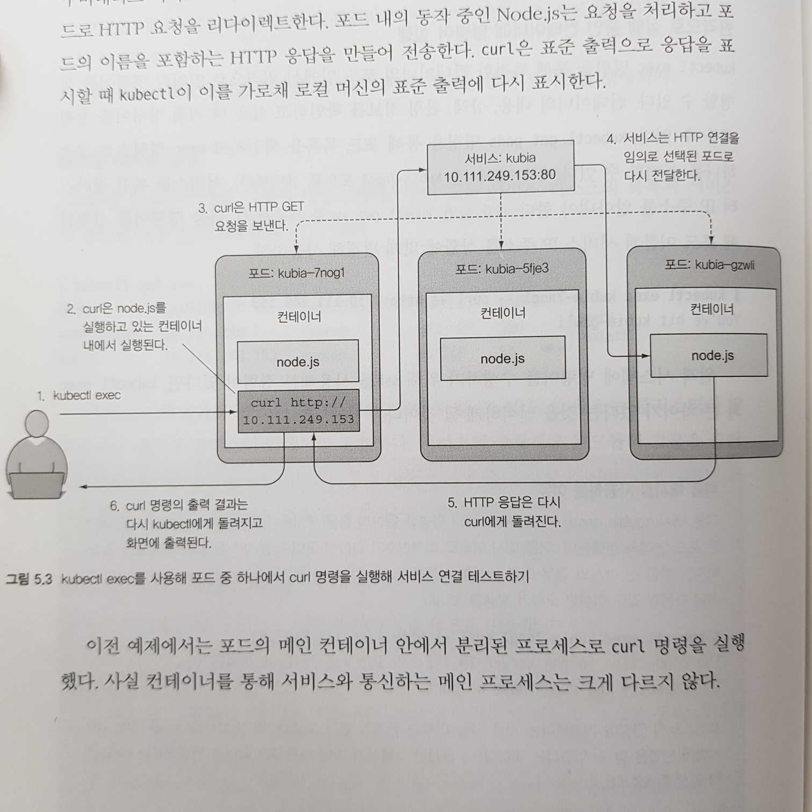
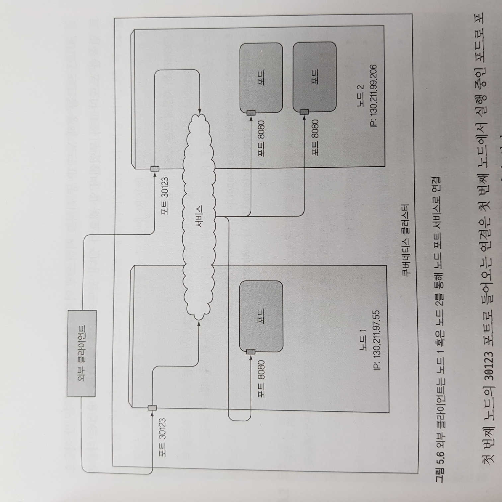

# Week 04 - Kubernetes Services

포드가 다른 곳에서 제공하는 서비스를 사용하려면 다른 포드를 찾을 방법이 필요합니다. 그러나 클라이언트가 서비스를 제공하는 서버의 IP 주소나 호스트 이름을 지정하는 일반적인 애플리케이션과 달리 쿠버네티스에선 포드가 일회성이라 언제든지 이동하거나 사라질 수 있기 때문에 포드를 연결하기 위한 단일 진입 점이 필요합니다.

이런 문제를 해결하기 위해 쿠버네티스에선 변하지 않는 IP 주소와 포트를 제공하는 서비스(Service) 라는 리소스를 제공합니다. 그리하여 클라이언트는 해당 IP 및 포트에 연결하여 포드 중 하나와 통신할 수 있게 됩니다. 이번 챕터에선 서비스가 어떻게 생성되는지 보면서 자세히 알아보겠습니다.

## 서비스 생성

서비스는 기본적으로 `expose` 명령으로 생성될 수 있는데, 역시 YAML 디스크립터로도 생성할 수 있습니다.

```yaml
apiVersion: v1
kind: Service
metadata:
  name: kubia
spec:
  selector:
    app: kubia # 라벨이 app=kubia 인 모든 포드는 이 서비스에 속합니다
  ports:
    - name: http
      port: 80 # 서비스가 사용할 포트
      targetPort: http # 서비스가 포워드 할 포트
```

위 디스크립터에 의해 생성된 서비스는 80 포트로 들어오는 연결을 허용하고 `app=kubia` 라벨 셀렉터에 매칭되는 포드 중 하나를 http(여기서는 8080) 포트로 라우팅합니다. 이렇게 생성된 서비스는 `CLUSTER_IP` 라는 클러스터 안에서만 유효한 내부 IP 를 할당받게 됩니다. 그리하여 `app=kubia` 란 라벨이 붙은 포드에 `exec` 명령을 실행하여 curl 로 서비스에 요청을 보내면 동일한 라벨이 붙은 포드로 전달되어 응답을 받는 것을 확인할 수 있습니다.

<figure>
  
  <figcaption style="color: grey;">서비스 동작 과정</figcaption>
</figure>

또한 서비스는 여러개의 포트도 지원할 수 있습니다. 예를 들어 서비스의 80번 포트와 443 포트를 포드의 8080 포트와 8443 포트로 라우팅 할 수 있습니다. 포트는 이름도 지정할 수 있는데, 서비스 디스크립터에 해당 이름으로 포트를 설정할 수도 있습니다. 즉, 포드에 다음과 같이 포트 이름을 지정하고, 서비스는 해당 포트로 라우팅 하도록 디스크립터를 작성할 수 있습니다.

```yaml
# pod.yml
apiVersion: v1
kind: Pod
spec:
  containers:
      - name: kubia
      ports:
        - name: http
          containerPort: 8080   # 컨테이너 포트 8080은 http 란 이름으로 설정합니다
        - name: https
          containerPort: 8443   # 컨테이너 포트 8443은 https 란 이름으로 설정합니다
```

```yaml
apiVersion: v1
kind: Service
spec:
  ports:
    - name: http # 서비스의 포트 80은 http 라 불리는 컨테이너 포트에 매핑됩니다
      port: 80
      targetPort: http
    - name: https # 서비스의 포트 443은 https 라 불리는 컨테이너 포트에 매핑됩니다
      port: 443
      targetPort: https
```

포트의 이름을 지정하면 서비스 디스크립터의 변경 없이 컨테이너의 포트를 변경할 수 있습니다.

## 서비스 디스커버리

서비스를 생성하면 포드에게 액세스할 수 있는 단일 진입점이 생성되었단 것을 알려주어야 하는데, 사람이 직접 설정할 필요 없이 쿠버네티스는 포드가 서비스의 IP 와 포트번호를 알아낼 수 있는 두 가지 방법을 제공합니다.

첫 번째로 쿠버네티스는 포드가 시작되면 그 순간 존재하는 각 서비스들을 가리키는 환경 변수를 세팅합니다. 즉, 포드를 생성하기 전에 서비스를 생성했다면 포드는 환경 변수를 조사해서 서비스의 IP 주소와 포트 번호를 알아낼 수 있습니다. 그러나 포드가 생성된 이후 서비스가 생성된다면 환경변수는 아직 설정되지 않는데, 이 경우 두 번째 방법인 DNS로 서비스를 찾을 수 있습니다.

### 환경변수를 이용한 서비스 디스커버리

서비스가 생성된 이후 포드를 생성하고, 해당 포드의 환경변수를 출력해보면 다음과 같이 나옵니다.

```sh
> kubectl exec <pod_name> env
...
<SERVICE_NAME>_SERVICE_HOST=10.109.132.222   # 서비스의 클러스터 IP
<SERVICE_NAME>_SERVICE_PORT=80               # 서비스가 사용 가능한 포트
...
```

위와 같이 특정 서비스의 이름이 prefix 로 붙어있는 환경변수로 서비스의 IP 주소와 포트번호를 저장하고 있는 것을 확인할 수 있습니다.

### DNS를 이용한 서비스 디스커버리

kube-system 네임스페이스의 리소스를 출력해보면(`kubectl get all -n kube-system`) core-dns 라는 포드가 존재하는 것을 확인할 수 있습니다. 이름에서 알 수 있듯이 이 포드는 DNS 서버를 실행하고, 클러스터에서 실행하는 다른 모든 포드가 자동으로 사용하도록 구성됩니다.

쿠버네티스는 각 컨테이너의 `/etc/resolv.conf` 파일을 수정해서 이 작업을 수행합니다.

그리하여 포드에서 프로세스가 수행하는 모든 DNS 쿼리는 쿠버네티스의 자체 DNS 서버에서 처리합니다. 그리하여 포드는 FQDN(Fully Qualified Domain Names) 를 통해 서비스에 액세스 할 수 있습니다. 컨테이너의 `/etc/resolv.conf` 파일을 출력해보면 이를 이해할 수 있습니다.

```sh
> kubectl exec <pod_name> -- cat /etc/resolv.conf
nameserver 10.96.0.10         # kube-system 네임스페이스에 정의된 kube-dns 서비스의 IP 주소
search default.svc.cluster.local svc.cluster.local cluster.local # <네임스페이스.도메인> 으로 구성된 FQDN 목록
```

**Note**: 포드에서 curl 로 서비스에 액세스할 수 있지만 ping 에는 응답하지 않습니다. 서비스의 클러스터 IP 는 가상 IP 주소로 서비스 포트와 결합됐을 경우에만 의미가 있기 때문입니다. 포드에서 서비스로 ping 을 날리지 맙시다....

## 클러스터 내부에서 외부로 연결하기

클러스터 내부에서만 통신하지 않고 외부 서비스에도 연결할 수 있습니다. 그 전에 먼저 엔드포인트를 언급하겠습니다.

### 서비스 엔드포인트

서비스는 포드를 직접 링크(link)하지 않습니다. 대신 엔드포인트(Endpoint)라 불리는 리소스를 생성해 서비스와 포드 사이에 위치시킵니다. 실제로 `get endpoint` 명령으로 엔트포인트 정보를 확인할 수 있습니다. 그리하여 서비스는 라벨 셀렉터를 사용하여 연결을 리다이렉트 시키는 것 대신 IP 와 포트 목록을 만들고 엔드포인트 리소스로 저장하는데 사용합니다. 엔드포인트는 다음과 같이 생성할 수 있습니다.

```yaml
apiVersion: v1
kind: Endpoints # 리소스 유형은 Endoints
metadata:
  name: external-service # !!서비스 이름과 동일해야 합니다!!
subsets:
  - addresses: # 서비스가 연결을 포워딩 할 엔드포인트의 IP 주소 목록
      - ip: 11.11.11.11
      - ip: 22.22.22.22
    ports:
      - port: 80 # 엔드포인트의 대상 포트
```

위 디스크립터로 엔드포인트가 생성되면 서비스가 생성된 후 만들어진 포드는 서비스의 환경변수가 포함될 것이고 컨테이너의 모든 IP 와 포트 쌍으로의 연결은 서비스 엔드포인트 간에 로드밸런싱 될 것입니다. 아래 그림은 그러한 과정을 나타내고 있습니다.

<figure>
  
  <figcaption style="color: grey;">엔드포인트를 통해 외부로 요청을 보내는 서비스</figcaption>
</figure>

엔드포인트의 spec.type 을 ExternalName 으로 정의하고 spec.externalName 필드에 FQDN 값을 주면 도메인 주소로도 외부에 연결할 수 있습니다.

## 클러스터 외부에서 내부로 연결하기

지금까진 클러스터 내부에서 포드가 서비스를 사용하는 방법을 알아보았는데, 이제 클러스터 외부 서비스가 클러스터 내부 서비스에 액세스 할 수 있도록 하는 방법에 대해서 알아보도록 하겠습니다. 서비스가 외부에서 액세스 가능하게 하는 방법은 몇 가지가 있습니다.

- NodePort 서비스 타입으로 설정하는 방법
- LoadBalancer 서비스 타입으로 설정하는 방법
- 하나의 IP 주소로 여러 서비스를 제공하는 인그레스(Ingress) 리소스 생성하는 방법

### NodePort 서비스 사용

NodePort 서비스를 생성하면 쿠버네티스가 모든 노드를 대상으로 포트를 예약합니다. 그리고 들어오는 접속을 서비스 각 포트로 전송합니다. 서비스는 각 포트로 들어온 요청을 가용 상태의 포드 중 하나의 알맞은 타겟 포트로 라우팅합니다.

```yaml
apiVersion: v1
kind: Service
metadata:
  name: kubia-nodeport
spec:
  type: NodePort # 서비스 타입을 NodePort 로 설정합니다
  selector:
    app: kubia
  ports:
    - port: 80 # 서비스의 내부 클러스터 IP의 포트
      targetPort: 8080 # 서비스를 지원하는 포드의 대상 포트
      nodePort: 30123 # 해당 서비스는 각 클러스터 노드를 포트 30123을 통해 액세스 합니다
```

노드포트를 생성할 때 nodePort 를 반드시 지정해야 하는 것은 아닙니다. 생략할 경우 임의의 포트가 선택됩니다.

위 서비스를 생성하면 서비스의 IP 를 통해 액세스도 되고 노드의 IP 와 노드포트를 통해서도 액세스 가능합니다. minikube 의 경우 minikube 노드의 IP 주소와 nodePort 로 로컬 머신에서 요청을 보내면 응답을 받을 수 있습니다.

<figure>
  
  <figcaption style="color: grey;">노드포트로 서비스를 외부와 연결한 상태</figcaption>
</figure>

그리하여 포드는 각 노드 30123 포트를 통해 외부로부터 쉽게 액세스 할 수 있습니다. 그런데 클리아언트에서 요청을 보낼 노드로 단일 노드를 가리킨다면 해당 노드가 다운됬을 때 문제가 될 수 있습니다. 그래서 로드밸런서를 노드 앞에 배치하여 클라이언트에게 단일 진입점을 제공하고 정상적인 노드로 요청을 분산시킬 수 있어야 합니다.

쿠버네티스는 그러한 목적으로 NodePort 대신 LoadBalaner 라는 리소스를 제공하고 있습니다.

### LoadBalancer 서비스 사용

쿠버네티스 클러스터는 클라우드 인프라스트럭처로부터 로드 밸런서를 자동으로 프로비전하는 기능을 제공합니다. 로드밸런서는 외부에서 액세스가 가능하면서 자신만의 고유한 IP 주소를 갖고 모든 연결을 서비스로 리다이렉트 합니다. 로드밸런서는 다음과 같이 생성할 수 있습니다.

```yaml
apiVersion: v1
kind: Service
metadata:
  name: kubia-loadbalancer
spec:
  type: LoadBalancer # 서비스 타입을 LoadBalancer 로 지정하면 쿠버네티스 클러스터를 호스팅하고 있는 인프라로부터 로드밸런서를 얻을 수 있습니다
  selector:
    app: kubia
  ports:
    - port: 80
      targetPort: 8080
```

로드밸런서는 nodePort 를 지정할 필요가 없습니다. 노드로 라우팅 하는 것은 쿠버네티스가 선택합니다.

<figure>
  
  <figcaption style="color: grey;">로드밸런서로 서비스를 외부와 연결한 상태</figcaption>
</figure>

## 인그레스를 이용해 외부로 서비스 노출하기

위에서 클러스터 외부의 클라이언트로 서비스를 노출하는 두 가지 방법을 살펴보았습니다. 마지막으로 인그레스(Ingress) 리소스를 생성해 서비스를 노출하는 방법을 살펴보겠습니다. 먼저 쿠버네티스 서비스에 액세스하기 위해 인그레스를 사용하는 방법이 필요한 이유를 살펴보겠습니다.

### 인그레스가 필요한 이유

각 LoadBalancer 서비스는 그 자신만의 공개 IP 를 갖는 자체 로드밸런서를 필요로 하는 반면, 인그레스는 수십 개의 서비스에 대한 액세스를 제공할 때도 하나의 IP만 필요로 하기 때문입니다. 다음 그림과 같이 클라이언트가 HTTP 요청을 인그레스에 보내면 호스트와 요청 상의 경로로 포워딩 될 서비스를 결정됩니다.

<figure>
  
  <figcaption style="color: grey;">하나의 인그레스로 여러 서비스를 노출시킨 상태</figcaption>
</figure>

또한 인그레스는 애플리케이션 레이어에서 동작하기 때문에, 서비스가 할 수 없는 쿠키 기반 고정 세션 기능도 제공할 수 있습니다. 마찬가지로 디스크립터로 인그레스를 생성할 수 있습니다.

minikube 의 경우 인그레스 애드온을 활성화 시켜야 사용할 수 있습니다. `minikube addons list` 명령으로 ingress 애드온이 활성화 되어 있는지 확인하고, 그렇지 않다면 `minikube addons enable ingress` 명령으로 활성화 시켜야 합니다.

```yaml
apiVersion: networking.k8s.io/v1
kind: Ingress # 리소스 형태는 Ingress
metadata:
  name: kubia
spec:
  rules:
    - host: kubia.example.com # 도메인 이름을 서비스로 매칭합니다
      http:
        paths:
          - path: /kubia # /kubia 로 요청이 들어오면 name=kubia 인 서비스 80번 포트로 전달합니다
            pathType: Prefix
            backend:
              service:
                name: kubia
                port:
                  number: 80
          - path: /bar # /bar 로 요청이 들어오면 name=bar 인 서비스 80번 포트로 전달합니다
            pathType: Prefix
            backend:
              service:
                name: bar
                port:
                  number: 80
```

위 디스크립터로 인그레스 서비스를 생성한 뒤 `kubectl get ingresses` 명령으로 인그레스 IP 주소와 호스트 이름를 확인할 수 있습니다. 해당 IP 주소를 `/etc/hosts` 에 다음과 같이 추가해주고 해당 호스트로 curl 요청을 보내면 응답을 받는 것을 확인할 수 있습니다.

```sh
# /etc/hosts
192.168.99.100 kubia.example.com
```

```sh
> curl http://kubia.example.com
You've hit kubia-cbjc7
```

### 인그레스 동작방식

클러스터 외부 클라이언트는 처음에 [kubia.example.com](http://kubia.example.com) 에 대해 DNS 룩업을 수행하고, DNS 서버(minikube 의 경우 로컬 머신)는 인그레스 컨트롤러의 IP 주소를 반환합니다. 그런 다음 클라이언트는 HTTP 요청을 인그레스 컨트롤러로 보내고 Host 헤더에 kubia.example.com 을 지정합니다. 이 헤더에서 컨트롤러는 클라이언트가 액세스 하려고 하는 서비스를 결정하고 서비스와 연관된 엔드포인트 객체를 통해 포드 IP 를 조회한 클라이언트 요청을 포드 중 하나로 전달합니다. 즉, 인그레스 컨트롤러는 요청을 서비스로 전달하지 않고 오직 포드를 선택하는데 사용합니다.

<figure>
  
  <figcaption style="color: grey;">인그레스 동작방식</figcaption>
</figure>

### 인그레스 TLS 설정

지금까지 인그레스가 HTTP 트래픽을 전달하는 방법을 살펴보았습니다. 그런데 외부 클라이언트가 인그레스 컨트롤러와 TLS(SSL) 연결을 할 때 컨트롤러는 TLS(SSL) 인증서와 개인 키를 보유해야 합니다. 이 두 가지는 시크릿(Secret) 이라는 쿠버네티스 리소스에 저장됩니다. 다음과 같이 로컬에서 self-signed 인증서를 생성해서 인그레스 디스크립터에 제공할 수 있습니다. 먼저 로컬 머신에 다음과 같이 개인키와 인증서를 생성합니다.

```yaml
openssl genrsa -out tls.key 2048     # 개인 키 생성
openssl req -new -x509 -key tls.key -out tls.cert -days 360   # 인증서 생성
```

위에서 생성한 개인키와 인증서를 바탕으로 쿠버네티스 시크릿 리소스를 생성합니다.

```yaml
kubectl create secret tls tls-secret --cert=tls.cert --key.tls.key # 시크릿 생성
```

마지막으로 해당 시크릿을 인그레스 디스크립터에 주입하여 TLS 연결이 가능하도록 합니다.

```yaml
apiVersion: networking.k8s.io/v1
kind: Ingress
metadata:
  name: kubia
spec:
  tls: # 전체 tls 구성은 이 속성 이하에 위치시킵니다
    - hosts:
        - kubia.example.com
      secretName: tls-secret # 위에서 생성한 비밀키와 인증서를 바탕으로 만든 tls-secret 시크릿을 제고합니다
  rules:
    - host: kubia.example.com
      http:
        paths:
          - path: /
            pathType: Prefix
            backend:
              service:
                name: kubia-nodeport
                port:
                  number: 80
```

이렇게 인그레스 컨트롤러를 생성하면 HTTPS 요청을 받을 수 있습니다.

```sh
> curl -k -v https://kubia.example.com/kubia
...
* Server certificate:
*  subject: O=Acme Co; CN=Kubernetes Ingress Controller Fake Certificate
...
> GET /kubia HTTP/2
> Host: kubia.example.com
> User-Agent: curl/7.64.1
> Accept: */*
>
...
You've hit kubia-lgmvf
```

## 포드가 연결을 수락할 수 있는 상태인지 검사하기

서비스와 인그레스에 대해 살펴봐야 할 사항이 한 가지 더 있습니다. 포드가 막 생성되었을 때 해당 포드로 요청을 보내면 오랜 시간을 기다려야 할 수도 있습니다. 그런 경우에는 이미 실행중인 포드가 요청을 처리하는 것이 효율적일 것입니다. 이렇게 포드가 요청을 수락할 수 있는 상태가 될 때까지 서비스에 추가하지 않는 역할을 하는 리소스는 레디네스 프로브(Readiness Probe) 입니다.

### 레디네스 프로브

라이브니스 프로브처럼 레디네스 프로브도 동일한 메커니즘으로 컨테이너의 상태를 모니터링합니다. 그리하여 컨테이너가 시작되면 구성 가능한 시간이 경과할 때 까지 대기하고, 주기적으로 신호를 보내어 포드가 준비돼 있지 않다고 알려주면 서비스에서 삭제하며 포드가 다시 준비되면 서비스에 추가합니다. 또 라이브니스 프로브와 달리 레디네스 프로브는 컨테이너 준비 확인에 실패했다고 컨테이너를 다시 시작하지 않습니다.

레디네스 프로브도 디스크립터로 정의할 수 있습니다.

```yaml
---
spec:
  containers:
    - name: kubia
      image: luksa/kubia
      ports:
        - containerPort: 8080
      readinessProbe: # 해당 컨테이너를 모니터링하는 레디네스 프로브를 정의합니다
        exec: # 레디네스 프로브가 아래 커맨드를 주기적으로 실행하도록 합니다
          command:
            - ls
            - /var/ready
```

위 디스크립터로 생성한 레디네스 프로브는 주기적으로 컨테이너 안에서 `ls /var/ready` 명령을 실행합니다. 파일이 있으면 0의 종료 코드를 반환하고 파일이 없으면 0이 아닌 값을 반환합니다. 파일이 있으면 레디네스 프로브는 성공하고 그렇지 않으면 실패합니다.

## 헤드리스 서비스로 개별 포드 찾기

지금까진 클라이언트가 하나의 포드와 통신하도록 하기 위해 단일 진입점(서비스)을 제공하는 방법에 대해서 살펴보았습니다. 그런데 클라이언트가 모든 포드에 연결해야 하고자 한다면 어떻게 해야 할까요? 이 경우 클라이언트가 쿠버네티스에게 클러스터 IP 가 필요없다고 말하면, 즉 서비스 spec 에 clusterIP 필드를 None 으로 설정하면 DNS 서버는 단일 서비스 IP 대신 포드의 IP 목록을 알려줍니다.

```yaml
apiVersion: v1
kind: Service
metadata:
  name: kubia-headless
spec:
  clusterIP: None # 서비스를 헤드리스로 만듭니다
  selector:
    app: kubia
  ports:
    - port: 80
      targetPort: 8080
```

## Recap

지금까지 애플리케이션에서 가용한 서비스를 노출하기 위해 각 서비스에 얼마나 많은 포드 인스턴스가 제공되는지와 관계없이 쿠버네티스 서비스 리소스를 생성하는 방법을 배웠습니다. 배운 내용을 정리하면 다음과 같습니다.

- 고정 IP 주소 및 포트를 통해 특정 라벨이 붙은 포드들을 노출할 수 있습니다.
- 기본적으로 클러스터 내부에서 서비스에 접근할 수 있는데, 서비스 유형을 NodePort 또는 LoadBalancer 로 설정해 외부에서 서비스에 접근하게 할 수 있습니다.
- 포드는 환경변수를 검색해 서비스 IP 주소 및 포트를 알아낼 수 있습니다.
- 단일 인그레스를 통해 다수의 HTTP 서비스를 노출할 수 있습니다.
- 포드를 서비스 엔드포인트에 포함시킬지 여부를 결정하기 위해 레디네스 프로브를 사용합니다.

## References

- Kubernetes in Action
