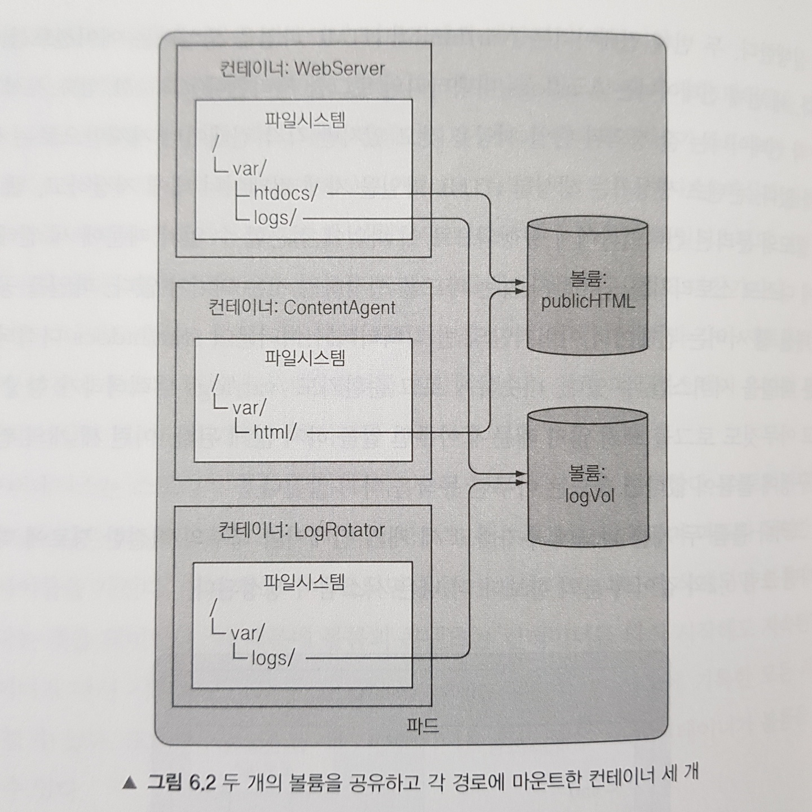
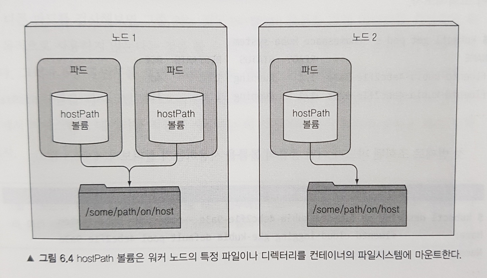
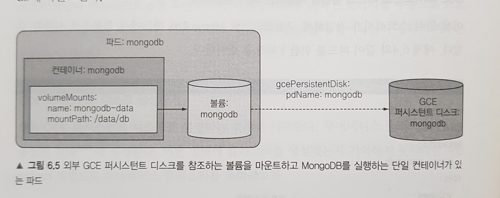
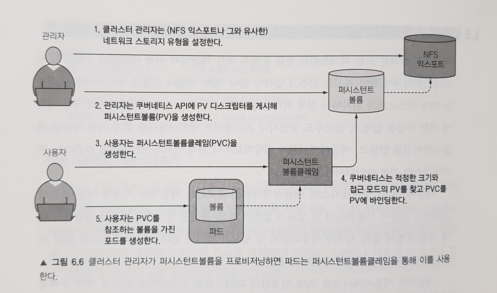
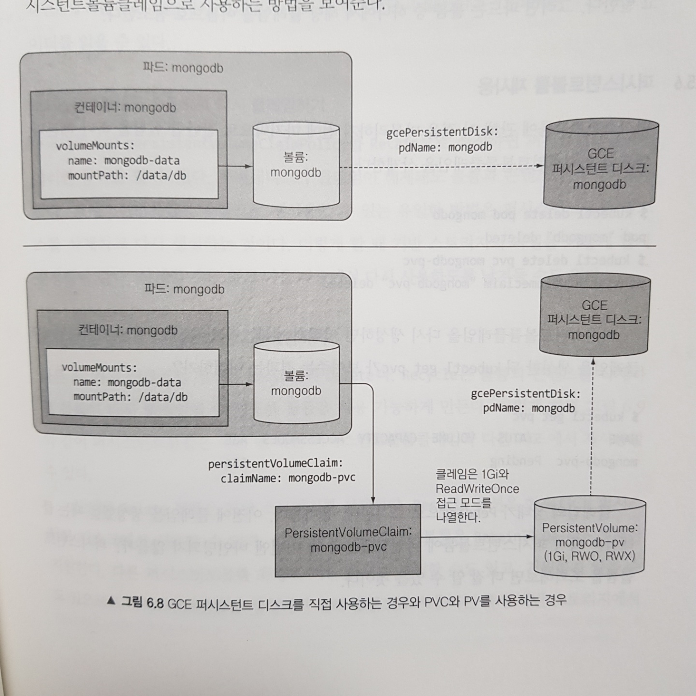
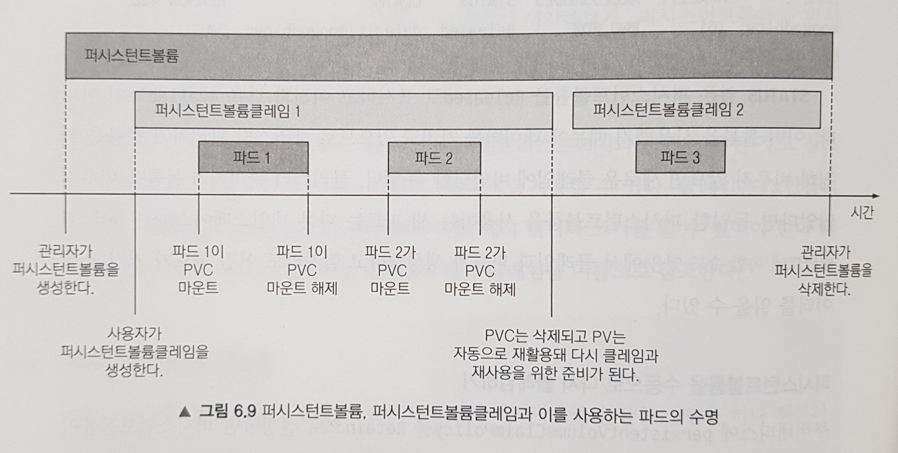
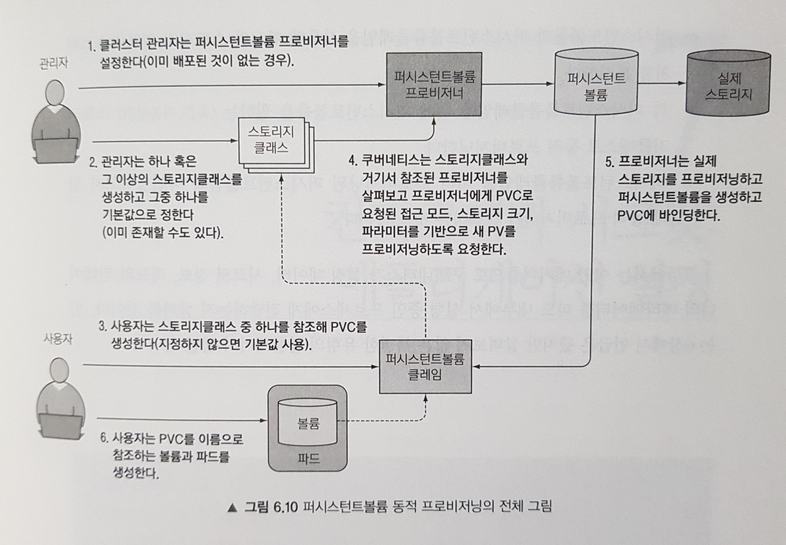

# Week 05 - Kubernetes Volumes

쿠버네티스 파드 내에서 돌아가는 컨테이너는 고유한 파일 시스템을 갖습니다. 파일 시스템은 컨테이너 이미지에서 제공되기 때문입니다. 그렇기 때문에 컨테이너가 재시작하게 되면 이전에 컨테이너에서 쓰여진 파일시스템은 새롭게 시작된 컨테이너가 볼 수 없습니다. 만약 컨테이너가 종료되더라도 파일시스템이 유지되도록 하고 싶다면 어떻게 하면 좋을까요?

이 경우 쿠버네티스 볼륨을 정의할 수 있습니다. 볼륨은 파드의 일부분으로 정의되며 파드와 동일한 라이프사이클을 갖는 디스크 스토리지입니다. 파드가 여러 개의 컨테이너를 가지는 경우 모든 컨테이너가 볼륨을 공유할 수도 있습니다. 이번 포스팅에서는 볼륨에 대해 알아보도록 하겠습니다.

# 볼륨 소개

쿠버네티스 볼륨은 파드의 구성 요소로 컨테이너와 동일하게 파드 스펙에서 정의됩니다. 볼륨은 독립적인 쿠버네티스 리소스가 아니므로 자체적으로 생성, 삭제될 수 없습니다. 볼륨은 파드의 모든 컨테이너에서 사용 가능하며 이 경우 접근하려는 각 컨테이너에서 마운트해야 합니다. 각 컨테이너 파일 시스템의 어느 경로에나 볼륨을 마운트 할 수 있습니다.

볼륨의 동작을 보다 쉽게 이해하기 위해 어떤 파드에 Web Server, Content Agent, Log Rotator 기능을 하는 컨테이너 3개가 존재한다고 가정해봅시다. Web Server는 `/var/htdocs` 디렉터리에 HTML 페이지를 서빙하고 `/var/logs` 에 액세스 로그를 기록합니다. Content Agent는 Web Server가 서빙할 HTML 파일을 `/var/html` 에 생성합니다. Log Rotator는 `/var/logs` 디렉터리의 로그를 처리합니다. 이 컨테이너들이 서로의 파일 시스템을 공유할 수 있게 다음과 같이 `publicHTML`, `logVol` 두 볼륨을 추가할 수 있습니다.

<figure>
  
  <figcaption style="color: grey;">두 개의 볼륨을 공유하고 각 경로에 마운트한 컨테이너</figcaption>
</figure>

위 예제에서 두 볼륨은 빈 상태로 초기화되므로 `emptyDir` 이란 유형의 볼륨을 사용할 수 있습니다. 쿠버네티스에선 볼륨을 초기화하며 외부 소스의 내용을 채우거나, 볼륨 내부에 기존에 존재하는 디렉터리를 마운트하는 것과 같은 다른 유형의 볼륨도 지원합니다. 볼륨을 채우거나 마운트하는 프로세스는 파드의 컨테이너가 시작되기 전에 수행됩니다. 그럼 어떤 유형의 볼륨이 있는지 살펴볼까요?

## 사용 가능한 볼륨 목록

쿠버네티스는 아래 유형의 볼륨들을 지원하고 있습니다.

- `emptyDir`: 일시적인 데이터를 저장하는 데 사용되는 간단한 빈 디렉터리
- `hostPath`: 워커 노드의 파일 시스템을 파드의 디렉터리로 마운트하는데 사용
- `nfs`: NFS 공유 파드에 마운트
- `gcePersistentDisk(GCE Persistent Disk)`, `awsElasticBlockStore(AWS EBS Volume)`, `azureDist(MS Azure Disk Volume)`: 클라우드 제공자의 전용 스토리지를 마운트
- `cinder`, `cephfs`, `iscsi`, `glusterfs`, `quobyte`, `rbd`, `flexVolume`, `vsphereVolume`, `photonPersistentDisk`: 다른 유형의 네트워크 스토리지를 마운트
- `configMap`, `secret`, `downwardAPI`: 쿠버네티스 리소스나 클러스터 정보를 파드에 노출하는 데 사용되는 특별한 유형의 볼륨
- `persistentVolumeClaim`: 사전에 혹은 동적으로 프로비저닝된 퍼시스턴트 스토리지를 사용하는 방법

여기서는 몇 가지 유형에 대해서 소개해 드리도록 하겠습니다.

## emptyDir 볼륨

`emptyDir` 볼륨은 이름에서 알 수 있듯이 빈 디렉터리로 초기화되는 볼륨입니다. 이 볼륨 유형은 동일 파드에서 실행 중인 컨테이너 간 파일을 공유할 때 유용합니다.

앞서 설명한 예제를 단순화시켜 Web Server, Content Agent 가 하나의 `emptyDir` 볼륨을 공유하는 상황을 한번 구현해봅시다. 먼저 Web Server로 Nginx 컨테이너 이미지를 사용하고 Content Agent는 `fortune` 명령으로 임의의 인용문을 만드는 컨테이너 이미지(`luksa/fortune`)를 활용하겠습니다. 두 컨테이너가 하나의 볼륨을 공유하는 파드 디스크립터는 다음과 같이 작성할 수 있습니다.

```yaml
apiVersion: v1
kind: Pod
metadata:
  name: fortune
  labels:
    app: kubia
spec:
  containers:
    # 첫 번재 컨테이너(Content Agent)는 html-generator 라고 이름 짓고 luksa/fortune 이미지를 실행한다
    - image: luksa/fortune
      name: html-generator
      # html 이름의 볼륨을 컨테이너의 /var/htdocs 에 마운트한다
      volumeMounts:
        - name: html
          mountPath: /var/htdocs
    # 두 번째 컨테이너(Web Server)는 web-server 라고 이름 짓고 nginx:alpine 이미지를 실행한다
    - image: nginx:alpine
      name: web-server
      # 위와 동일한 볼륨을 /usr/share/nginx/html 에 읽기 전용으로 마운트한다
      volumeMounts:
        - name: html
          mountPath: /usr/share/nginx/html
          readOnly: true
      ports:
        - containerPort: 80
          protocol: TCP
    # html 이란 단일 emptyDir 볼륨을 위의 컨테이너 두 개에 마운트한다
  volumes:
    - name: html
      emptyDir: {}
```

위 디스크립터를 API 서버에 게시하면 파드가 생성되고, 로컬 머신의 포드를 위 파드의 80번 포트로 포워딩 하면 Nginx 서버에 접근할 수 있습니다.

```sh
$ kubectl port-forward fortune 8080:80
```

그런 다음 `http://localhost:8080` 으로 요청을 보내면 응답으로 임의의 인용문을 전달받게 되고, 잠시 후 다시 요청을 보냈을 때 다른 응답을 받는 것을 확인할 수 있습니다. 그리하여 어떻게 볼륨이 컨테이너 두 개를 결합시키는지 확인할 수 있습니다.

### emptyDir 을 사용하기 위한 매체 지정

`emptyDir` 은 워커 노드의 디스크에 생성되기 때문에 노드 디스크 유형에 따라 성능이 결정됩니다. 반면 디스크가 아닌 메모리를 사용하는 tmpfs 파일 시스템으로 생성하도록 다음과 같이 요청할 수 있습니다.

```yaml
volumes:
  - name: html
    emptyDir:
      # 이 emptyDir 의 파일들은 메모리에 저장됩니다.
      medium: Memory
```

`emptyDir` 볼륨은 이를 포함하는 파드를 위해 특별히 생성되고 독점적으로 사용되는 디렉터리입니다. 파드가 삭제되면 볼륨과 이에 저장된 파일들은 삭제됩니다. 그러나 다른 유형의 볼륨은 새 디렉터리를 생성하지 않고 기존에 존재하는 외부 디렉터리를 파드의 컨테이너 파일시스템에 마운트합니다. 지금부턴 이러한 유형의 볼륨을 소개해 드리겠습니다.

## hostPath 볼륨

`hostPath` 볼륨은 노드의 파일시스템의 특정 파일이나 디렉터리를 가리킵니다. 이 볼륨을 사용하면 파드 내 컨테이너 간 데이터를 공유할 수 있을 뿐만 아니라 같은 노드에 실행중인 파드 사이에서도 같은 파일 시스템을 공유할 수 있습니다.

<figure>
  
  <figcaption style="color: grey;">hostPath 볼륨을 사용하는 상황</figcaption>
</figure>

`hostPath` 볼륨은 퍼시스턴트 스토리지 중 하나로, `emptyDir` 처럼 파드가 종료되면 삭제되는 볼륨과 달리 파드가 삭제되어도 볼륨의 콘텐츠가 삭제되지 않는 볼륨입니다. 파드가 재시작할 때 같은 노드에 스케줄링 되는 조건에서 새 파드는 이전 파드가 남긴 모든 항목을 볼 수 있습니다. `hostPath` 는 노드 데이터에 접근하기 위한 용도로 사용할 때 유용합니다.

단 `hostPath` 는 노드의 파일 시스템을 마운트하기 때문에 파드가 다른 노드로 스케줄링 되면 이전 데이터를 볼 수 없단 점을 주의해야 합니다. 그러므로 데이터베이스의 데이터 디렉터리로 사용하거나 여러 노드에 걸쳐 데이터를 유지하기 위해 사용하는 것은 적절하지 않겠죠. 지금부턴 다중 노드 클러스터에서 퍼시스턴트 데이터를 적절히 저장하는 데 사용하는 다른 유형의 볼륨을 알아봅시다.

## 퍼시스턴트 스토리지

파드에서 실행중인 앱이 디스크에 데이터를 유지해야 하고, 파드가 다른 노드로 스케줄링된 경우에도 동일한 데이터를 사용해야 한다면 지금까지 언급한 유형의 볼륨은 사용할 수 없습니다. 이러한 데이터는 어떤 클러스터 노드에서도 접근이 필요하기 때문입니다. 그리하여 이러한 경우 NAS 유형의 볼륨, 즉 GCE, AWS, MS Azure 등의 클라우드 에서 제공하는 퍼시스턴트 스토리지를 사용할 수 있습니다.

영구적으로 데이터를 저장하는 볼륨을 이해하기 쉽게 MongoDB를 실행하는 파드를 생성해봅시다. 만약 GCE에 쿠버네티스 클러스터가 실행중이라면 GCE Persistent Disk 를 기반 퍼시스턴트 스토리지로 사용할 수 있습니다. 그리하여 다음과 같이 GCE 퍼시스턴트 디스크를 생성한 뒤, MongoDB 파드에서 볼륨으로 사용할 수 있습니다.

```sh
# mongodb 란 이름의 1GiB 크기의 GCE 퍼시스턴트 디스크를 생성합니다.
# 주의: 쿠버네티스 클러스터와 동일한 zone 에 생성해야 합니다.
$ gcloud compute disks create --size=1GiB --zone=europe-west1-b mongodb
```

```yaml
apiVersion: v1
kind: Pod
metadata:
  name: mongodb
spec:
  volumes:
  # mongodb-data 란 이름의 볼륨을 생성합니다
  - name: mongodb-data
    # 볼륨의 유형은 GCE 퍼시스턴트 디스크입니다
    gcePersistentDisk:
      # 퍼시스턴트 디스크와 이름은 반드시 이전에 쉘에서 생성한 실제 PD(Persistent Disk)와 일치해야 합니다
      pdName: mongodb
      # 파일시스템 유형은 EXT4(리눅스 파일시스템 유형 중 하나)이다
      fsType: ext4
  containers:
    - image: mongo
      name: mongodb
      volumeMounts:
        # 볼륨의 이름은 볼륨을 마운트할 떄 참조됩니다
        - name: mongodb-data
          # MongoDB가 데이터를 지정할 경로입니다
          mountPath: /data/db
        ports:
          - containerPort: 27017
            protocol: TCP
```

**Note**: Minikube를 사용한다면 GCE 퍼시스턴트 디스크 대신 hostPath 볼륨을 사용하는 [mongo-pod-hostpath.yaml](https://github.com/luksa/kubernetes-in-action/blob/master/Chapter06/mongodb-pod-hostpath.yaml) 를 활용할 수 있습니다. hostPath 볼륨은 minikube 처럼 단일 노드 환경에서 퍼시스턴트 스토리지를 테스트하는 데 사용될 수 있습니다.

위 디스크립터로 생성한 파드는 GCE 퍼시스턴트 디스크를 기반으로 한 단일 볼륨과 단일 컨테이너로 이뤄집니다.

<figure>
  
  <figcaption style="color: grey;">GCE 퍼시스턴트 디스크를 참조하는 볼륨을 마운트하는 파드</figcaption>
</figure>

그리하여 이렇게 생성한 파드로 데이터 스토리지(MongoDB)에 데이터를 기록하고, 파드를 삭제한 뒤 다시 생성하더라도 여전히 이전에 기록한 mongodb 데이터를 확인할 수 있습니다. 위 예제에서는 GCE 퍼시스턴트 디스크를 퍼시스턴트 스토리지로 사용하였는데, AWS EBS 볼륨이나 NFS 볼륨을 퍼시스턴트 스토리지로 활용할 수도 있습니다.

근데 잠깐 생각해봅시다. 위 예제에서는 GCE 퍼시스턴트 디스크 정보를 직접 디스크립터에 작성하였습니다. 과연 개발자가 파드를 생성할 때 인프라와 관련된 스토리지 세부 사항을 처리해야 할까요? 파드의 볼륨이 실제 기반 인프라를 참조한다는 것은 애플리케이션과 개발자로부터 실제 인프라를 숨긴다는 쿠버네티스의 기본 아이디어에 반합니다. 이런 인프라 관련 정보를 파드 정의에 포함한다는 것은 파드 정의가 특정 쿠버네티스 클러스터에 밀접하게 연결됨을 의미합니다. 동일한 파드 정의를 다른 클러스터에서는 사용할 수가 없겠죠. 이는 볼륨을 이런 방식으로 사용하는 것이 파드에 퍼시스턴트 스토리지를 연결하는 최적의 방법이 아닌 것을 의미합니다. 그렇다면 이를 어떻게 개선할 수 있을까요?

# 기반 스토리지 기술과 파드 분리

이상적으로 쿠버네티스에 애플리케이션을 배포하는 개발자는 어떤 종류의 스토리지 기술이 사용되는지 알 필요가 없어야 합니다. 개발자가 파드를 실행하기 위해 어떤 유형의 물리 서버가 사용되는지 알 필요가 없는 것과 마찬가지죠. 이는 전적으로 클러스터 관리자만의 영역이여야 합니다.

개발자가 파드를 실행할 때 CPU, 메모리와 다른 리소스를 요청할 수 있는 것 처럼 퍼시스턴트 스토리지를 필요로 하면 쿠버네티스에 요청할 수 있어야 합니다. 이를 해결하기 위해 퍼시스턴트볼륨과 퍼시스턴트클레임이 등장합니다.

## 퍼시스턴트볼륨(PV) 및 퍼시스턴트클레임(PVC)

퍼시스턴트볼륨(PV)과 퍼시스턴트클레임(PVC)을 보다 쉽게 이해하기 위해 아래 그림을 먼저 보겠습니다.

<figure>
  
  <figcaption style="color: grey;">관리자와 개발자가 퍼시스턴트볼륨 및 퍼시스턴트클레임을 활용하는 다이어그램</figcaption>
</figure>

먼저 클러스터 관리자는 기반 스토리지를 설정하고 쿠버네티스 API 서버로 PV 리소스를 생성해 쿠버네티스에 등록합니다. PV가 생성되면 크기와 지원 가능한 접근 모드를 지정합니다. 개발자는 파드에 퍼시스턴트 스토리지를 사용해야 하면 먼저 최소 용량과 접근 모드를 명시한 PVC 매니페스트를 생성합니다. 그런 다음 PVC 매니페스트를 쿠버네티스 API 서버에 게시하고 쿠버네티스는 적절한 PV를 찾아 클레임에 볼륨을 바인딩합니다. 그리하여 최종적으로 PVC는 파드 내부의 볼륨 중 하나로 사용될 수 있습니다. PVC의 바인딩을 삭제해 릴리스될 때 까지 다른 개발자는 동일한 PV를 사용할 수 없습니다.

### 퍼시스턴트볼륨 생성

MongoDB 예제를 다시 살펴보겠습니다. 먼저 클러스터 관리자로써 GCE 퍼시스턴트 디스크를 기반으로 한 PV를 생성합니다. 그런 다음 개발자로써 PV를 클레임해서 이를 파드에서 사용해봅시다.

PV는 다음과 같이 생성할 수 있습니다.

```yaml
apiVersion: v1
kind: PersistentVolume
metadata:
  name: mongodb-pv
spec:
  # PersistentVolume 사이즈를 지정합니다
  capacity:
    storage: 1Gi
  # 이 PV 는 단일 클라이언트의 읽기 / 쓰기용(ReadWriteOnce) 이나 여러 클라이언트를 위한 읽기 전용(ReadOnlyMany) 로 마운트됩니다
  accessModes:
    - ReadWriteOnce
    - ReadOnlyMany
  # 클레임이 해제된 후 퍼시스턴트 볼륨은 유지되어야 합니다(지워지거나 삭제되면 안됩니다)
  persistentVolumeReclaimPolicy: Retain
  # 퍼시스턴트 볼륨은 이전에 생성한 GCE 퍼시스턴트 디스크를 기반으로 합니다
  gcePersistentDisk:
    pdName: mongodb
    fsType: ext4
```

**Note**: Minikube를 사용한다면 [mongodb-pv-hostpath.yaml](https://github.com/luksa/kubernetes-in-action/blob/master/Chapter06/mongodb-pv-hostpath.yaml) 파일로 PV를 대신 생성할 수 있습니다.

PV를 생성할 때 관리자는 쿠버네티스에게 용량이 얼마나 되는지 단일 노드나 동시에 다수 노드에 읽거나 쓰기가 가능한지 여부를 알려줘야 합니다. 또한 쿠버네티스에게 PV가 바인딩된 PVC가 삭제될 때 어떤 동작을 해야 할지 알려줘야 합니다. 마지막으로 실제 스토리지의 유형, 위치 등의 정보를 지정해야 합니다.

위 디스크립터로 PV를 생성한 뒤 `kubectl get pv` 명령으로 어떤 PV가 존재하는지 조회할 수 있습니다.

```sh
$ kubectl get pv
NAME         CAPACITY   ACCESS MODES   RECLAIM POLICY   STATUS      CLAIM   STORAGECLASS   REASON   AGE
mongodb-pv   1Gi        RWO,ROX        Retain           Available                                   10s
```

**Note**: PVC는 네임스페이스에 속하지만, PV는 특정 네임스페이스에 속하지 않습니다.

### 퍼시스턴트클레임 생성을 통한 퍼시스턴트볼륨 요청

이제 관리자가 아닌 개발자의 입장으로 바라봅시다. 퍼시스턴트 스토리지가 필요한 파드를 배포해야 합니다. 이전에 생성한 PV를 사용할 것인데, 직접 사용할 수 없고 클레임을 먼저 해야 합니다. 이 때 파드가 재스케줄링 되더라도 동일한 PVC를 사용 가능한 상태로 유지되기를 원하므로 PV에 대한 클레임은 파드를 생성하는 것과 별개의 프로세스입니다. 즉, 다음과 같이 디스크립터로 PVC를 생성하도록 하겠습니다.

```yaml
apiVersion: v1
kind: PersistentVolumeClaim
metadata:
  # persistentVolumeClaim 의 이름으로 나중에 파드의 볼륨을 요청할 때 사용합니다
  name: mongodb-pvc
spec:
  resources:
    # 1GiB의 스토리지를 요청합니다
    requests:
      storage: 1Gi
  # 단일 클라이언트를 지원하는 스토리지로 읽기/쓰기를 모두 수행합니다
  accessModes:
    - ReadWriteOnce
  # 이 부분은 잠시 뒤에 설명합니다
  storageClassName: ""
```

위 디스크립터를 API 서버에 게시하면 PVC가 생성되자마자 쿠버네티스는 적잘한 PV를 찾고 클레임에 바인딩합니다. PV의 용량은 PVC의 요청을 수용할 만큼 커야 하며 접근 모드는 PVC에서 요청한 접근 모드를 모두 포함하고 있어야 합니다. 위의 경우 PVC가 요청한 1GiB 용량과 ReadWriteOnce 접근 모드를 PV가 모두 만족하므로 PV는 PVC에 바인딩됩니다.

PVC또한 `kubectl get pvc` 명령으로 조회할 수 있습니다.

```sh
$ kubectl get pvc
NAME          STATUS   VOLUME       CAPACITY   ACCESS MODES   STORAGECLASS   AGE
mongodb-pvc   Bound    mongodb-pv   1Gi        RWO,ROX                       7s
```

클레임이 `mongodb-pv` 에 bound 됐다고 나옵니다. 이제 파드에서 PVC를 사용할 준비가 끝났습니다.

**Note**: RWO는 ReadWriteOnce, ROX는 ReadOnlyMany 의 약자입니다. 참고로 RWO, ROX는 파드 수가 아닌 볼륨을 동시에 사용할 수 있는 워커 노드 수와 관련이 있습니다.

### 파드에서 퍼시스턴트볼륨클레임 사용하기

이제 PV를 사용중에 있으며 볼륨을 해제할 때 까지 다른 개발자는 동일한 볼륨에 클레임을 할 수 없습니다. 파드 내부에서 볼륨을 사용하기 위해 다음과 같이 파드 볼륨에서 이름으로 PVC를 참조할 수 있습니다.

```yaml
apiVersion: v1
kind: Pod
metadata:
  name: mongodb
spec:
  containers:
    - image: mongo
      name: mongodb
      volumeMounts:
        - name: mongodb-data
          mountPath: /data/db
      ports:
        - containerPort: 27017
          protocol: TCP
  volumes:
    - name: mongodb-data
      # 파드 볼륨에서 이름으로 PVC를 참조합니다
      persistentVolumeClaim:
        claimName: mongodb-pvc
```

위 파드 디스크립터를 게시하여 PVC를 참조하는 볼륨을 컨테이너에 마운트하는 파드를 생성하면, 이전에 파드 디스크립터에 gcePersistentDisk 를 직접 기술해서 생성했던 것과 동일하게 동작합니다. 그러나 PV와 PVC가 연결되는 구조가 생겼단 점에서 차이가 있는데요, 달라진 상황을 비교하는 그림은 다음과 같습니다.

<figure>
  
  <figcaption style="color: grey;">퍼시스턴트 스토리지를 직접 사용하는 방식과 PV 및 PVC를 사용하는 방식의 차이</figcaption>
</figure>

퍼시스턴트 스토리지를 직접 사용하는 것에 비해 PV와 PVC를 사용하는 것을 이를 생성하는 추가 절차가 필요하지만, 개발자가 실제 스토리지 기술을 알 필요가 없고 동일한 파드와 클레임 매니페스트는 인프라와 관련된 어떤 것도 참조하지 않으므로 다른 쿠버네티스 클러스터에서 활용할 수 있게 되었습니다.

## 퍼시스턴트볼륨 재사용

앞에서 PV를 생성할 때 `persistentVolumeReclaimPolicy` 속성을 `Retain` 으로 준 것을 기억하고 계실겁니다. 이는 PVC가 삭제되어 클레임이 해제되어도 볼륨과 콘텐츠를 유지하도록 하는 설정입니다. 하지만 새로운 클레임에 의해 바인딩 되지 않는데, 이전에 클레임되었을 때의 데이터가 남아있기 때문입니다.

만약 PV를 수동으로 다시 클레임하려면 PV를 삭제하고 다시 생성해야 합니다. 이 경우 기반 스토리지 파일을 어떻게 할지 결정해야 하는데, 삭제할 수도 있고 다음 파드에서 다시 사용하도록 남겨둘 수도 있습니다. 만약 PV가 리클레임 정책으로 `Delete` 를 지원한다면 자동으로 기반 스토리지를 삭제할 수 있습니다.

<figure>
  
  <figcaption style="color: grey;">PV, PVC 그리고 파드의 수명 주기</figcaption>
</figure>

# 퍼시스턴트볼륨의 동적 프로비저닝

지금까지 PV와 PVC를 사용함으로써 개발자가 내부적으로 사용된 스토리지 기술을 처리할 필요 없이 얼마나 쉽게 퍼시스턴트 스토리지를 사용할 수 있는지 살펴보았습니다. 그러나 여전히 클러스터 관리자는 실제 스토리지를 미리 프로비저닝 해야 하는 귀찮음이 있습니다. 다행히 쿠버네티스는 PV의 동적 프로비저닝(Dynamic Provisioning)을 지원하여 이 작업을 자동으로 수행할 수 있습니다.

클러스터 관리자가 PV를 생성하는 대신 PV 프로비저너(Provisioner)를 배포하고 사용자가 선택 가능한 PV 타입을 하나 이상의 스토리지 클래스(SC, Storage Class) 오브젝트로 정의할 수 있습니다. 사용자가 PVC에서 PV가 아닌 SC를 참조하면 프로비저너가 퍼시스턴트 스토리지를 프로비저닝할 때 이를 처리합니다.

그런데 대부분의 클라우드에서 프로비저너를 포함하므로 관리자가 프로비저너를 배포할 필요도 없습니다. 그리하여 PVC에서 SC만 정의하면 클레임 요청시 시스템이 알아서 PV를 생성합니다.

## 스토리지클래스 리소스를 통한 사용 가능한 스토리지 유형 정의

SC 리소스는 PVC가 SC에 요청할 때 어떤 프로비저너가 PV를 프로비저닝 해야할 지를 지정합니다. SC에 정의된 파라미터들은 프로비저너에 전달되며, 파라미터는 각 프로비저너 플러그인마다 다릅니다. SC는 다음과 같이 생성할 수 있습니다.

```yaml
apiVersion: storage.k8s.io/v1
kind: StorageClass
metadata:
  name: fast
# 퍼시스턴트볼륨 프로비저닝을 위해 사용되는 볼륨 플러그인
provisioner: kubernetes.io/gce-pd
# 파라미터가 프로비저너로 전달됩니다
parameters:
  type: pd-ssd
  zone: europe-west1-b
```

**Note**: Minikube를 사용하는 경우 [storageclass-fast-hostpath.yaml](https://github.com/luksa/kubernetes-in-action/blob/master/Chapter06/storageclass-fast-hostpath.yaml) 파일을 활용할 수 있습니다.

위 SC는 GCE의 퍼시스턴트 디스크 프로비저너를 사용하므로 GCE 클러스터가 실행중일 때 사용할 수 있습니다. 다른 클라우드 공급자인 경우 다른 프로비저너를 사용하면 됩니다.

## 퍼시스턴트볼륨클레임에서 스토리지클래스 요청하기

SC 리소스가 생성되면 개발자는 PVC의 이름에 SC를 참조할 수 있습니다. 이전에 작성한 Mongodb-pvc를 동적으로 프로비저닝 하도록 수정해봅시다.

```yaml
apiVersion: v1
kind: PersistentVolumeClaim
metadata:
  name: mongodb-pvc
spec:
  resources:
    requests:
      storage: 100Mi
  accessModes:
    - ReadWriteOnce
  # PVC는 사용자 정의 스토리지 클래스를 요청힙니다("" -> fast)
  storageClassName: fast
```

앞에서 작성한 fast SC를 생성하고 위 클레임을 생성하면 fast SC에 참조된 프로비저너가 PV를 생성합니다. 프로비저너는 수동으로 프로비저닝된 PV와 PVC를 매핑하는데도 사용됩니다. 이때 만약 PVC에서 존재하지 않은 SC를 참조하면 PV 프로비저닝은 실패합니다. 또한 `storageClassName` 속성을 지정하지 않고 PVC를 생성하면 standard 유형의 클래스가 디폴트로 선택됩니다. 또 `storageClassName` 를 맨 처음에는 `""` 인 빈 문자열로 지정했었는데, 이 경우 PVC가 새로운 PV를 동적으로 프로비저닝하지 않고 미리 프로비저닝된 PV에 바인딩 되도록 강제할 수 있습니다(위에선 PVC와 PV의 연결을 보여주고자 이렇게 하였습니다).

자, 여기까지 해서 SC를 사용하는 방법도 알아보았습니다. 이렇게 SC를 사용하면 클러스터 관리자는 성능이나 기타 특성이 다른 여러 SC를 생성할 수 있습니다. 그리고 개발자는 생성할 각 클레임에 적합한 SC를 결정하면 됩니다. 어떤가요. 관리자도, 개발자도 모두 편리해지지 않았나요?

## 퍼시스턴트볼륨 동적 프로비저닝 정리

파드에 퍼시스턴트 스토리지를 연결하는 최적의 방법은 바로 SC를 명시적으로 지정한 PVC와 파드를 생성하는 것 이란 걸 알게 되었습니다. PV와 실제 스토리지를 생성하는 것은 관리자와 개발자가 아닌 전적으로 프로비저너의 역할인 것입니다. 동적 프로비저닝된 PV를 가져오는 것을 포함한 전체 그림은 다음과 같습니다.

<figure>
  
  <figcaption style="color: grey;">PV 동적 프로비저닝 워크플로우</figcaption>
</figure>

# Recap

이번 포스팅에서는 파드 내 컨테이너에 스토리지를 제공하기 위해 어떻게 볼륨이 사용되는지 소개해 드렸습니다. 이번에 소개해드린 내용을 정리해보면 다음과 같습니다.

- 볼륨을 파드에 추가하고 각 컨테이너에 마운트해 동일한 파일시스템을 참조할 수 있다
- `emptyDir` 볼륨을 사용해 파드 내 임시, 비영구 데이터를 저장할 수 있다
- `hostPath` 볼륨을 사용해 워커 노드의 파일시스템에 접근할 수 있다
- 외부 스토리지를 볼륨에 마운트해 파드가 재시작 하더라도 파드의 데이터를 유지할 수 있다
- 퍼시스턴트볼륨(PV)와 퍼시스턴트볼륨클레임(PVC)를 사용해 스토리지와 인프라를 분리할 수 있다
- 각 PVC를 위해 PV를 원하는 스토리지 클래스(SC)로 동적으로 프로비저닝 할 수 있다
- PVC를 미리 프로비저닝된 PV와 바인딩 하고자 할 때 동적 프로비저너가 간섭하는 것을 막을 수 있다

## References

- Kubernetes in Action
