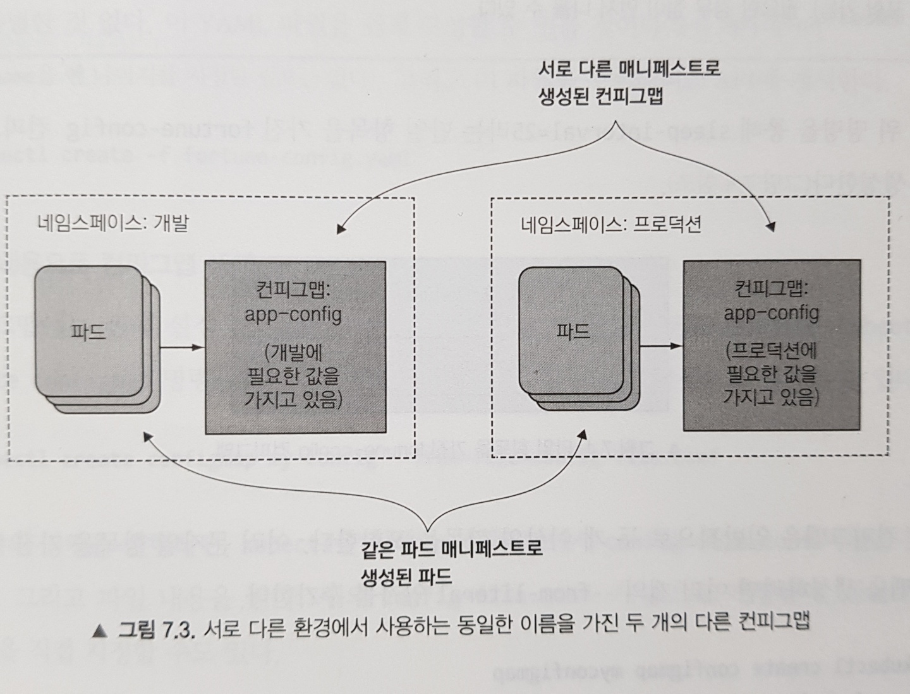
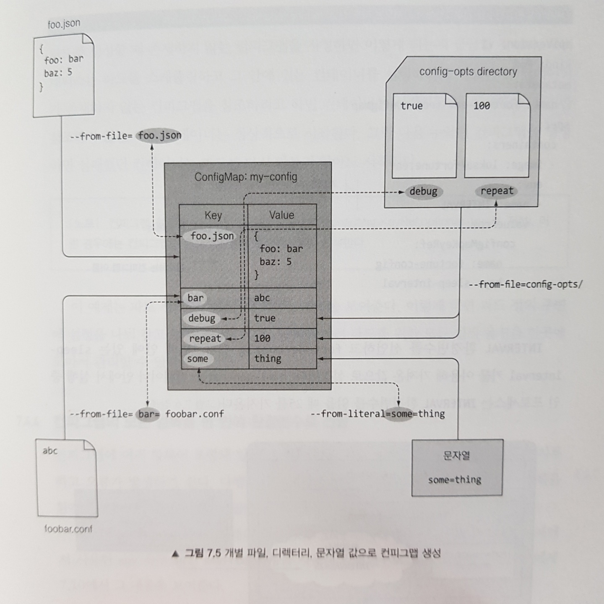

# Week 06 - Kubernetes Configmap and Secret

일반적인 컨테이너(ex. Docker) 애플리케이션에 설정 데이터를 전달하는 방법들과 유사한 방식으로 쿠버네티스에선 컨피그맵(Configmap)과 시크릿(Secret)이라는 리소스를 활용하여 컨테이너에 설정 정보를 전달할 수 있습니다. 일반적인 설정 정보는 컨피그맵, 암호화 키와 같이 보안을 신경써야하는 정보는 시크릿으로 전달할 수 있습니다. 이번 포스팅에서는 이러한 리소스를 활용하여 쿠버네티스 상에서 컨테이너 애플리케이션에 설정 정보를 전달하는 방법을 소개해드리곘습니다.

# 명령줄 인자(Arguments) 전달

## 도커에서 명령어와 인자 정의

쿠버네티스는 파드 컨테이너 정의에 지정된 실행 명령(Dockerfile 의 `ENTRYPOINT` 또는 `CMD`) 대신 다른 실행파일을 실행하거나 명령줄 인자를 사용해 실행할 수 있습니다. 앞으로 다룰 내용들의 이해를 돕기 위해 [쿠버네티스 볼륨 포스트](https://eunsukim.me/posts/kubernetes-volume-overview)에서 다룬 fortune 예제를 다시 들겠습니다. 이 fortune 애플리케이션은 주기적으로 `fortune` 명령을 실행한 결과를 `/var/htdocs/index.html` 에 출력하는 콘텐츠 생성기라고 가정하였습니다. 이 애플리케이션이 인자로 반복하는 주기를 받는다고 생각해봅시다.

```sh
# fortune 스크립트를 주기적으로 실행하는 쉘 스크립트(fortuneloop.sh)
#!/bin/bash
trap "exit" SIGINT
INTERVAL=$1
echo Configured to generate new fortune every $INTERVAL seconds
mkdir -p /var/htdocs
while :
do
  echo $(date) Writing fortune to /var/htdocs/index.html
  /usr/games/fortune > /var/htdocs/index.html
  sleep $INTERVAL
done
```

```dockerfile
# fortune 애플리케이션의 Dockerfile
FROM ubuntu:latest
RUN apt-get update ; apt-get -y install fortune
ADD fortuneloop.sh /bin/fortuneloop.sh
# exec 형태의 ENTRYPOINT 명령
ENTRYPOINT ["/bin/fortuneloop.sh"]
# 실행할 때 사용할 기본 인자
CMD ["10"]
```

**Note**: `ENTRYPOINT`는 컨테이너가 시작될 때 호출될 명령어를 정의하고, `CMD`는 `ENTRYPOINT`에 전달되는 인자를 정의합니다. 이 두 명령어는 shell 형식(`ENTRYPOINT node app.js`)과 exec 형식(`ENTRYPOINT ["node", "app.js"]`)을 지원하는데, 차이점은 정의된 명령을 shell 로 호출하는지 여부입니다. 후자의 경우 컨테이너 내부에서 직접 node 프로세스를 실행하는 반면 전자는 shell 에서 node 프로세스를 실행합니다. 일반적으로 shell 프로세스는 불필요하므로 exec 형식을 사용합니다.

위 이미지를 빌드하고 도커 허브에 푸시할 수 있습니다. 위 명세로 빌드된 도커 이미지는 `docker.io/luksa/fortune:args` 에서 찾을 수 있습니다. 로컬에서 해당 이미지를 pull 받아 실행해보면 10초 간격으로 표준 출력으로 echo 명령의 실행 결과를 확인할 수 있습니다.

```sh
# sleep 시간 간격을 인자로 전달해 재정의할 수도 있습니다.
$ docker run -it docker.io/luksa/fortune:args
Configured to generate new fortune every 10 seconds
Sun Apr 18 13:09:06 UTC 2021 Writing fortune to /var/htdocs/index.html
...
```

컨테이너에 인자를 전달하는 방법을 알아봤으니 이제 파드에 인자를 전달하는 방법을 알아봅시다.

## 파드에서 명령어와 인자 재정의

컨테이너 Dockerfile에서 정의한 `ENTRYPOINT`와 `CMD` 둘 다 재정의할 수 있습니다. 쿠버네티스에서는 파드 디스크립터에서 `spec.containers` 아래에 `command` 와 `args` 속성을 정의함으로써 명령과 인자를 재정의할 수 있습니다.

```yaml
kind: Pod
spec:
  containers:
    - image: awesome/image
      command: ["/bin/command"] # Dockerfile 내 ENTRYPOINT 에 정의된 실팽 명령을 재정의합니다
      args: ["arg1", "arg2", "arg3"] # Dockerfile 내 CMD 에 정의된 인자를 재정의합니다
```

앞에서 예를 든 fortune 이미지를 컨테이너 이미지로 활용하고 반복 주기를 2초로 설정하는 디스크립터는 다음과 같이 작성할 수 있습니다.

```yaml
apiVersion: v1
kind: Pod
metadata:
  name: fortune2s-args
spec:
  containers:
    - image: luksa/fortune:args
      # argument 로 2 를 주어서 fortuneloop.sh 스크립트가 2초마다 새로운 fortune 메시지를 생성하도록 합니다
      args: ["2"]
```

# 컨테이너의 환경변수 설정

쿠버네티스는 컨테이너에 환경변수를 설정할 수도 있습니다. 위에서 작성한 `fortuneloop.sh` 에서 `INTERVAL` 변수를 초기화하는 행을 제거한 뒤 이미지를 만들고, 파드 내 컨테이너의 환경변수를 주입하여 `INTERVAL` 를 정의할 수 있습니다.

```sh
#!/bin/bash
trap "exit" SIGINT
# INTERVAL=$1   'INTERVAL' 를 초기화하는 행을 제거하여 INTERVAL를 환경변수에서 가져오도록 합니다
echo Configured to generate new fortune every $INTERVAL seconds
mkdir -p /var/htdocs
while :
do
  echo $(date) Writing fortune to /var/htdocs/index.html
  /usr/games/fortune > /var/htdocs/index.html
  sleep $INTERVAL
done
```

```yaml
apiVersion: v1
kind: Pod
metadata:
  name: fortune2s-env
spec:
  containers:
    - image: luksa/fortune:env
      # 환경변수 목록에 INTERVAL 를 추가합니다
      env:
        - name: INTERVAL
          value: "30"
        # 추가적으로 이미 정의된 환경 변수를 참조할 수도 있습니다
        - name: SECOND_ENV_FOO
          value: "$(INTERVAL)_BAR" # 30_BAR
```

위 처럼 파드 디스크립터에서 환경변수를 정의하는 것은 dev, prod 용 파드 디스크립터를 분리해야 한다는 단점이 있습니다. 여러 환경에서 동일한 파드 디스크립터를 재사용하려면 파드 정의에서 설정을 분리해야 합니다. 바로 이러한 목적으로 컨피그맵 리소스를 사용할 수 있습니다.

# 컨피그맵으로 설정 분리

컨피그맵은 문자열 또는 전체 설정 파일에 이르는 값을 가지는 key-value 쌍으로 구성된 맵입니다. 컨피그맵의 내용은 명령줄 인자, 환경변수 또는 볼륨 파일로 애플리케이션에 전달할 수 있습니다.

파드는 컨피그맵을 이름으로 참조하기 때문에, 동일한 이름의 컨피그맵을 환경(namespace)별로 생성하고 파드에서 해당 이름의 컨피그맵을 참조하면 동일한 파드 정의를 사용해 각 환경에서 서로 다른 설정을 사용할 수 있습니다.

<figure>
  
  <figcaption style="color: grey;">서로 다른 환경에서 동일한 이름을 갖는 두 컨피그맵</figcaption>
</figure>

## 컨피그맵 생성

위에서 만든 fortune 파드에 컨피그맵을 사용하는 방법을 알아보겠습니다. 가장 간단하게는 다음과 같이 `kubectl create configmap` 명령으로 생성할 수 있습니다.

```sh
$ kubectl create configmap fortune-config --from-literal=sleep-interval=25
```

`--from-literal` 옵션을 전달하면 문자열 항목을 추가할 수 있습니다. 이 옵션을 여러번 전달하면 여러 문자열 항목을 추가할 수 있습니다. 위 명령을 실행하면 `sleep-interval=25` 라는 단일 항목을 가진 fortune-config 컨피그맵이 생성됩니다. 이 컨피그맵은 다음과 같은 YAML 파일로 생성할 수도 있습니다.

```yaml
# fortune-config.yaml
apiVersion: v1
kind: ConfigMap
metadata:
  name: fortune-config
data:
  sleep-interval: "25"
```

```sh
$ kubectl create -f fortune-config.yaml
```

### 파일 내용으로 컨피그맵 생성

특정 파일을 컨피그맵으로 저장하는 것도 가능합니다. `create` 명령의 옵션으로 `--from-file` 을 지정하면 파일을 읽어서 파일의 이름을 key, 파일의 내용을 value 로 저장합니다.

```sh
$ kubectl create configmap my-config --from-file=config-file.conf
# 키 이름을 직접 지정할 수도 있습니다.
$ kubectl create configmap my-config --from-file=customkey=config-file.conf
```

### 디렉터리에 있는 파일로 컨피그맵 생성

각 파일을 개별적으로 추가하는 대신 디렉터리 안의 모든 파일을 가져올 수도 있습니다.

```sh
$ kubectl create configmap my-config --from-file=/path/to/dir
```

위 명령은 지정한 디렉터리 안에 있는 각 파일을 개별 항목으로 저장합니다. 이 때 파일 이름이 유효한 파일만 추가합니다.

**Note**: 컨피그맵 키의 이름은 유효한 DNS 서브도메인 이어야 합니다. 영숫자, 대시, 밑줄, 점만 포함 가능합니다.

### 다양한 옵션 결합

위에서 소개한 옵션을 조합해서 사용할 수도 있습니다. 아래 그림은 여러 옵션을 조합하여 명령을 실행했을 때 만들어지는 컨피그맵의 구성을 보여주고 있습니다.

```sh
$ kubectl create configmap my-config \
  --from-file=foo.json \
  --from-file=bar=foobar.conf \
  --from-file=config-opts/ \
  --from-literal=some=thing
```

<figure>
  
  <figcaption style="color: grey;">다양한 옵션으로 생성한 컨피그맵의 구성</figcaption>
</figure>

## 컨피그맵 항목을 컨테이너에 전달

이렇게 생성한 컨피그맵은 환경변수, 명령줄 인자, 볼륨으로 파드 내 컨테이너에 전달할 수 있습니다.

### 환경변수로 전달

먼저 환경변수로 전달하는 방법을 살펴보면, `env.value` 가 아닌 `env.valueFrom` 필드로 컨피그맵 내용을 전달할 수 있습니다.

```yaml
apiVersion: v1
kind: Pod
metadata:
  name: fortune-env-from-configmap
  labels:
    app: kubia
spec:
  containers:
    - image: luksa/fortune:env
      name: html-generator
      env:
        - name: INTERVAL
          # 고정 value 를 설정하는 대신 컨피그맵 키에서 값을 가져와 초기화합니다
          valueFrom:
            configMapKeyRef:
              # 참조하는 컨피그 맵 이름
              name: fortune-config
              # 컨피그맵에서 해당 키 아래에 저장된 값으로 환경 변수 설정
              key: sleep-interval
              # NOTE: 만약 주어진 이름의 컨피그맵을 찾지 못하면 컨테이너는 시작하는데 실패합니다.
              # 이 때 optional: true 로 설정하면 해당 이름의 컨피그맵을 찾지 못해도 컨테이너가 시작됩니다.
```

`INTERVAL` 환경변수를 정의하고 fortune-config 컨피그맵 안에 있는 `sleep-interval` 키에 해당하는 값으로 설정했습니다. `html-generator` 컨테이너에서 실행중인 프로세스는 `INTERVAL` 환경변수를 읽을 때 해당 값을 읽게 됩니다.

만약 컨피그맵에 여러 항목이 포함되어 있고, 모든 항목을 컨테이너에 전달하고자 한다면 다음과 같이 `env` 가 아닌 `envFrom` 속성을 사용해 모두 환경변수로 노출할 수 있습니다.

```yaml
spec:
  containers:
    - image: some-image
      # env 대신 envFrom 사용
      envFrom:
        # prefix 속성으로 환경변수의 접두사를 지정할 수 있습니다.
        # 모든 환경변수는 CONFIG_ 접두사를 가지게 만듭니다
        - prefix: CONFIG_
          configMapKeyRef:
            name: my-config-map
```

만약 my-config-map 이 `FOO`, `BAR`, `FOO-BAR` 총 3개의 키를 가지고 있었다면 컨테이너에 전달되는 환경변수는 `CONFIG_FOO`, `CONFIG_BAR` 총 2개가 됩니다. `FOO-BAR` 가 환경변수로 전달되지 못 하는 이유는 해당 컨피그맵 키가 대시(`-`)를 포함함으로써 올바른 환경변수 이름이 아니기 때문입니다. 이 경우에 쿠버네티스는 환경변수로 변환하지 않고 건너뛰게 됩니다(단, 건너뛰었다는 것을 이벤트로 기록합니다).

### 명령줄 인자로 전달

컨피그맵 항목을 명령줄 인자로 컨테이너에 전달할 수도 있습니다. 다음과 같이 먼저 컨피그맵 항목을 환경변수로 초기화하고 이 변수를 인자로 참조하도록 지정하면 됩니다.

```yaml
apiVersion: v1
kind: Pod
metadata:
  name: fortune2s-args-configmap
  labels:
    app: kubia
spec:
  containers:
    # 환경변수가 아닌 args 로 부턴 interval 를 가져오는 이미지 사용합니다
    - image: luksa/fortune:args
      name: html-generator
      # 컨피그맵에서 환경변수를 정의합니다
      env:
        - name: INTERVAL
          valueFrom:
            configMapKeyRef:
              name: fortune-config
              key: sleep-interval
      # 환경변수로 지정한 값을 argument 로 사용합니다
      args: ["$(INTERVAL)"]
```

### 컨피그맵 볼륨을 사용해 전달

컨피그맵 설정을 환경변수 또는 명령줄 인자로 전달하는 것은 일반적으로 짧은 값에 대해서 사용됩니다. 이에 더해 여러 파일들을 전달하려면 [쿠버네티스 볼륨 포스트](https://eunsukim.me/posts/kubernetes-volume-overview)에서 소개한 볼륨 유형 중 하나인 컨피그맵 볼륨을 사용할 수 있습니다.

#### 컨피그맵 생성

이해를 돕기 위해 한 가지 예를 들어보겠습니다. fortune 파드 내 웹 서버 컨테이너 안에서 실행되는 Nginx 서버의 환경 설정을 위해 컨피그맵을 활용한다고 가정해봅시다. Nginx가 클라이언트로 응답을 압축해서 보내려고 한다면 압축을 사용하도록 Nginx를 다음과 같이 설정해야 합니다.

```nginx
server {
  listen  80;
  server_name www.kubia-example.com;

  # 일반 텍스트와 xml 파일에 대해 gzip 압축을 활성화
  gzip  on;
  gzip_types  text/plain application/xml;

  location / {
    root /usr/share/nginx/html;
    index index.html index.htm;
  }
}
```

위 설정을 `configmap-files` 폴더 아래 `my-nginx-config.conf` 파일로 저장하고, 동일한 위치에 `sleep-interval` 이란 일반 텍스트 파일을 생성하고 `25`를 저장하면 `configmap-files` 폴더를 컨피그맵으로 활용할 수 있습니다.

```sh
# 기존에 생성했던 fortune-config 는 삭제합니다
$ kubectl delete configmap fortune-config
# 위에서 생성한 디렉터리로 새 컨피그맵을 생성합니다
$ kubectl create configmap fortune-config --from-file=configmap-files
```

#### 컨피그맵 볼륨 사용

이제 생성한 컨피그맵을 파드의 볼륨으로 사용하도록 하고, 이 볼륨을 컨테이너에 마운트하면 됩니다. 참고로 Nginx는 `/etc/nginx/nginx.conf` 파일의 설정을 기본으로 하고, `/etc/nginx/conf.d/` 디렉터리 안에 있는 모든 `.conf` 파일을 포함합니다. 즉, fortune-config 컨피그맵을 참조하는 볼륨을 웹 서버 컨테이너의 `/etc/nginx/conf.d` 에 마운트하면 Nginx는 해당 디렉터리에서 `my-nginx-config.conf` 를 찾을 수 있게 됩니다.

위와 같이 컨피그맵 볼륨을 설정하는 파드 디스크립터는 다음과 같습니다.

```yaml
apiVersion: v1
kind: Pod
metadata:
  name: fortune-configmap-volume
spec:
  containers:
    - image: nginx:alpine
      name: web-server
      volumeMounts:
        ...
        # 컨피그맵을 참조하는 볼륨을 마운트합니다
        - name: config
          mountPath: /etc/nginx/conf.d
          readOnly: true
      ...
  volumes:
    # 이 볼륨은 fortune-config 컨피그맵을 참조합니다
    - name: config
      configMap:
        name: fortune-config
```

위 파드를 생성하고, 웹 서버 컨테이너의 `/etc/nginx/conf.d` 디렉터리를 조회하면 컨피그맵의 두 항목이 모두 파일로 추가되어 있는 것을 확인할 수 있습니다.

```sh
$ kubectl exec fortune-configmap-volume -c web-server -- ls /etc/nginx/conf.d
my-nginx-config.conf
sleep-interval
```

여기서 sleep-interval 항목은 콘텐츠 생성기 컨테이너에서 사용되고 웹 서버에서는 사용되지 않지만 같이 포함되어 있습니다. 해당 항목은 콘텐츠 생성기에서만 사용하기 떄문에, 웹 서버에 노출하는 것은 좋지 않은 것 같습니다.

다행히 `items` 속성을 사용하면 컨피그맵 볼륨을 컨피그맵 항목의 일부만으로 채울 수 있습니다. 그리하여 sleep-interval 항목은 볼륨이 아닌 환경변수로 전달하기로 하고, nginx 설정 파일만 볼륨에 포함시킬 수 있습니다.

```yaml
volumes:
  - name: config
    configMap:
      name: fortune-config
      # 지정된 컨피그맵 항목만 파일 디렉터리에 마운트하려면 다음과 같이 item 을 정의할 수 있습니다
      items:
        # 주어진 키의 value를 볼륨에 포함시킵니다
        - key: my-nginx-config.conf
          # value를 지정된 파일에 저장합니다
          # 즉, web-server 의 /etc/nginx/conf.d 디렉터리에는 gzip.conf 파일만 포함합니다
          path: gzip.conf
```

#### 주의: 디렉터리를 마운트할 때 기존 파일을 숨기는 것 이해

여기서 한 가지 짚고 넘어가야 할 사항이 있습니다. 위 예제에서 볼륨을 컨테이너의 디렉터리에 마운트 하였습니다. 즉, 컨테이너 이미지 자체에 있던 `/etc/nginx/conf.d` 디렉터리 안에 저장된 파일을 숨긴 것으로, 해당 디렉터리는 마운트한 파일 시스템에 있는 파일만 포함하게 되고 원래 있던 파일은 접근할 수 없게 됩니다.

이를 해결하기 위해 컨피그맵의 항목들을 개별 파일로 추가할 수 있습니다. 전체 볼륨을 마운트하는 대신 `volumeMount.subPath` 속성으로 파일이나 디렉터리 하나를 마운트 할 수 있습니다.

```yaml
spec:
  containers:
    - image: some/image
      volumeMounts:
        - name: myvolume
          # 디렉터리가 아닌 파일을 마운트합니다
          mountPath: /etc/someconfig.conf
          # 전체 볼륨을 마운트하는 대신 myconfig.conf 항목만 마운트 합니다
          subPath: myconfig.conf
```

사실 `subPath` 속성은 모든 종류의 볼륨을 마운트할 때 사용할 수 있습니다. 전체 볼륨을 마운트하는 대신 일부만을 마운트할 수 있습니다.

#### 컨피그맵 볼륨 안에 있는 파일 권한 설정

기본적으로 컨피그맵 볼륨의 모든 파일 권한은 644(-rw-r--r--)로 설정됩니다. 이는 다음과 같이 `defaultMode` 속성으로 변경할 수 있습니다.

```yaml
volumes:
  - name: config
    configMap:
      name: fortune-config
      # 모든 파일 권한을 -rw-rw----- 로 설정합니다
      defaultMode: "6600"
```

### 애플리케이션을 재시작하지 않고 애플리케이션 설정 업데이트

지금까지 환경변수, 명령줄 인자, 컨피그맵 볼륨을 활용해 설정 값 또는 파일을 컨테이너에 전달하는 방법을 살펴보았습니다. 이때 환경변수 또는 명령줄 인자로 설정을 전달하는 방법은 프로세스가 실행되는 동안에 업데이트 할 수 없다는 단점이 있습니다. 그러나 컨피그맵 볼륨을 사용해 노출하면 파드를 다시 만들거나 컨테이너를 다시 시작할 필요 없이 설정을 업데이트 할 수 있습니다.

어떻게 이런게 가능할까요? 사실 쿠버네티스는 심볼릭 링크를 사용해 이를 수행합니다. 컨피그맵 볼륨의 모든 파일을 조회하면 다음과 같은 내용을 보게됩니다.

```노
$ kubectl exec -it fortune-configmap-volume -c web-server -- ls -lA /etc/nginx/conf.d
total 4
drwxr-xr-x ... 12:15 ..4984_09_04_12_15_06.865837643
lrwxrwxrwx ... 12:15 ..data -> ..4984_09_04_12_15_06.865837643
lrwxrwxrwx ... 12:15 my-nginx-config.conf -> ..data/my-nginx-config.conf
lrwxrwxrwx ... 12:15 sleep-interval -> ..data/sleep-interval
```

이처럼 마운트된 컨피그맵 볼륨 안의 파일은 `..data` 디렉터리의 파일을 가리키는 심볼릭 링크입니다. `..data` 또한 `..4984_09_04_...생략` 디렉터리를 가리키는 심볼릭 링크입니다. 컨피그맵이 업데이트되면 쿠버네티스는 이와 같은 새 디렉터리를 생성하고, 모든 파일을 여기에 쓴 다음 `..data` 심볼릭 링크가 새 디렉터리를 가리키도록 해서 볼륨의 수정이 컨테이너에 곧바로 적용되도록 합니다.

# 시크릿으로 민감한 데이터 전달

지금까진 컨테이너에 보안을 유지할 필요가 없는 정보를 전달하는 방법을 알아보았습니다. 만약 보안을 유지해야 하는 데이터를 전달해야 한다면 컨피그맵이 아닌 시크릿(Secret)을 사용해야 합니다.

시크릿은 컨피그맵과 매우 유사한 key-value 쌍을 가지는 맵입니다. 시크릿은 컨피그맵과 같은 방식으로 사용할 수 있습니다. 쿠버네티스는 시크릿에 접근해야 하는 파드가 실행되고 있는 노드에만 개별 시크릿을 배포해 안전하게 유지합니다. 또한 노드 자체적으로 시크릿을 항상 메모리에만 저장합니다.

지금부턴 시크릿을 직접 생성해서 컨테이너에 전달하는 방법에 대해서 알아보도록 합시다.

## 시크릿 생성

Nginx 컨테이너가 HTTPS 트래픽을 제공할 수 있도록 개선한다고 생각해봅시다. 이를 위해 인증서와 개인키를 만들어야 합니다. 개인키를 안전하게 유지해야 하므로 개인키와 인증서를 시크릿으로 전달하도록 하겠습니다.

먼저 인증서와 개인키 파일은 openssl 로 생성할 수 있습니다.

```sh
$ openssl genrsa -out https.key  2048
$ openssl req -new -x509 -key https.key -out https.cert -days 3650 -subj /CN=www.kubia-example.com
```

이제 `kubectl create secret` 명령으로 시크릿을 생성할 수 있습니다.

```sh
$ kubectl create secret generic fortune-https --from-file=https.key --from-file=https.cert
```

컨피그맵을 생성하는 것과 크게 다르지 않습니다. 여기서는 fortune-https 란 이름을 가진 generic 유형의 시크릿을 생성했습니다.

**Note**: 시크릿의 유형은 도커 레지스트리를 사용하기 위한 docker-registry, TLS 통신을 위한 tls, generic 이 있습니다.

**Note**: 시크릿에 포함된 데이터는 Base64 형태로 인코딩되어 저장되며, 컨테이너에 전달될 때는 디코딩되어 전달됩니다.

## 파드에서 시크릿 사용

인증서와 키 파일을 모두 포함하는 fortune-https 시크릿을 Nginx에서 사용할 수 있도록 설정하는 작업이 필요합니다. 즉, 다음과 같이 ssl 설정을 `my-nginx-config.conf`에 추가해주어야 합니다.

```nginx
server {
  listen  80;
  listen  443;
  server_name www.kubia-example.com;

  # 각 경로는 /etc/nginx 를 기준으로 지정합니다
  ssl_certificate       certs/https.cert;
  ssl_certificate_key   certs/https.key;
  ssl_protocols         TLSv1 TLSv1.1 TLSv1.2;
  ssl_ciphers           HIGH:!aNULL:!MD5;

  location / {
    root /usr/share/nginx/html;
    index index.html index.htm;
  }
}
```

위처럼 웹 서버가 인증서와 키 파일을 `/etc/nginx/certs` 에서 읽도록 지정하였기 때문에 시크릿 볼륨을 해당 위치에 마운트해야 합니다.

```yaml
apiVersion: v1
kind: Pod
metadata:
  name: fortune-https
spec:
  containers:
    ...
    - image: nginx:alpine
      name: web-server
      volumeMounts:
        - name: config
          mountPath: /etc/nginx/conf.d
          readOnly: true
        # Nginx 서버가 인증서와 키를 /etc/nginx/certs 에서 읽도록 설정했기 때문에 시크릿 볼륨을 해당 위치에 마운트합니다
        - name: certs
          mountPath: /etc/nginx/certs/
          readOnly: true
      ...
  volumes:
    - name: config
      configMap:
        name: fortune-config
        items:
          - key: my-nginx-config.conf
            path: https.conf
    # fortune-https 시크릿을 참조하도록 시크릿 볼륨을 정의합니다
    - name: certs
      secret:
        secretName: fortune-https
```

### 이미지를 가져올 때 시크릿 사용

지금까지는 퍼블릭 이미지만을 다뤘기 때문에 이미지를 pull 할 때 자격증명을 전달할 필요가 없었습니다. 그러나 프라이빗 레지스트리에서 이미지를 가져와야 한다면 앞서 언급한 도커 레지스트리 유형의 시크릿을 사용해야 합니다.

지금부터 프라이빗 이미지를 가져올 때 어떻게 할 수 있는지 알아봅시다(여기서는 도커 허브를 사용한다고 가정합니다).

#### 도커 레지스트리 인증을 위한 시크릿 생성

먼저 도커 레지스트리 유형의 시크릿은 다음과 같이 생성할 수 있습니다.

```sh
$ kubectl create secret docker-registry mydockerhubsecret \
  --docker-username=myusername --docker-password=mypassword \
  --docker-email=my.email@provider.com
```

위 명령을 실행하면 `mydockerhubsecret` 이란 이름의 docker-registry 유형 시크릿이 생성됩니다. 이제 프라이빗 도커 이미지를 가져올 때 이 시크릿을 사용할 수 있습니다.

#### 파드 정의에서 도커 레지스트리 시크릿 사용

파드 디스크립터에서 다음과 같이 `imagePullSecret` 속성으로 docker-registry 유형의 시크릿을 참조할 수 있습니다.

```yaml
apiVersion: v1
kind: Pod
metadata:
  name: private-pod
spec:
  # 프라이빗 이미지 레지스트리에서 이미지를 가져올 수 있습니다
  imagePullSecrets:
    - name: mydockerhubsecret
  containers:
    - image: username/private:tag
      name: main
```

# Recap

이번 포스팅에서는 파드 내 컨테이너에 설정 데이터를 전달하는 방법에 대해서 알아보았습니다. 여기서 다룬 내용을 정리해보면 다음과 같습니다.

- 컨테이너 이미지에 정의된 ENTRYPOINT, CMD 를 파드 디스크립터 내에서 재정의 할 수 있습니다.
- 파드 내 컨테이너 프로세스에 환경변수, 명령줄 인자를 전달할 수 있습니다.
- 컨피그맵을 참조하는 볼륨을 마운트해 컨테이너에 설정 데이터를 전달할 수 있습니다.
- 민감한 데이터는 시크릿에 넣고 이를 참조하는 볼륨을 마운트해 컨테이너에 설정을 전달할 수 있습니다.
- docker-registry 시크릿을 사용하여 프라이빗 이미지 레지스트리에서 이미지를 가져올 수 있습니다.

# References

- Kubernetes in Action
