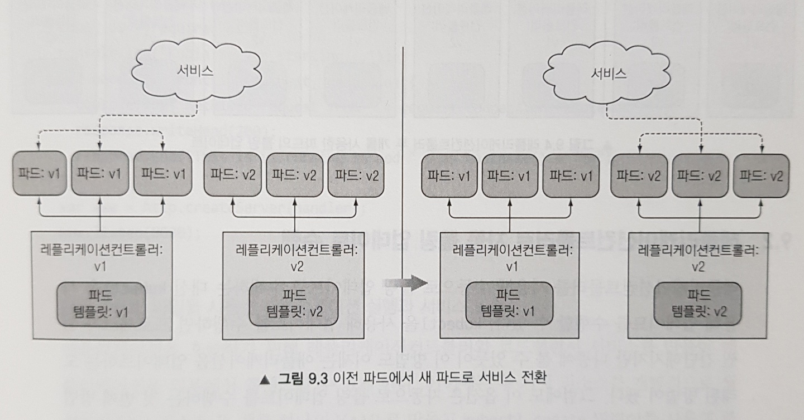

# Week 07 - Kubernetes Deployment

쿠버네티스에서 실행되는 기본 애플리케이션 구조는 외부 클라이언트가 서비스를 통해 파드에 요청을 보내고, 파드는 레플리케이션 컨트롤러 또는 레플리카 셋에 의해 제어됩니다. 이 때 애플리케이션의 새로운 버전을 배포하려고 한다면 어떻게 해야 할까요? 이번 포스팅에서는 쿠버네티스에서 실행되는 애플리케이션을 업데이트하는 방법과 쿠버네티스가 어떻게 무중단 업데이트 프로세스로 전환하는지 알아보겠습니다. 이 작업은 레플리케이션 컨트롤러 또는 레플리카셋을 사용해 수행할 수 있지만, 쿠버네티스는 레플리카셋 기능을 활용하는 디플로이먼트 리소스를 제공해 선언적인 애플리케이션 업데이트를 가능하게 합니다. 이것이 무슨 뜻인지 지금부터 알아보도록 합시다.

# 파드에서 실행중인 애플리케이션 업데이트

파드를 업데이트 하는 방법은 다음과 같은 두 가지가 있습니다.

1. 기존 파드를 모두 삭제한 다음 새 파드를 시작합니다

2. 새로운 파드를 시작하고, 기동하면 기존 파드를 삭제합니다. 새 파드를 모두 추가한 다음 한꺼번에 기존 파드를 삭제하거나 순차적으로 새 파드를 추가하고 기존 파드를 점진적으로 제거할 수 있습니다

위 두 가지 방법은 모두 장단점이 있습니다. 1번의 경우 짧은 시간 동안 다운타임이 발생하고, 2번의 경우 애플리케이션이 배포되는 동안 두 가지 버전이 실행됩니다.

쿠버네티스에서 위 두 가지 방법을 어떻게 수행할까요? 먼저 수동으로 수행하는 방법부터 알아보도록 하겠습니다.

## 오래된 파드를 삭제하고 새 파드로 교체

1번의 경우 버전 v1 파드를 관리하는 레플리카셋의 파드 템플릿의 컨테이너 이미지를 v2로 변경한 뒤, 해당 레플리케이션 컨트롤러에 의해 관리되는 모든 파드를 삭제하면 됩니다. 그러면 컨트롤러에 의해 v2 파드가 즉시 스핀업됩니다.

<figure>
  
  <figcaption style="color: grey;">파드 템플릿을 변경하고 오래된 파드를 삭제하는 방식</figcaption>
</figure>

위 방법은 이전 파드가 삭제되고 새 파드가 시작되는 동안 다운타임이 발생해도 괜찮다면 파드를 업데이트하는 가장 간단한 방법입니다.

## 새 파드 기동과 이전 파드 삭제

2번의 경우 새로운 레플리카셋을 먼저 만들고, 레플리카셋이 스핀업한 파드가 모두 기동되면 서비스가 새로 기동된 파드를 가리키도록 셀렉터를 변경한 뒤 기존 레플리카셋을 삭제하면 됩니다. 이 경우 잠시 동안 두 배의 파드가 실행되므로 더 많은 하드웨어 리소스가 필요합니다.

<figure>
  
  <figcaption style="color: grey;">새 레플리카셋 생성 후 기존 서비스의 셀렉터를 변경하는 방식</figcaption>
</figure>

### 롤링 업데이트

새 파드가 모두 실행된 후 이전 파드를 한 번에 삭제하는 방법 대신 점진적으로 파드를 교체해나가는 롤링 업데이트(rolling update)를 수행할 수도 있습니다.

<figure>
  
  <figcaption style="color: grey;">레플리케이션 컨트롤러 두 개를 사용한 파드의 롤링 업데이트</figcaption>
</figure>

수동으로 롤링 업데이트를 수행하는 것은 어렵고 휴먼 에러(human-error)가 발생하기 쉽습니다. 다행히 쿠버네티스에서는 kubectl 의 `rolling-update` 명령으로 롤링 업데이트를 간단하게 수행할 수 있습니다.

**Note**: `rolling-update` 명령은 현 시점(2021년 5월)을 기준으로 deprecated 되었습니다. 관련된 내용으로 [여기](https://github.com/kubernetes/kubernetes/pull/61285)를 참고하세요. 여기서는 rolling-update 의 동작을 이해하고, 다음 섹션에서 어떤 방식으로 이를 해결했는지 알아봅시다.

```sh
$ kubectl rolling-update OLD_CONTROLLER_NAME NEW_CONTROLLER_NAME --image=NEW_CONTAINER_IMAGE
```

위 처럼 기존 컨트롤러 이름과 새롭게 생성할 컨트롤러의 이름을 지정한 다음, 원래 이미지를 교체할 새 이미지를 명령줄 인자로 제공하면 됩니다. 이렇게 하면 쿠버네티스는 새로운 컨트롤러를 생성하고 롤링 업데이트에 필요한 모든 단계의 명령을 자동으로 수행합니다. 이 때 기존의 컨트롤러에 의해 새로 생성된 파드가 제어되지 않도록 두 컨트롤러에 `deployment` 라벨 셀렉터를 추가하고, 이 라벨 셀렉터에 의해 새로 생성된 파드가 기존의 컨트롤러에게 제어되지 않도록 구분합니다.

<figure>
  
  <figcaption style="color: grey;">롤링 업데이트 중 요청을 이전 파드와 새로운 파드로 전달하는 모습</figcaption>
</figure>

## kubectl rolling-update를 더 이상 사용하지 않는 이유

`rolling-update` 명령 단 한번으로 롤링 업데이트를 수행할 수 있다는 점은 아주 편리한 것 같습니다. 그러나, `rolling-update` 로 애플리케이션을 업데이트하는 것은 더 이상 사용하지 않습니다.

그 이유는 첫 번째로 `rolling-update` 명령은 클라이언트 사이드 명령이기 때문입니다. 즉, 롤링 업데이트의 모든 단계를 kubectl 클라이언트가 쿠버네티스 API를 호출해서 실행한다는 것 입니다. 만약 kubectl 이 업데이트를 수행하는 동안 네트워크 연결이 끊어지게 된다면, 업데이트 프로세스는 중간에 중단되게 됩니다.

또 다른 이유로 이러한 동작은 선언적(declarative)이지 않고 명령적(imperative)이란 것입니다. 쿠버네티스에서는 의도하는 시스템의 상태를 선언(declare)하고 쿠버네티스가 그것을 달성할 수 있는 가장 좋은 방법을 찾아냄으로써 스스로 그 상태를 달성하도록 하는 것을 추구합니다. 즉, 쿠버네티스에 파드를 추가하거나 초과된 파드를 직접 제거하라고 지시하지 말고 그저 원하는 레플리카 수를 선언함으로써 애플리케이션을 업데이트 할 수 있어야 합니다.

마찬가지로 파드 스펙에서 원하는 이미지 태그를 변경하고 쿠버네티스가 파드를 새 이미지로 실행하는 새로운 파드로 교체할 것입니다. 바로 이것이 현재 쿠버네티스에서 애플리케이션을 배포하는 가장 좋은 방법인 디플로이먼트(Deployment)라는 새로운 리소스를 도입하게 된 이유입니다.

# 애플리케이션의 선언적 업데이트: 디플로이먼트

디플로이먼트는 low-level 개념으로 간주되는 레플리케이션 컨트롤러 또는 레플리카셋을 통해 수행하는 대신 애플리케이션을 배포하고 선언적으로 업데이트하기 위한 high-level의 리소스입니다. 디플로이먼트를 생성하면 레플리카셋 리소스가 그 아래에 생성되고, 이 레플리카셋에 의해 파드가 생성되고 관리됩니다.

디플로이먼트의 구조(레플리카셋 위에 다른 오브젝트를 도입한 형태)를 이렇게 만든 이유가 궁금할 것입니다. 앞에서 소개한 롤링 업데이트 예제에서 알 수 있듯이 애플리케이션을 업데이트 할 때는 추가 컨트롤러를 도입하고 두 컨트롤러가 잘 조화되도록 조정해야 합니다. 즉, 전체적으로 통제하는 역할이 필요한데 디플로이먼트가 바로 이를 관리합니다.

**Note**: 디플로이먼트 리소스가 직접 수행하는 것은 아니지만 쿠버네티스 컨트롤 플레인에서 실행중인 컨트롤러 프로세스가 수행합니다. 자세한 내용은 이어지는 블로그 포스팅에서 다룰 예정입니다.

## 디플로이먼트 생성

디플로이먼트를 생성하는 것은 레플리케이션 컨트롤러를 만드는 것과 다르지 않습니다. 레이블 셀렉터, 원하는 레플리카 수, 파드 템플릿으로 구성됩니다. 또한 디플로이먼트 리소스가 수정될 때 업데이트 수행 방법을 정의하는 디플로이먼트 전략을 지정할수도 있습니다.

```yaml
# kubia-deployment-v1.yaml
# 디플로이먼트 API 그룹은 apps 의 v1 버전입니다
apiVersion: apps/v1
kind: Deployment
metadata:
  name: kubia
spec:
  replicas: 3
  selector:
    matchLabels:
      app: kubia
  template:
    metadata:
      name: kubia
      labels:
        app: kubia
    spec:
      containers:
        # luksa/kubia:v1 이미지는 HTTP request에 대해 hostname 을 반환하는 간단한 애플리케이션입니다
        - image: luksa/kubia:v1
          # 컨테이너 이름은 nodejs 라고 합시다(nodejs 애플리케이션이므로)
          name: nodejs
```

```sh
$ kubectl create -f kubia-deployment-v1.yaml -record
deployment.apps/kubia created
```

**Note**: create할 때 반드시 `--record` 옵션을 포함해야 합니다. 이는 명령어를 개정 이력(revision history)에 기록해 나중에 유용하게 사용할 수 있습니다.

이렇게 디플로이먼트를 생성한 뒤 디플로이먼트의 상태를 확인하기 위해 다음과 같이 `rollout` 이란 특별한 명령을 사용할 수 있습니다.

```sh
$ kubectl rollout status deployment kubia
deployment "kubia" successfully rolled out
```

디플로이먼트의 롤아웃이 성공적으로 수행됬다고 나오니, 파드 레플리카 세 개가 시작돼 실행되고 있을 것입니다.

```sh
$ kubectl get pods
NAME                     READY   STATUS    RESTARTS   AGE
kubia-74967b5695-65xpd   1/1     Running   0          107s
kubia-74967b5695-nkshl   1/1     Running   0          107s
kubia-74967b5695-ztqxd   1/1     Running   0          107s
```

애플리케이션을 테스트하기 위해서 파드 셀렉터가 `app: kubia` 인 서비스를 만들고, 이 서비스의 external ip 로 요청을 보내거나 브라우저 주소창에 입력하여 접속하면 정상적으로 응답을 받아오는 것을 확인할 수 있습니다.

예전에 레플리케이션 컨트롤러로 파드를 생성했을 땐 파드의 이름이 컨트롤러 이름과 임의의 문자열(ex. `kubia-m33mv`)로 구성되었는데, 현재 파드의 이름(`kubia-74967b5695-65xpd`)을 살펴보면 이름 중간에 또 다른 문자열이 추가된 것을 확인할 수 있습니다. 이는 디플로이먼트와 파드 템플릿의 해시값으로, 레플리카셋이 이러한 파드를 관리함을 뜻합니다. 디플로이먼트를 생성할 때 함께 생성된 레플리카셋을 살펴보면 같은 해시값을 포함하는 것을 확인할 수 있습니다.

```sh
$ kubectl get rs
NAME               DESIRED   CURRENT   READY   AGE
kubia-74967b5695   3         3         3       6m59s
```

나중에 언급하겠지만 디플로이먼트는 파드 템플릿의 각 버전마다 하나씩 여러 개의 레플리카셋을 만듭니다. 이와 같이 파드 템플릿의 해시값을 사용하면 디플로이먼트에서 지정된 버전의 파드 템플릿에 관해 항상 동일한 레플리카셋을 사용할 수 있습니다.

## 디플로이먼트 업데이트

이전에는 `rolling-update` 를 실행해 쿠버네티스에 업데이트를 수행하도록 명시적으로 지시해야 했습니다. 쿠버네티스가 모든 원본 파드를 새 파드로 교체하고 프로세스가 끝날 때 원본 레플리케이션 컨트롤러를 삭제했고, 이 프로세스 동안 터미널을 열어두고 kubectl 이 롤링 업데이트를 완료할 때 까지 기다려야 했습니다.

이를 디플로이먼트의 업데이트 방법과 비교해봅시다. 디플로이먼트는 파드 템플릿을 수정하기만 하면 쿠버네티스가 실제 시스템 상태를 리소스에 정의된 상태로 만드는 데 필요한 모든 단계를 수행합니다. 이 때 새로운 상태를 달성하는 방법은 디플로이먼트에 구성된 디플로이먼트 전략에 의해 결정됩니다.

### 사용 가능한 디플로이먼트 전략

디플로이먼트는 기본적으로 RollingUpdate라는 전략을 갖는데, 이전 파드를 하나씩 제거하고 동시에 새 파드를 추가해 전체 프로세스에서 애플리케이션을 계속 사용할 수 있도록 하고 서비스 다운타임이 없도록 합니다. 단 애플리케이션이 이전 버전과 새 버전을 동시에 실행할 수 있는 경우에만 이 전략을 사용해야 합니다.

다른 방법으로 Recreate라는 전략을 사용하여 새 파드를 만들기 전 이전 파드를 모두 삭제하는 방법을 적용할 수 있습니다. 이 전략은 RollingUpdate처럼 중단없이 애플리케이션을 업데이트 하지 않기 때문에 짧은 다운타임이 발생합니다.

### 롤링 업데이트 시작

롤아웃을 시작하려면 다음과 같이 파드 컨테이너에 사용되는 이미지를 변경하면 됩니다.

```sh
# 기존 kubia:v1 이미지를 kubia:v2 로 변경합니다
# v2는 v1에 비해 HTTP response 가 다른 애플리케이션입니다
$ kubectl set image deployment kubia nodejs=luksa/kubia:v2
```

위 명령을 실행하면 롤링 업데이트가 시작되고, 이 동안 디플로이먼트 영역에서 발생한 이벤트는 `rolling-update` 명령을 수행하는 동안 발생하는 이벤트와 유사합니다. 추가 레플리카셋이 생성됐고, 그 후 천천히 스케일업하여 이전 레플리카셋의 크기를 0으로 스케일 다운합니다.

<figure>
  
  <figcaption style="color: grey;">롤링 업데이트 시작과 종료 시점의 디플로이먼트</figcaption>
</figure>

롤링 업데이트 후 레플리카셋을 조회하면 기존 레플리카셋과 새 레플리카셋을 나란히 볼 수 있습니다.

```sh
$ kubectl get rs
NAME               DESIRED   CURRENT   READY   AGE
kubia-74967b5695   0         0         0       22m
kubia-bcf9bb974    3         3         3       98s
```

`rolling-update` 명령은 롤링 업데이트 후 기존 컨트롤러를 삭제하는 반면, 디플로이먼트는 롤링 업데이트가 끝나도 이전 레플리카셋을 삭제하지 않았는데, 그 이유는 롤백을 가능하게 하기 위함입니다.

그러나 직접 레플리카셋을 생성한 것이 아니기 떄문에 레플리카셋을 신경쓰지 않아도 됩니다. 디플로이먼트 리소스만 만들고 조작했을 뿐, 세부적인 구현은 하위의 레플리카셋이 담당합니다. 단일 디플로이먼트 오브젝트를 관리하는 것이 여러 레플리케이션 컨트롤러를 처리하고 추적하는 것 보다 훨씬 간단하는데 동의할 것입니다.

롤아웃이 문제없이 잘 수행됬다면 이 차이가 뚜렷하지 않을 수 있지만, 롤아웃 프로세스에 어떤 문제가 발생하면 그 차이를 더욱 분명히 알 수 있습니다. 지금부터 한 가지 문제를 시뮬레이션 해보겠습니다.

## 디플로이먼트 롤백

현재 이미지의 v2 버전을 실행중인데, v3 버전은 다섯 번째 이후 모든 요청에 대해 HTTP 500 으로 응답하는 이미지라고 합시다. v3 버전의 이미지로 디플로이먼트 파드 템플릿을 변경해 새 버전을 배포해봅시다.

```sh
$ kubectl set image deployment kubia nodejs=luksa/kubia:v3
deployment.apps/kubia image updated
```

이전에 만든 서비스의 external ip 로 몇 번의 요청을 보내면 오류를 출력하는 것을 확인할 수 있습니다.

### 롤아웃 되돌리기

사용자가 오류를 경험하게 둘 수 없으므로 조치를 취해야 합니다. 잘못된 버전의 롤아웃을 자동으로 차단하는 방법을 뒤에서 설명하겠지만 지금은 잘못된 롤아웃을 수동으로 처리하는 방법을 알아보도록 하겠습니다.

디플로이먼트는 다음과 같이 `rollout undo` 명령으로 이전에 배포된 버전으로 쉽게 롤백할 수 있습니다.

```sh
$ kubectl rollout undo deployment kubia
deployment.apps/kubia rolled back
```

위 명령을 수행하면 디플로이먼트는 이전 버전으로 롤백합니다.

### 디플로이먼트 롤아웃 이력 표시

이게 가능한 이유는 디플로이먼트가 revision hisotry 를 유지하기 때문입니다. 이러한 이력은 기본 레플리카셋에 저장되는데, 롤아웃이 완료되면 이전 레플리카셋은 삭제되지 않으므로 이전 버전뿐만 아니라 모든 버전으로 롤백할 수 있습니다.

Revision history 는 `rollout history` 명령으로 조회할 수 있습니다

```sh
$ kubectl rollout history deployment kubia
deployment.apps/kubia
REVISION  CHANGE-CAUSE
1         kubectl create --filename=chapter09/kubia-deployment-v1.yaml --record=true
3         kubectl create --filename=chapter09/kubia-deployment-v1.yaml --record=true
4         kubectl create --filename=chapter09/kubia-deployment-v1.yaml --record=true
```

디플로이먼트를 만들 때 사용한 `--record` 명령을 기억하실 겁니다. 이 옵션이 없으면 revision history의 `CHANGE-CAUSE` 열이 비어있어서 각 revision 뒤에 무엇이 있는지 알아내기 어려워질 것입니다.

### 특정 디플로이먼트 revision 으로 롤백

`rollout undo` 명령에서 revision 번호를 지정해 특정 revision 으로 롤백할 수 있습니다. 예를 들어 첫 번째 revision 으로 롤백하고자 한다면 다음과 같이 명령할 수 있습니다.

```sh
# 특정 revision 으로 롤백하려면 --to-revision 옵션을 부여햡니다
$ kubectl rollout undo deployment kubia --to-revision=1
```

디플로이먼트를 처음 수정했을 때 기존 레플리카셋이 남아있던 것을 기억하시나요? 그 레플리카셋은 디플로이먼트의 첫 번째 revision을 나타냅니다. 디플로이먼트에서 생성한 모든 레플리카셋은 전체 revision history를 나타냅니다. 각 레플리카셋은 해당 특정 버전에서 디플로이먼트의 전체 정보를 저장하므로 수동으로 삭제해서는 안됩니다. 그렇게 하면 디플로이먼트 기록에서 특정 버전을 잃어 롤백할 수 없게 됩니다.

이때 revision history 수는 디플로이먼트 리소스의 `editionHistoryLimit` 속성에 의해 제한됩니다. 기본값은 10으로 설정되어 있고, 그보다 이전 레플리카셋은 자동으로 삭제됩니다.

## 롤아웃 속도 제어

롤아웃은 두 가지 추가 속성을 통해 새 파드를 만들고 기존 파드를 삭제하는 방법을 구성할 수 있습니다.

### maxSurge와 maxUnavailable 속성

이 두 가지 속성은 디플로이먼트의 롤링 업데이트 중에 한 번에 몇 개의 파드를 교체할지를 결정합니다. `maxSurge` 와 `maxUnavailable` 은 다음과 같이 디플로이먼트의 `strategy` 속성의 `rollingUpdate` 속성 아래의 일부로 설정할 수 있습니다.

```yaml
spec:
  strategy:
    rollingUpdate:
      # maxSurge 는 레플리카 수를 기준으로 얼마나 많은 파드를 허용할지를 결정합니다
      maxSurge: 1
      # maxUnavailable 은 레플리카 수를 기준으로 사용할 수 없는 파드 수를 결정합니다
      maxUnavailable: 0
    type: RollingUpdate
```

`maxSurge`와 `maxUnavailable` 속성은 기본적으로 레플리카 수의 25%로 설정되고, `maxSurge` 는 반올림되는 반면 `maxUnavailable` 은 내림됩니다.

즉, 의도하는 레플리카 수가 3이면 `maxSurge` 는 모든 파드 수가 4개에 도달하도록 허용하며, `maxUnavailable` 은 사용할 수 없는 파드를 허용하지 않습니다(즉, 항상 파드 3개를 사용할 수 있어야 합니다).

이 경우를 그림으로 나타내면 다음과 같습니다.

<figure>
  
  <figcaption style="color: grey;">레플리카 3개와 기본 maxSurge=1, maxUnavailable=0 인 디플로이먼트의 롤링 업데이트 과정</figcaption>
</figure>

만약 `maxUnavailable` 이 1로 설정되면 롤링 업데이트 과정은 다음과 같습니다.

<figure>
  
  <figcaption style="color: grey;">레플리카 3개와 기본 maxSurge=1, maxUnavailable=1 인 디플로이먼트의 롤링 업데이트 과정</figcaption>
</figure>

`maxSurge`, `maxUnavailable` 속성은 레플리카 수를 기준으로 한다는 점을 명심해야 합니다. 위 그림에서 `maxUnavailable` 은 1 이지만 두 번째 열에서 사용할 수 없는 파드는 두 개가 표시됩니다.

## 롤아웃 프로세스 일시 중지

애플리케이션 v3 버전에서 좋지 않은(?) 경험을 한 뒤 버그를 수정하고 v4 버전 이미지를 푸시했다고 가정해봅시다. 여기서 원하는 것은 기존 v2 파드 옆에 v4 파드 하나를 실행하고 일부 사용자만 작동하는지 확인하는 것입니다. 그런 다음 잘 굴러 간다면 기존 모든 파드를 새 파드로 교체할 수 있습니다.

### 롤아웃 일시 정지

디플로이먼트의 파드 템플릿의 이미지를 v4 로 변경해봅시다. 그런 다음 즉시 `rollout pause` 명령을 실행해 롤아웃을 일시 중지합니다.

```sh
$ kubectl set image deployment kubia nodejs=luksa/kubia:v4
deployment.apps/kubia image updated

$ kubectl rollout pause deployment kubia
deployment.apps/kubia paused
```

이렇게 하면 v4 파드 하나가 실행되고 원본 파드도 모두 실행중인 상태가 됩니다. 이렇게 하면 카나리 릴리스(canary release)를 효과적으로 실행할 수 있습니다.

**Note**: 카나리 릴리스란 잘못된 버전의 애플리케이션이 롤아웃돼 모든 사용자에게 영향을 주는 위험을 최소화하는 기술입니다.

이렇게 해서 새 버전이 제대로 작동하는지 확인한 후 나머지 롤아웃을 계속하거나 이전 버전으로 롤백할 수 있습니다.

### 롤아웃 재개

`rollout pause` 명령으로 중지된 롤아웃은 `rollout resume` 명령으로 재개할 수 있습니다.

```sh
$ kubectl rollout resume deployment kubia
deployment.apps/kubia resumed
```

롤아웃 과정에서 일시 중지해서 카나리 릴리스를 하는 것은 좀 tricky 한 방법이고, 적절한 방법은 두 가지 다른 디플로이먼트를 사용해 적절하게 확장하는 것입니다.

**Note**: 롤아웃이 일시 중지된 경우 롤아웃을 다시 재개해야 `rollout undo` 명령으로 롤백할 수 있습니다.

## 잘못된 버전의 롤아웃 방지

위에서 잘못된 버전의 롤아웃을 `rollout undo` 명령으로 수동으로 처리할 수 있단 것을 배웠습니다. 그러나 더 중요한 것은 잘못된 버전이 롤아웃 될 때 미치는 영향을 최소화하기 위해선, 사태가 발생하고 롤백하는 것이 아닌 사전에 예방할 수 있도록 하고 자동으로 처리하는 방법이 필요합니다.

여기서 `minReadySeconds` 속성이 등장합니다. 이 속성은 파드가 준비된 후 주어진 시간동안 대기하도록 해 배포 속도를 늦추는 기능을 하는데, 그리하여 오작동 버전의 배포를 방지합니다.

### minReadySeconds의 적용 가능성 이해

이 속성은 파드를 사용 가능한 것으로 취급하기 전에 새로 만든 파드를 준비할 시간을 지정합니다. 파드가 사용 가능할 때 까지 롤아웃 프로세스가 계속되지 않습니다. 모든 파드의 레디니스 프로브가 성공하면 파드가 준비됩니다. 만약 `minReadySeconds`가 지나기 전에 새 파드가 제대로 작동하지 않고 레디니스 프로브가 실패하기 시작하면 새 버전의 롤아웃이 효과적으로 차단됩니다.

### 레디니스 프로브 정의

앞에서 문제가 있었던 버전인 v3를 다시 배포해봅시다. 하지만 이번에는 파드에 적절한 레디니스 프로브와 `minReadySeconds` 속성을 정의할 것입니다. 그리하여 잘못된 버전의 롤아웃을 어떻게 자동으로 방지할 수 있는지 보여드리도록 하겠습니다.

이전에는 레디니스 프로브가 정의되지 않았기 때문에, 파드가 실제로 준비되지 않았거나 오류를 반환하더라도 컨테이너와 파드는 항상 준비된 것으로 간주되었습니다. 쿠버네티스가 애플리케이션이 오작동 했으며 클라이언트에게 노출돼서는 안 된다는 것을 알 방법이 없었던 것입니다.

이전에 작성한 디플로이먼트 디스크립터에서 파드 템플릿의 이미지를 변경하고 레디니스 프로브를 추가합시다.

```yaml
# kubia-deployment-v3-with-readinesscheck.yaml
apiVersion: apps/v1
kind: Deployment
metadata:
  name: kubia
spec:
  replicas: 3
  selector:
    matchLabels:
      app: kubia
  # minReadySeconds 를 10으로 설정합니다. 즉 파드가 준비된 후 10초 동안 대기하게 됩니다
  minReadySeconds: 10
  strategy:
    rollingUpdate:
      maxSurge: 1
      # 디플로이먼트가 파드를 하나씩 교체하도록 maxUnavailable 을 0으로 설정합니다
      maxUnavailable: 0
    type: RollingUpdate
  template:
    metadata:
      name: kubia
      labels:
        app: kubia
    spec:
      containers:
        # 문제의 버전인 v3로 이미지를 설정합니다
        - image: luksa/kubia:v3
          name: nodejs
          # 1초 마다 실행되는 레디니스 프로브를 정의합니다
          readinessProbe:
            periodSeconds: 1
            # 레디니스 프로브는 컨테이너에 HTTP GET 요청을 수행합니다
            httpGet:
              path: /
              port: 8080
```

### kubectl apply를 통한 디플로이먼트 업데이트

위에서 작성한 디플로이먼트 디스크립터를 `kubectl apply` 명령으로 디플로이먼트를 업데이트 합니다.

```sh
$ kubectl apply -f kubia-deployment-v3-with-readinesscheck.yaml
deployment.apps/kubia configured
```

위 명령을 실행하면 롤링 업데이트 프로세스가 시작됩니다. 이때 `rollout status` 명령으로 롤아웃 프로세스를 추적해보면 진전이 없는 것을 확인할 수 있습니다. curl 로 서비스에 요청을 보내도 v3 파드에 접근할 수 없는 것을 확인할 수 있습니다. 왜일까요? 파드가 없는 것일까요? 파드를 조회해보면 다음과 같을 것입니다.

```sh
$ kubectl get pods
NAME                     READY   STATUS    RESTARTS   AGE
kubia-555774bf68-8tdbh   1/1     Running   0          27m
kubia-555774bf68-cr6z4   1/1     Running   0          23m
kubia-555774bf68-h9lqn   1/1     Running   0          23m
kubia-86499d4c5f-68zsd   0/1     Running   0          34s
```

문제를 찾았습니다. 파드가 준비되지 않았던 것이었습니다. 그러나 이는 우리가 예상했던 것이죠. v3는 잘못된 버전이기 때문에, 롤아웃이 진행되지 않고 있는 것입니다. 지금부터 무슨일이 벌어진 것인지 말씀드리겠습니다.

### 레디니스 프로브가 잘못된 버전으로 롤아웃되는 것을 방지하는 법

새 파드가 시작되자마자 레디니스 프로브가 매초마다 시작됩니다. v3는 다섯번째 요청부터 HTTP status가 500 인 응답을 반환하기 때문에, 5초 뒤에 레디니스 프로브가 실패하기 시작합니다.

결과적으로 새 파드는 아직 준비되지 않은 것으로 판단되며 서비스의 엔드포인트에서 제거됩니다. 이것이 바로 서비스로 요청을 보내도 파드에 접속하지 못한 이유입니다. 제대로 동작하지 않는 파드에 사용자가 접근할 수 없도록 하기 때문인데 이것이 바로 우리가 바라던 것입니다.

<figure>
  
  <figcaption style="color: grey;">새 파드에서 레디니스 프로브의 실패로 차단된 디플로이먼트</figcaption>
</figure>

`rollout status` 명령으로 추적하던 롤아웃 프로세스는 하나의 새 레플리카셋만 시작됐음을 보여줍니다. 새 파드를 사용할 수 없기 때문에 롤아웃 프로세스가 계속되지 않습니다. 또한 앞에서 `maxUnavailable`을 0으로 설정했기 때문에 원래 파드도 제거되지 않습니다.

**Note**: `minReadySeconds`를 올바르게 설정하지 않고 레디니스 프로브만 정의하는 경우 레디니스 프로브의 첫 번째 호출이 성공하면 즉시 새 파드가 준비된 것으로 간주됩니다. 레디니스 프로브가 곧 실패하면 모든 파드에서 잘못된 버전이 롤아웃됩니다. 따라서 `minReadySeconds` 를 적절히 설정해야 합니다.

### 롤아웃 데드라인 설정

기본적으로 롤아웃이 10분동안 진행되지 않으면 실패한 것으로 간주됩니다. `kubectl describe deployment` 명령으로 다음과 같이 `ProgressDeadlineExceeded` 조건이 표시됩니다.

```sh
$ kubectl describe deployment kubia
Name:                   kubia
...
Conditions:
  Type           Status  Reason
  ----           ------  ------
  Available      True    MinimumReplicasAvailable
  Progressing    False   ProgressDeadlineExceeded # 디플로이먼트를 진행하는 데 너무 오래 걸렸단 것을 확인할 수 있습니다
```

디플로이먼트가 실패한 것으로 간주되는 시간은 디플로이먼트 디스크립터에서 `progressDeadlineSeconds` 속성으로 설정할 수 있습니다.

# Recap

이번 포스팅에서는 쿠버네티스에서 애플리케이션을 선언적으로 업데이트하는 방식을 제공하는 디플로이먼트 리소스에 대해서 살펴보았습니다. 이번 포스팅에서 다룬 내용을 정리하면 다음과 같습니다.

- 기존 레플리케이션 컨트롤러에서 관리하는 파드의 롤링 업데이트 방법(`rolling-update`)
- 낮은 수준의 레플리케이션 컨트롤러 또는 레플리카셋 대신 디플로이먼트 생성하기
- 디플로이먼트 스펙에서 파드 템플릿을 편집해 파드 업데이트하기
- 디플로이먼트를 이전 revision 이나 revision history에 조회된 특정 revision 으로 롤백하기
- 롤아웃 중간에 롤아웃 중단하기, 카나리 릴리스 방법
- `maxSurge` 와 `maxUnavailable` 속성으로 롤링 업데이트 속도 제어하기
- 결함이 있는 버전의 롤아웃이 자동으로 차단되도록 `minReadySeconds`와 레디니스 프로브 사용하기

# References

- Kubernetes in Action
