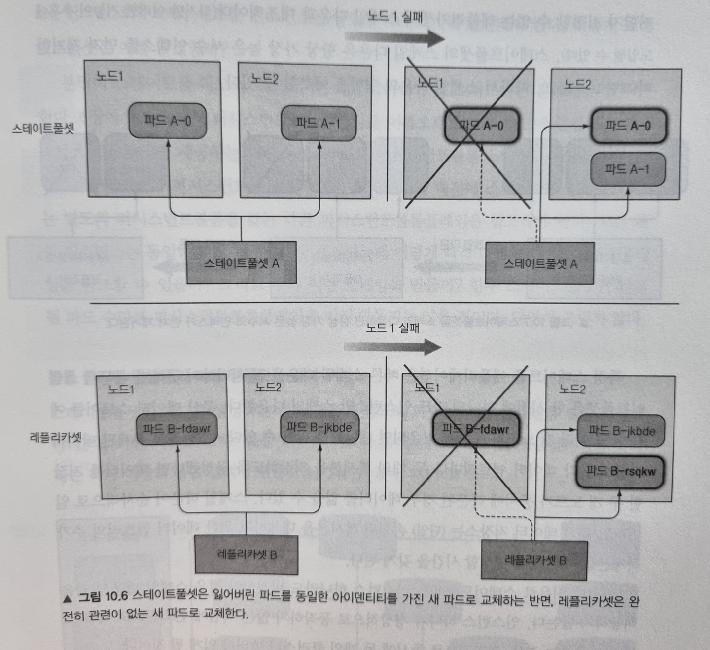
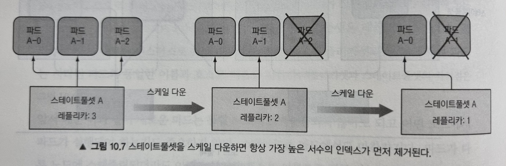
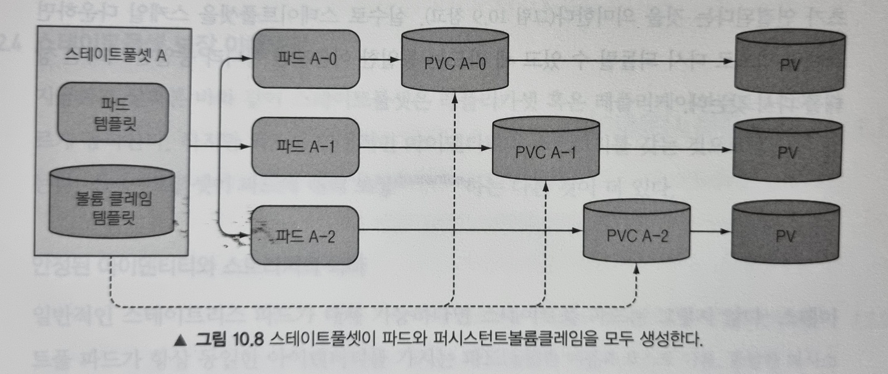
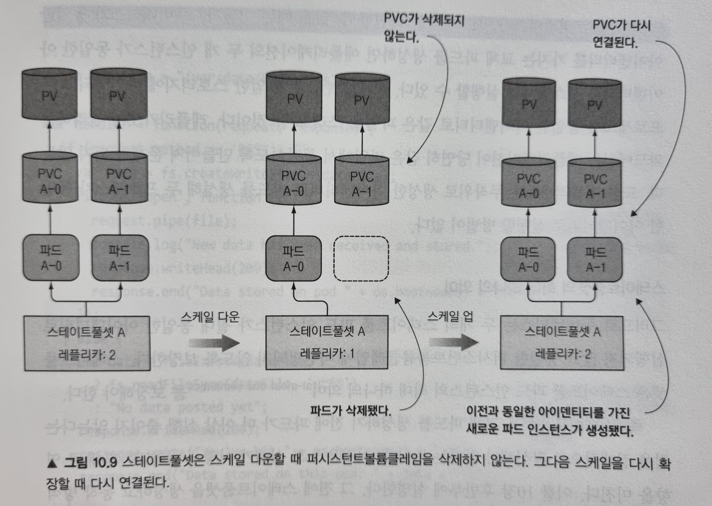
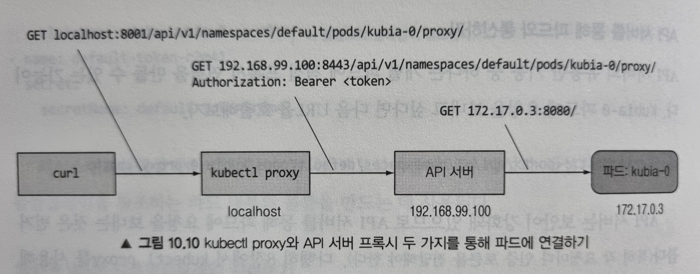
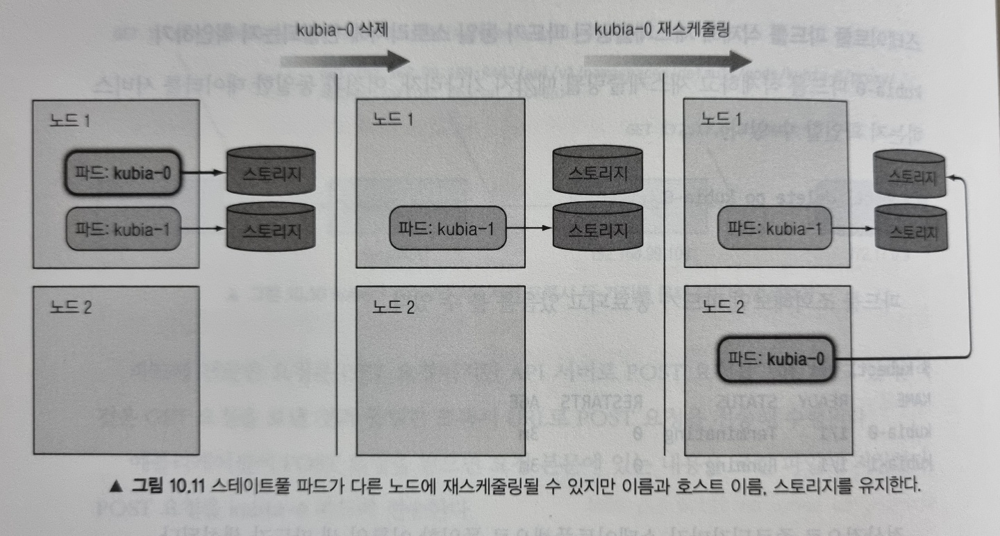
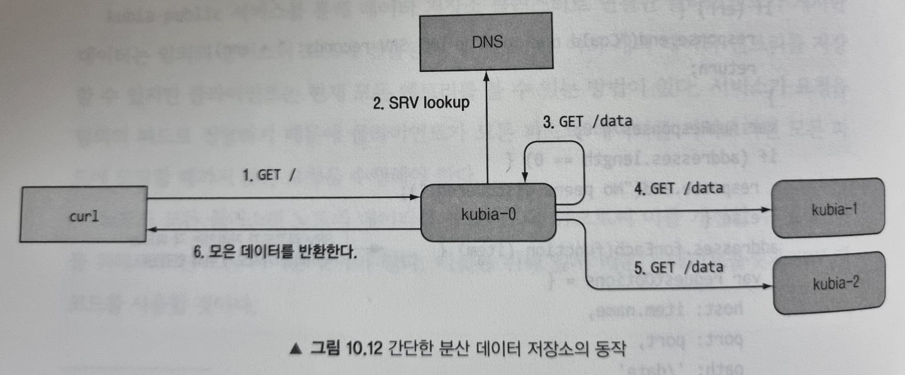

# Week 08 - Kubernetes StatefulSets

이번 포스팅에서는 파드가 안정적인(장시간 지속적으로 변하지 않는) 아이덴티티(네트워크 식별자, 스토리지 등) 개별적으로 취급될 수 있도록 하는 스테이트풀셋에 대해서 소개해드리겠습니다. 스테이트풀셋을 이해하는 가장 빠른 방법은 레플리카셋과 비교하는 것인데, 한 가지 비유를 들어 설명해보겠습니다.

# 스테이트풀셋 이해하기

쿠버네티스 클러스터상에서 돌아가는 애플리케이션을 애완동물(pets)이나 가축(cattle)으로 생각해봅시다. 개발자는 각 인스턴스에 이름을 부여하고 개별적으로 관리한다는 점에서 애플리케이션을 애완동물처럼 대하는 경향이 있는데, 그러한 각별한 주의를 기울일 필요 없이 가축처럼 취급하는 편이 더 나을 수 있습니다. 그러면 농부가 병든 가축을 교체하는 것 처럼 비정상적인 인스턴스를 주저없이 교체할 수 있기 때문입니다. 스테이트리스(stateless) 애플리케이션의 인스턴스는 가축과 같이 동작합니다. 인스턴스가 죽더라도 새로운 인스턴스를 만들 수 있고 사람들은 그 차이를 눈치채지 못할 것이기 떄문에 인스턴스가 죽는 것은 아무런 문제가 되지 않습니다.

그러나 스테이트풀(stateful) 애플리케이션은 애완동물과 같습니다. 애완동물이 죽었을 때 새 애완동물을 바로 살 수 없고, 주변 사람들도 금방 알아차릴 것이기 때문입니다. 잃어버린 애완동물을 대체하기 위해선 이전 애완동물과 생김새나 행동이 완전히 똑같은 새로운 애완동물을 찾아야 하는데, 이는 애플리케이션의 경우 새 인스턴스가 이전 인스턴스와 완전히 같은 상태와 아이덴티티를 가져야 함을 의미합니다.

레플리카셋이나 레플리케이션 컨트롤러로 관리되는 파드는 가축과 같습니다. 이 파드들은 stateless로 언제든지 새로운 파드로 교체될 수 있습니다. 반면 스테이트풀셋으로 관리되는 파드는 stateful해서 새로운 파드로 교체될 때 동일한 이름, 네트워크 아이덴티티, 상태 그대로 다음 노드에서 되살아납니다.

## 안정적인 네트워크 아이덴티티 제공하기

### 순서 색인

스테이트풀셋으로 생성된 파드는 0번 부터 인덱스가 할당되고 스테이트풀셋의 이름과 이 인덱스를 조합하여 호스트 이름을 얻습니다. 예를 들어 스테이트풀셋의 이름이 `A` 라면 생성된 파드의 이름은 `A-0`, `A-1`, ... 가 됩니다.

### 거버닝 헤드리스 서비스

스테이트풀셋은 현재 파드의 네트워크 신원을 책임질 거버닝 헤드리스 서비스(governing headless service)가 필요합니다. 그리하여 각 파드에게 실제 네트워크 아이덴티티를 제공해야 합니다. 이 서비스를 통해 각 파드는 자체 DNS 엔트리를 가지게 됩니다.

예를 들어 `default` 네임스페이스에 속하는 `foo` 란 이름의 서비스가 있고 파드의 이름이 `A-0` 라면, 이 파드는 `a-0.foo.default.svc.cluster.local` 이라는 FQDN을 통해 접근할 수 있습니다. 여기서 `foo` 라는 거버닝 서비스는 스테이트풀셋의 `serviceName` 필드에 의해 참조됩니다.

### 애완동물 교체하기

스테이트풀셋으로 관리되는 파드 인스턴스가 사라지면 새로운 파드로 교체되는데, 이때 새로운 파드는 이전 파드와 동일한 이름과 호스트 이름을 갖습니다.

<figure>
  
  <figcaption style="color: grey;">레플리카셋과 스테이트풀셋의 파드 교체 비교</figcaption>
</figure>

### 스케일링

스테이트풀셋을 스케일링하면 다음 서수 인덱스를 갖는 새로운 파드 인스턴스를 생성합니다. 예를 들어 두 개에서 세 개로 스케일업하면 새 파드는 인덱스 2를 부여받습니다.

반대로 스케일 다운의 경우 항상 가장 높은 서수 인덱스를 가진 파드를 먼저 제거합니다. 따라서 스케일 다운의 영향을 예측할 수 있습니다.

<figure>
  
  <figcaption style="color: grey;">순서대로 스케일 다운되는 스테이트풀셋</figcaption>
</figure>

스테이트풀셋은 한 시점에 단 하나의 파드 인스턴스만 스케일 다운하는데, 이는 분산 데이터 스토어와 같이 여러 노드가 동시에 다운되면 데이터를 잃을 수 있는 위험이 있기 때문입니다. 그래서 스테이트풀셋은 인스턴스 하나라도 비정상인 경우 스케일 다운 작업을 허용하지 않는데, 인스턴스 하나가 정상 동작하지 않는 시점에 인스턴스 하나를 스케일 다운하는 경우 결과적으로 두 개의 클러스터 멤버를 잃게 되기 때문입니다.

## 안정적인 전용 스토리지 제공하기

각 파드가 동일한 PVC(퍼시스턴트볼륨클레임)를 참조하지 않기 위해선 스테이트풀셋이 파드를 생성하는 것과 같은 방식으로 PVC 또한 생성해야 합니다. 그리하여 스테이트풀셋은 파드 템플릿과 함께 볼륨 클레임 템플릿을 가질 수 있습니다.

<figure>
  
  <figcaption style="color: grey;">볼륨클레임템플릿으로 개별 파드에 고유한 볼륨과 PVC를 생성</figcaption>
</figure>

### 퍼시스턴트볼륨클레임의 생성과 삭제 이해

스테이트풀셋이 스케일 다운할 때 파드만 삭제하고 클레임은 남겨두는데, 이는 데이터를 영구적으로 남겨두기 위함입니다. 클레임이 삭제되는 경우 바인딩됐던 퍼시스턴트 볼륨은 재활용되거나 삭제되기 때문입니다. 즉, 스테이트풀셋에 의해 사용되는 PVC와 PV(퍼시스턴트 볼륨)는 반드시 수동으로 삭제해야 합니다.

스케일 다운 이후 다시 스케일 업을 하면 남아 있던 PVC를 파드에 다시 연결할 수 있고, PVC는 PV에 계속 바인딩 되어 있기 때문에 콘텐츠를 지속적으로 전달할 수 있습니다.

<figure>
  
  <figcaption style="color: grey;">파드가 삭제되어도 PVC는 삭제되지 않는다</figcaption>
</figure>

# 스테이트풀셋 사용하기

스테이트풀셋을 직접 사용해보기 위해 아주 간단한 클러스터된 데이터 저장소를 직접 구축해봅시다.

예제 애플리케이션은 POST 요청을 받을때마다 body에 포함된 데이터를 `/var/data/kubia.txt` 파일에 기록한다고 생각해봅시다. GET요청을 받으면 호스트 이름과 저장된 데이터를 반환합니다. 이 애플리케이션의 [소스 코드](https://github.com/luksa/kubernetes-in-action/blob/master/Chapter10/kubia-pet-image/app.js)와 [Dockerfile](https://github.com/luksa/kubernetes-in-action/blob/master/Chapter10/kubia-pet-image/Dockerfile)을 참고하세요. 이미 빌드된 이미지는 [docker.io/luksa/kubia-pet](https://hub.docker.com/r/luksa/kubia-pet) 을 사용하면 됩니다.

## 스테이트풀셋을 통한 애플리케이션 배포

스테이트풀셋 애플리케이션을 배포하기 위해선 다음과 같은 오브젝트를 생성해야 합니다.

- 데이터 파일을 저장하기 위한 PV(클러스터가 동적 프로비저닝을 지원하지 않는 경우 직접 생성)
- 헤드리스 거버닝 서비스
- 스테이트풀셋 자체

스테이트풀셋은 PV에 바인딩되는 PVC를 생성하는데, 클러스터가 동적 프로비저닝을 지원하면 PV를 수동으로 생성할 필요가 없지만 그렇지 않은 경우 아래와 같이 직접 생성해야 합니다.

### 퍼시스턴트볼륨 생성하기

여기서는 Minikube를 사용하기 때문에 hostpath 를 PV로 사용하도록 합니다. 그리하여 다음과 같이 `pv-a`, `pv-b`, `pv-c` 라는 3개의 PV를 생성합니다.

```yaml
# 이 kind 는 세 개의 PV의 리스트(list)를 나타냅니다
kind: PersistentVolumeList
apiVersion: v1
items:
  - apiVersion: v1
    kind: PersistentVolume
    metadata:
      name: pv-a
    spec:
      capacity:
        storage: 1Mi
      accessModes:
        - ReadWriteOnce
      # 클레임에서 볼륨이 해제되면 다시 사용해 재사용합니다
      persistentVolumeReclaimPolicy: Recycle
      # 볼륨은 hostPath를 기반 스토리지 매커니즘으로 사용합니다
      hostPath:
        path: /tmp/pv-a

  - apiVersion: v1
    kind: PersistentVolume
    metadata:
      name: pv-b
    spec:
      capacity:
        storage: 1Mi
      accessModes:
        - ReadWriteOnce
      persistentVolumeReclaimPolicy: Recycle
      hostPath:
        path: /tmp/pv-b

  - apiVersion: v1
    kind: PersistentVolume
    metadata:
      name: pv-c
    spec:
      capacity:
        storage: 1Mi
      accessModes:
        - ReadWriteOnce
      persistentVolumeReclaimPolicy: Recycle
      hostPath:
        path: /tmp/pv-c
```

### 거버닝 서비스 생성하기

스테이트풀셋은 파드의 네트워크 신원을 책임질 거버닝 헤드리스 서비스가 필요하다고 앞에서 설명하였습니다. 다음과 같이 서비스를 생성해줍니다.

```yaml
apiVersion: v1
kind: Service
metadata:
  name: kubia
spec:
  # 스테이트풀셋의 거버닝 서비스는 헤드리스여야 합니다
  clusterIP: None
  selector:
    app: kubia
  ports:
    - name: http
      port: 80
```

### 스테이트풀셋 생성하기

이제 다음과 같이 스테이트풀셋을 생성할 수 있습니다.

```yaml
apiVersion: apps/v1
kind: StatefulSet
metadata:
  name: kubia
spec:
  # 위에서 정의한 서비스의 이름을 참조해서 거버닝 서비스로 사용합니다
  serviceName: kubia
  replicas: 2
  selector:
    matchLabels:
      app: kubia
  template:
    metadata:
      labels:
        app: kubia
    spec:
      containers:
        - name: kubia
          image: luksa/kubia-pet
          ports:
            - name: http
              containerPort: 8080
          volumeMounts:
            - name: data
              mountPath: /var/data
  volumeClaimTemplates:
    - metadata:
        name: data
      spec:
        resources:
          requests:
            storage: 1Mi
        accessModes:
          - ReadWriteOnce
        storageClassName: ""
```

레플리카셋의 디스크립터와 많이 다르지 않습니다. 단지 PVC 템플릿을 나타내는 `volumeClaimTemplates` 가 추가되었습니다.

주목할만한 것은 이전에 파드에서 PVC를 참조하기 위해 `volumes.persistentVolumeClaim` 필드를 정의했었는데, 위 파드 템플릿에서는 찾아볼 수 없습니다. 그 이유는 스테이트풀셋이 파드 스펙에 자동으로 볼륨을 추가하고 클레임에 볼륨이 바인딩되도록 설정하기 때문입니다.

위 디스크립터를 게시해서 스테이트풀셋을 생성한 뒤 파드를 조회하면 다음과 같이 첫 번째 파드가 먼저 실행되고 두 번째 파드가 생성되는 것을 확인할 수 있습니다.

```sh
$ kubectl get pods
NAME      READY   STATUS              RESTARTS   AGE
kubia-0   1/1     Running             0          10s
kubia-1   0/1     ContainerCreating   0          3s
```

### 생성된 스테이트풀 파드 살펴보기

파드 스펙을 자세히 살펴보면 파드가 사용중인 볼륨과 마운트 경로를 확인할 수 있습니다.

```sh
$ kubectl get pods kubia-0 -o yaml
apiVersion: v1
kind: Pod
metadata:
  ...
spec:
  containers:
  - image: luksa/kubia-pet
      ...
    # 파드 템플릿에 명시한대로 data 볼륨을 /var/data에 마운트한 것을 확인할 수 있습니다
    volumeMounts:
    - mountPath: /var/data
      name: data
    - mountPath: /var/run/secrets/kubernetes.io/serviceaccount
      name: default-token-zn82v
      readOnly: true
...
# 스테이트풀셋이 자동으로 볼륨 필드를 생성했습니다
volumes:
  - name: data
    persistentVolumeClaim:
      claimName: data-kubia-0
  - name: default-token-zn82v
    secret:
      defaultMode: 420
      secretName: default-token-zn82v
```

볼륨 클레임 템플릿이 PVC의 생성과 PVC를 참조하는 파드 내부의 볼륨을 만드는 데 사용된 것을 확인할 수 있습니다.

### 생성된 퍼시스턴트볼륨클레임 살펴보기

생성된 퍼시스턴트볼륨클레임을 조회하면 다음과 같습니다.

```sh
$ kubectl get pvc
NAME           STATUS   VOLUME   CAPACITY   ACCESS MODES   STORAGECLASS   AGE
data-kubia-0   Bound    pv-a     1Mi        RWO                           36m
data-kubia-1   Bound    pv-b     1Mi        RWO                           36m
```

생성된 PVC의 이름은 `volumeClaimTemplate`에 정의된 이름과 파드 이름의 조합입니다.

## 파드 가지고 놀기

현재 생성된 서비스는 헤드리스 이므로 서비스 디스커버리 역할을 할 수가 없습니다. 즉, 서비스를 통해 파드와 통신할 수 없습니다. 파드를 가지고 놀기 위해서 먼저 개별 파드에 직접 연결해야 하는데, 여기서는 API 서버를 파드의 프록시로 사용해보도록 하겠습니다.

다음과 같이 `kubectl proxy` 를 사용하면 SSL 인증서와 자격 증명 없이 API 서버와 통신할 수 있습니다.

```sh
$ kubectl proxy
Starting to serve on 127.0.0.1:8001
```

이제 proxy를 통해 API 서버와 통신하므로 다음과 같이 `kubia-0` 파드에 요청을 보낼 수 있습니다.

```sh
$ curl localhost:8001/api/v1/namespaces/default/pods/kubia-0/proxy/
You've hit kubia-0
Data stored on this pod: No data posted yet
```

**Note**: pod에 요청을 보내기 위한 URL scheme는 `{API_SERVER_HOST}:{PORT}/api/v1/namespaces/{NAMESPACE}/pods/{POD_NAME}/proxy/{PATH}` 입니다.

<figure>
  
  <figcaption style="color: grey;">프록시와 API 서버를 통해 파드에 연결하는 모습</figcaption>
</figure>

또한 GET 요청 뿐만 아니라 POST 요청도 보낼 수 있습니다.

```sh
$ curl -X POST -d "Hey there! This greeting was submitted to kubia-0." localhost:8001/api/v1/namespaces/default/pods/kubia-0/proxy/
Data stored on pod kubia-0
```

예제로 만든 애플리케이션이 POST 요청을 받으면 body에 있는 데이터를 로컬 파일로 저장한다고 언급했습니다. 다시 GET 요청을 보내서 저장된 데이터를 반환하는지 확인해봅시다.

```sh
$ curl localhost:8001/api/v1/namespaces/default/pods/kubia-0/proxy/
You've hit kubia-0
Data stored on this pod: Hey there! This greeting was submitted to kubia-0.
```

저장한 데이터를 잘 반환하고 있습니다. 이제 0번이 아닌 1번(kubia-1) 파드를 살펴보겠습니다.

```sh
$ curl localhost:8001/api/v1/namespaces/default/pods/kubia-1/proxy/
You've hit kubia-1
Data stored on this pod: No data posted yet
```

예상대로 1번 파드에는 저장된 데이터가 없다고 나옵니다. 이로써 파드가 서로 다른 스토리지에 연결되어 있는 것을 확인할 수 있습니다.

### 스테이트풀 파드를 삭제해 재스케줄링된 파드가 동일 스토리지에 연결되는지 확인하기

`kubia-0` 파드를 삭제하고 재스케줄링 하였을 때 이전과 동일한 데이터를 서비스하는지 확인해봅시다. 먼저 파드를 삭제해보겠습니다.

```sh
$ kubectl delete po kubia-0
pod "kubia-0" deleted
```

파드를 조회해보면 파드가 종료되는 것과 종료되자마자 동일한 이름의 새 파드가 생성되는 것을 확인할 수 있습니다.

```sh
$ kubectl get pods
NAME      READY   STATUS        RESTARTS   AGE
kubia-0   1/1     Terminating   0          3h35m
kubia-1   1/1     Running       0          3h34m

$ kubectl get pods
NAME      READY   STATUS    RESTARTS   AGE
kubia-0   1/1     Running   0          4s
kubia-1   1/1     Running   0          3h35m
```

새롭게 생성된 파드가 이전 파드와 동일한 아이덴티티를 갖는지 확인해보겠습니다. 호스트 이름과 영구 데이터가 동일하다면 이전과 같은 curl 요청을 보냈을 때 저장된 데이터를 반환해야 합니다.

```sh
$ curl localhost:8001/api/v1/namespaces/default/pods/kubia-0/proxy/
You've hit kubia-0
Data stored on this pod: Hey there! This greeting was submitted to kubia-0
```

응답이 동일합니다! 호스트 이름과 데이터가 이전과 동일하다는 것을 잘 보여주고 있습니다. 이로써 스테이트풀셋이 항상 삭제된 파드를 완전히 동일한 파드로 교체한다는 것을 확인할 수 있습니다.

<figure>
  
  <figcaption style="color: grey;">파드가 다른 노드에 스케줄링 되어도 이전에 연결했던 스토리지에 연결됩니다</figcaption>
</figure>

### 스테이트풀 파드를 헤드리스가 아닌 일반 서비스로 노출하기

보통 클라이언트는 파드에 직접 연결하기보다 서비스를 통해 연결하므로 헤드리스가 아닌 서비스를 파드 앞에 추가할 수 있습니다. 다음과 같이 간단한 서비스를 생성해봅시다.

```yaml
apiVersion: v1
kind: Service
metadata:
  name: kubia-public
spec:
  selector:
    app: kubia
  ports:
    - port: 80
      targetPort: 8080
```

노드포트나 로드밸런서 유형의 서비스가 아닌 CluterIP 서비스임을 주목합시다. 클러스터 내부에서만 위 서비스에 접근할 수 있습니다.

외부에서 서비스에 접근하기 위해 이전과 동일한 방법으로 API 서버를 프록시로 활용할 수 있습니다.

```sh
$ curl localhost:8001/api/v1/namespaces/default/services/kubia-public/proxy/
You've hit kubia-0
Data stored on this pod: Hey there! This greeting was submitted to kubia-0.
```

**Note**: 서비스에 요청을 보내기 위한 URL scheme는 `{API_SERVER_HOST}:{PORT}/api/v1/namespaces/{NAMESPACE}/services/{SERVICE_NAME}/proxy/{PATH}` 입니다.

마찬가지로 클러스터 내부의 클라이언트도 이 데이터 저장소에 접근하기 위해 `kubia-public` 서비스를 사용할 수 있습니다. 단 지금으로선 각 요청은 임의의 파드로 전달되는데, 다음에 이 부분을 개선해보겠습니다.

# 스테이트풀셋의 피어 디스커버리

클러스터된 애플리케이션의 중요한 요구 사항으로 피어 디스커버리가 있습니다. 스테이트풀셋의 각 파드는 다른 파드를 쉽게 찾을 수 있어야합니다. 쿠버네티스 API 서버와 통신해 찾을 수 있긴 하지만 이는 좋은 방법은 아닙니다(애플리케이션이 쿠버네티스와 완전히 독립적이여야 함).

파드가 API로 요청하지 않고 피어를 디스커버리하는 방법으로 DNS(SRV 레코드)를 활용할 수 있습니다.

### SRV 레코드 소개

SRV 레코드는 특정 서비스를 제공하는 서버의 호스트 이름과 포트를 가리키는데 사용됩니다. 쿠버네티스는 헤드리스 서비스를 뒷받침하는 파드의 호스트 이름을 가리키도록 SRV 레코드를 생성합니다.

이해를 돕기 위해 간단한 임시 파드(`srvlookup`)를 만들어 DNS lookup 도구인 `dig` 명령을 실행해 스테이트풀 파드의 SRV 레코드를 조회해봅시다.

```sh
+ kubectl run -it srvlookup --image=tutum/dnsutils --rm --restart=Never -- dig SRV kubia.default.svc.cluster.local
```

위 명령을 실행한 결과는 다음과 같습니다.

```sh
...
;; ANSWER SECTION:
kubia.default.svc.cluster.local. 30 IN	SRV	0 50 80 kubia-0.kubia.default.svc.cluster.local.
kubia.default.svc.cluster.local. 30 IN	SRV	0 50 80 kubia-1.kubia.default.svc.cluster.local.

;; ADDITIONAL SECTION:
kubia-0.kubia.default.svc.cluster.local. 30 IN A 172.17.0.4
kubia-1.kubia.default.svc.cluster.local. 30 IN A 172.17.0.5
...
```

ANSWER SECTION에는 헤드리스 서비스를 뒷받침하는 두 파드를 가리키는 두 SRV 레코드를 보여줍니다. 또한 각 파드는 ADDITIONAL SECTION에 표시된 것처럼 자체 A 레코드를 가집니다.

자, 그럼 파드가 스테이트풀셋의 다른 모든 파드의 목록을 가져오기 위해선 SRV DNS 룩업을 수행하기만 하면 된다는 것을 알았습니다. 이제 각 파드가 피어를 디스커버리 할 수 있도록 애플리케이션을 조금 수정해봅시다.

## DNS를 통한 피어 디스커버리

현재 데이터 저장소 예제는 완전히 다른 저장소와 독립적으로 실행되고 서로 상호작용하지 않고 있습니다. DNS를 통해 피어 디스커버리하는 방법을 알았으니 이제 이들을 통신하도록 해봅시다.

`kubia-public` 서비스를 통해 클라이언트가 전달한 데이터는 임의의 데이터 저장소 파드에 전달됩니다. 즉 클라이언트가 모든 파드의 데이터를 가져오려면 모든 파드에 도달할 때 까지 많은 요청을 수행해야 합니다.

파드가 모든 클러스터 파드의 데이터를 응답하도록 함으로써 이를 개선해봅시다. GET 요청을 받으면 `dns.resolveSrv("kubia.default.svc.cluster.local", callback);` 함수를 통해 SRV DNS 룩업을 수행하고 찾은 모든 피어의 데이터를 반환하는 로직이 추가됩니다. 변경된 [소스코드](https://github.com/luksa/kubernetes-in-action/blob/master/Chapter10/kubia-pet-peers-image/app.js)와 [도커 이미지](https://hub.docker.com/r/luksa/kubia-pet-peers)를 참고하세요.

<figure>
  
  <figcaption style="color: grey;">SRV DNS 룩업으로 피어 디스커버리를 수행</figcaption>
</figure>

## 스테이트풀셋 업데이트

변경된 애플리케이션 이미지를 스테이트풀셋에 적용하기위해 다음 명령을 실행하여 파드 템플릿을 수정해줍시다.

```sh
$ kubectl edit statefulset kubia
```

`spec.replicas` 를 3으로 변경하고 `spec.template.spec.container.image` 를 새 애플리케이션 이미지(luksa/kubia-pet-peers)로 변경해줍니다. 저장하면 새로운 파드가 생성되기 시작합니다.

```sh
$ kubectl get pods
NAME      READY   STATUS    RESTARTS   AGE
kubia-0   1/1     Running   0          63m
kubia-1   1/1     Running   0          4h38m
kubia-2   0/1     Pending   0          1s
```

2번 파드의 생성이 완료되면 1번, 0번 파드도 순서대로 교체됩니다.

**Note**: 스테이트풀셋은 쿠버네티스 버전 1.7부터 롤링 업데이트를 지원합니다.

## 클러스터된 데이터 저장소 사용하기

이제 데이터 저장소가 예상대로 동작(피어 디스커버리)하는지 확인해봅시다. 아래 처럼 몇 가지 요청을 `kubia-public` 서비스에 보내봅시다.

```sh
$ curl -X POST -d "The sun is shining" localhost:8001/api/v1/namespaces/default/services/kubia-public/proxy/
Data stored on pod kubia-1

$ curl -X POST -d "The weather is sweet" localhost:8001/api/v1/namespaces/default/services/kubia-public/proxy/
Data stored on pod kubia-2
```

이제 데이터 저장소에서 읽어와봅시다.

```sh
$ curl localhost:8001/api/v1/namespaces/default/services/kubia-public/proxy/
You've hit kubia-0
Data stored in the cluster:
- kubia-0.kubia.default.svc.cluster.local: Hey there! This greeting was submitted to kubia-0.
- kubia-1.kubia.default.svc.cluster.local: The sun is shining
- kubia-2.kubia.default.svc.cluster.local: The weather is sweet
```

클라이언트의 요청이 모든 피어를 디스커버리해 데이터를 수집한 것을 확인할 수 있습니다! 스테이트풀셋을 스케일 업하거나 스케일 다운하더라도 클라이언트 요청을 서비스하는 파드는 항상 그 시점에 실행중인 모든 피어를 찾을 수 있습니다.

이 데이터 저장소 예제를 통해 복제된 스테이트풀 애플리케이션의 인스턴스가 피어를 디스커버리하고 수평 확장을 쉽게 처리할 수 있는지를 확인할 수 있었습니다.

# 스테이트풀셋이 노드 실패를 처리하는 과정 이해하기

스테이트풀 파드가 항상 동일한 아이덴티티를 가지는 파드로 교체된다고 소개했습니다. 이 동작은 쿠버네티스가 이전 파드가 더 이상 존재하지 않음을 확신할 때 발생합니다. 만약 노드가 실패해서 쿠버네티스가 노드와 그 안의 파드의 상태를 알 수 없는 경우, 파드가 실행 중인지 알 수 없으며 단지 노드의 상태를 보고하는 작업이 중지된 Kubelet이 있다는 것만 알 수 있습니다.

스테이트풀셋은 동일한 아이덴티티의 파드가 두 개 이상 되지 않는 것을 보장하기 떄문에 노드가 실패한 경우 파드가 더 이상 실행되지 않는다는 것을 확신할 때 까지 대체 파드를 생성할 수 없습니다.

오직 클러스터 관리자가 알려줘야만 알 수 있어서, 이를 위해 관리자는 해당 파드를 삭제하거나 해당 노드를 삭제해서 해당 노드에 스케줄링된 모든 파드를 삭제해야 합니다.

이번 포스팅을 마무리하기 전에 클러스터 노드 중 하나의 네트워크 연결이 끊어지는 경우 스테이트풀셋과 파드에 어떤 일이 일어나는지 알아보도록 하겠습니다.

**Note**: 이 예제는 다수 노드를 필요로하기 때문에 Minikube에서는 실행할 수 없습니다.

## 노드의 네트워크 연결 해제 시뮬레이션

GKE 클러스터 상 노드 중 한 노드의 eth0 네트워크 인터페이스를 다운시켜보겠습니다.

### 노드의 네트워크 어댑터 셧다운

노드의 eth0 인터페이스를 셧다운하려면 다음과 같이 노드 중 하나에 ssh 접속합니다.

```sh
$ gcloud compute ssh gke-kubia-default-pool-32a2cac8-m0g1
```

그런 다음 다음 명령을 실행합니다.

```sh
$ sudo ifconfig eth0 down
```

### 쿠버네티스 마스터에서 본 노드 상태 확인하기

노드의 네트워크 인터페이스가 다운되면, 해당 노드에 실행중인 Kubelet이 더 이상 쿠버네티스 API 서버와 연결할 수 없고, 노드 및 파드의 정보를 보고할 수 없습니다.

그리하여 컨트롤 플레인은 잠시 후 해당 노드를 `NotReady`로 표시합니다.

```sh
$ kubectl get node
NAME                                  STATUS     AGE     VERSION
gke-kubia-default-pool-32a2cac8-596v  Ready      16m     v1.6.2
gke-kubia-default-pool-32a2cac8-m0g1  NotReady   16m     v1.6.2
gke-kubia-default-pool-32a2cac8-shl7  Ready      16m     v1.6.2
```

그리하여 해당 노드에 있는 모든 파드의 상태는 `Unknown`이 됩니다.

```sh
$ kubectl get po
NAME      READY   STATUS    RESTARTS   AGE
kubia-0   1/1     Unknown   0          15m
kubia-1   1/1     Ready     0          14m
kubia-2   1/1     Ready     0          13m
```

### UNKNOWN 상태인 파드에 무슨 일이 일어나는지 이해하기

노드가 다시 온라인 상태로 돌아와 파드의 상태를 보고하면 파드는 `Running`이 됩니다. 그러나 임계 시간을 넘기면 파드는 컨트롤 플레인에 의해 노드에서 제거됩니다.

Kubelet이 파드가 deletion으로 표시된 것을 확인하면 파드 종료를 시작합니다. 그러나 위 경우 Kubelet이 마스터에 연결할 수 없으므로 파드는 계속 실행중임을 의미합니다.

현재 상황을 이해하기 위해 kubia-0 파드의 상세 정보를 확인해봅시다.

```sh
$ kubectl describe po kubia-0
Name:       kubia-0
Namespace:  default
Node:       gke-kubia-default-pool-32a2cac8-m0g1/10.132.0.2
...
Status:     Terminating (expires Tue, 23 May 2017 15:06:09 +0200)
Reason:     NodeLost
Message:    Node gke-kubia-default-pool-32a2cac8-m0g1 which was running pod kubia-0 is unresponsive
```

파드의 종료 이유에 `NodeLost`로 표시되면서 `Terminating` 상태인 것으로 나타납니다.

**Note**: 여기에 표시된 것은 **컨트롤 플레인의 관점입니다**. 실제로는 파드의 컨테이너는 종료되지 않고 여전히 완벽하게 실행 중입니다.

## 수동으로 파드 삭제하기

파드가 3개 실행되어야 정상적으로 서비스 가능하다는 가정 하에 kubia-0 파드를 정상 노드로 재스케줄링 하기 위해 수동으로 파드를 삭제해보겠습니다.

```sh
$ kubectl delete po kubia-0
pod "kubia-0" deleted
```

자, 이제 파드를 다시 조회해봅시다.

```sh
$ kubectl get po
NAME      READY   STATUS    RESTARTS   AGE
kubia-0   1/1     Unknown   0          15m
kubia-1   1/1     Ready     0          14m
kubia-2   1/1     Ready     0          13m
```

이상합니다. 아까 파드를 삭제했다고 kubectl이 말해줬는데, 여전히 `kubia-0` 파드가 Unknown 으로 남아있습니다. 왜 그런 것일까요?

### 파드가 삭제되지 않는 이유 이해하기

사실 파드를 수동으로 삭제하기 전에 이미 deletion 표시가 돼 있었습니다. 그 이유는 컨트롤 플레인이 이미 파드를 삭제했기 때문입니다.

앞에서 describe한 것을 보면 상태가 `Terminating`임을 확인할 수 있습니다. 이전에 이미 deletion 표시가 됐고 해당 노드의 Kubelet이 API 서버에 파드의 컨테이너가 종료됐음을 통지하자마자 제거될 것입니다. 그러나 해당 노드의 네트워크가 복구되지 않는 이상 이 일은 절대 이뤄지지 않습니다.

### 파드를 강제 삭제하기

Kubelet이 더 파드가 더 이상 실행 중이지 않다는 보고를 기다리지 않고 API 서버에게 파드를 삭제하도록 강제할 수 있습니다.

```sh
$ kubectl delete po kubia-0 --force --grace-period 0
```

`--force`와 `--grace-period 0` 옵션을 동시에 사용해야 합니다. 파드를 다시 조회하면 비로소 `kubia-0` 파드가 재스케줄링 됐음을 확인할 수 있습니다.

```sh
$ kubectl get po
NAME      READY   STATUS               RESTARTS   AGE
kubia-0   1/1     ContainerCreating    0          8s
kubia-1   1/1     Ready                0          20m
kubia-2   1/1     Ready                0          19m
```

**Note**: 노드가 더 이상 실행 중이 아니거나 연결 불가함을 아는 경우가 아니라면, 스테이트풀 파드를 강제로 삭제하면 안됩니다. 이렇게 파드가 영구적으로 잘 유지가 됩니다.

# Recap

이번 포스팅에서는 스테이트풀셋을 사용해 스테이트풀 애플리케이션을 배포하는 방법을 살펴보았습니다. 이번 포스팅에서 소개한 내용을 정리하면 다음과 같습니다.

- 복제된 파드에 개별 스토리지 제공하기
- 파드에 안정적인 아이덴티티 제공하기
- 스테이트풀셋과 관련된 헤드리스 거버닝 서비스 생성하기
- 스테이트풀셋의 스케일링과 업데이트
- DNS를 통해 스테이트풀셋의 다른 멤버 디스커버리
- 호스트 이름을 통해 다른 멤버 연결하기
- 스테이트풀 파드 강제 삭제하기

# References

- Kubernetes in Action
