# Week 09 - Understanding how kubernetes works

이번 포스팅에서는 쿠버네티스 클러스터의 구성 요소들이 어떻게 동작하지에 대해서 알아보겠습니다. 또한 파드가 다른 노드에 있는 파드를 어떻게 찾을 수 있는지를 네트워크 관점으로 소개해드리겠습니다. 그리고 쿠버네티스 서비스의 동작 원리와 클러스터의 고가용성을 달성하기 위한 방법은 무엇인지 알아보도록 하곘습니다.

## 쿠버네티스 아키텍처 이해

[쿠버네티스 소개 및 아키텍처](https://blog.eunsukim.me/posts/understanding-basic-kubernetes-architecture)에서 쿠버네티스 클러스터의 구성요소를 한번 언급했었는데, 다시 정리하면 쿠버네티스 클러스터는 크게 두 부분으로 나눠집니다.

- 쿠버네티스 컨트롤 플레인
- (워커) 노드

**컨트롤 플레인 구성요소**

컨트롤 플레인은 클러스터 기능을 제어하고 전체 클러스터가 동작하게 만드는 역할을 합니다. 컨트롤 플레인에 포함된 구성요소는 다음과 같습니다.

- etcd 분산 데이터 스토리지
- API 서버
- 스케줄러
- 컨트롤러 매니저

**워커 노드 구성요소**

워커 노드는 컨테이너(파드)를 실행하는 작업을 담당하는 구성요소를 포함합니다.

- Kubelet
- 쿠버네티스 서비스 프록시(kube-proxy)
- 컨테이너 런타임(Docker, rkt 등)

**애드온 구성요소**

컨트롤 플레인과 워커 노드에서 실행되는 구성 요소 이외에도 클러스터에 필요한 기능을 제공하기 위해 다음과 같은 몇 가지 추가 구성요소가 필요합니다.

- 쿠버네티스 DNS 서버
- 대시보드
- 인그레스 컨트롤러
- 힙스터
- 컨테이너 네트워크 인터페이스 플러그인

### 쿠버네티스 구성요소의 분산

위에서 언급한 구성요소는 모두 개별 프로세스로 실행됩니다.

<figure>
  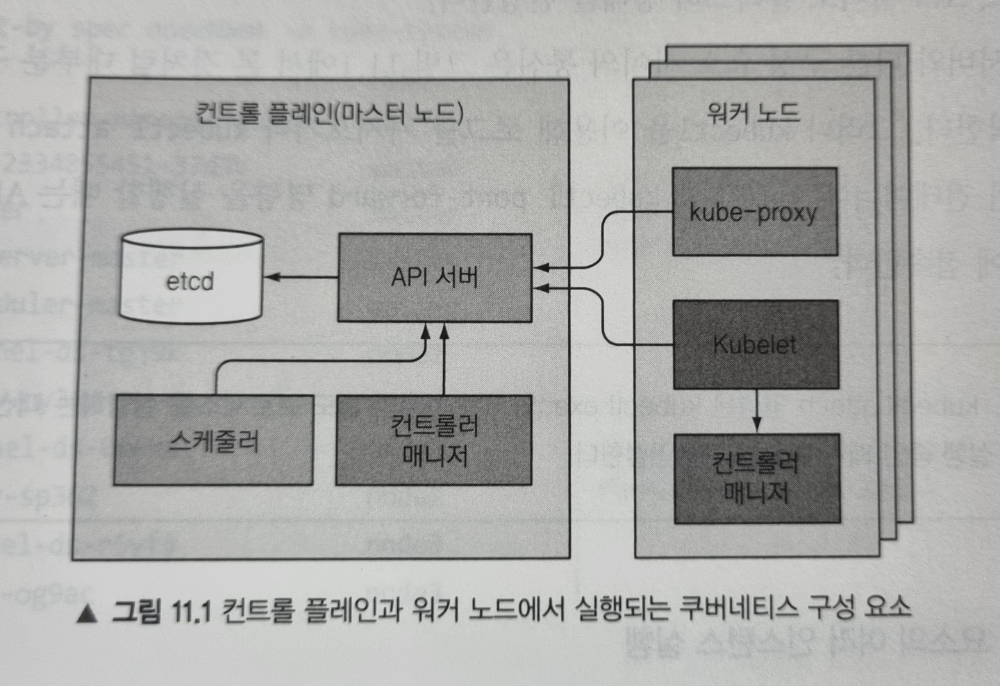
</figure>

**구성요소가 서로 통신하는 방법**

쿠버네티스 시스템 구성요소는 오직 API 서버하고만 통신합니다. 구성요소 끼리는 서로 직접 통신하지 않습니다. API 서버는 etcd와 통신하는 유일한 구성요소입니다. 다른 구성요소는 etcd와 직접 통신하지 않고, API 서버를 통해 클러스터의 상태를 변경합니다.

**개별 구성 요소의 여러 인스턴스 실행**

워커 노드의 구성요소는 모두 동일한 노드에서 실행되어야 하지만 컨트롤 플레인 구성요소는 여러 서버에 걸쳐 실행될 수 있고, 그리하여 가용성을 높일 수 있습니다(고가용성은 뒤에서 다시 언급합니다). 이때 etcd와 API 버서는 여러 인스턴스를 동시에 활성화해 병렬로 실행할 수 있고, 스케줄러와 컨트롤러 매니저는 하나의 인스턴스(리더)를 선출하고 나머지는 대기 상태에 있게 됩니다.

**구성 요소 실행 방법**

kube-proxy와 같은 컨트롤 플레인 구성요소는 시스템에 직접 배포하거나 파드로 실행할 수 있습니다. 그러나 Kubelet은 항상 시스템 구성 요소(데몬)으로 실행되어야 합니다. 그리하여 Kubelet이 다른 구성 요소를 파드로 실행합니다.

**Note**: 위에서 Kubelet은 워커 노드의 구성요소라고 하였는데, 사실 컨트롤 플레인 구성 요소를 파드로 실행하기 위해 마스터 노드에도 배포됩니다.

---

지금부터 본격적으로 각 구성요소의 역할에 대해 알아보겠습니다. 먼저 컨트롤 플레인 구성요소부터 알아봅시다.

### 쿠버네티스가 etcd를 사용하는 방법

쿠버네티스 리소스는 API 서버가 실패하더라도 이를 유지하기 위해 매니페스트가 영구적으로 저장될 필요가 있습니다. 그리하여 분산됭 데이터 저장소인 etcd에 이러한 데이터를 key-value 형태로 저장합니다.

쿠버네티스 API 서버만이 etcd와 직접 통신할 수 있는 유일한 구성요소라고 위에서 언급했습니다. 그리하여 다른 구성요소는 API 서버를 통해 etcd에 데이터를 읽거나 쓸 수 있으며, 이로써 낙관적 잠금(Optimisstic Lock)과 유효성 검사 등의 시스템 이점을 얻을 수 있습니다.

**Note**: 낙관적 잠금 시스템은 사용자들이 같은 데이터를 동시에 수정하지 않을 것이라고 가정하는 것으로 자세한 내용은 [여기](http://wiki.gurubee.net/pages/viewpage.action?pageId=21626883)를 참고하세요.

**리소스를 etcd에 저장하는 방법**

etcd(v3)은 디렉터리 구조(실제 파일시스템을 지원하는건 아님)로 그룹을 이루는 키들을 활용하여 데이터를 저장합니다. 예를 들어 minikube etcd에 저장된 pods를 보려면 다음과 같이 할 수 있습니다.

```sh
# 로컬에 etcdctl를 설치하지 않고 etcd-minikube pod에 설치된 etcdctl 을 이용합니다
kubectl exec -it \
  -n kube-system etcd-minikube \
  -- sh -c 'ETCDCTL_CACERT=/var/lib/minikube/certs/etcd/ca.crt \
    ETCDCTL_CERT=/var/lib/minikube/certs/etcd/peer.crt \
    ETCDCTL_KEY=/var/lib/minikube/certs/etcd/peer.key \
    ETCDCTL_API=3  \
    etcdctl \
      get \
      --keys-only \
      --prefix=true \
      "/registry/pods/" '
```

```sh
# 실행 결과
/registry/pods/kube-system/coredns-74ff55c5b-c24tw
/registry/pods/kube-system/etcd-minikube
/registry/pods/kube-system/kube-apiserver-minikube
/registry/pods/kube-system/kube-controller-manager-minikube
/registry/pods/kube-system/kube-proxy-scpjn
/registry/pods/kube-system/kube-scheduler-minikube
/registry/pods/kube-system/storage-provisioner
```

**Note**: etcdctl을 설치해서 사용하는 방법은 [여기](https://gist.github.com/lalyos/aef94a4c23973eaee4a17bb26b6972a2)를 참고하세요.

위 항목은 개별 파드를 나타냅니다. 각 항목의 이름으로 조회하면 JSON 형식의 파드 정의를 반환하는 것을 확인할 수 있습니다. 이렇게 API 서버는 리소스의 JSON 메니페스트를 etcd에 저장합니다.

**클러스터링된 etcd의 일관성 보장**

고가용성을 위해 두 개 이상의 etcd 인스턴스를 실행할 수 있는데, 이 경우 etcd는 데이터의 일관성을 유지해야 합니다. 이러한 분산 시스템에서는 실제 상태가 무엇인지 합의(consensus)에 도달해야 하는데, etcd는 [RAFT 합의 알고리즘](https://raft.github.io/)을 사용해 어느 순간이든 각 노드 상태가 대다수의 노드가 동의하는 현재 상태이거나 이전에 동의된 상태 중에 하나임을 보장합니다.

합의 알고리즘은 클러스터가 다음 상태로 진행하기 위해 과반수가 필요합니다. 만약 세 노드가 있는 클러스터에서 한 노드의 연결이 끊어지면 두 개의 노드를 포함하는 그룹이 여전히 과반을 가지고 있으므로 클러스터의 상태를 계속 변경할 수 있습니다. 그리고 나중에 끊어졌던 노드가 다시 연결될 경우 과반 그룹의 상태를 따라갈 수 있습니다.

<figure>
  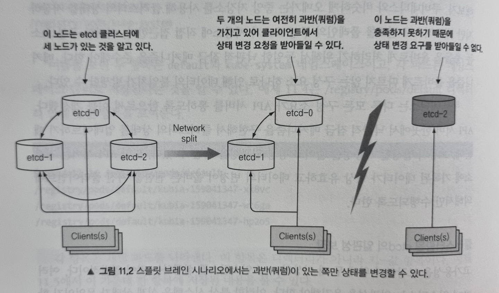
</figure>

이러한 이유로 일반적으로 etcd는 홀수로 배포합니다. 대규모 etcd 클러스터에서 5대 혹은 7대의 노드면 각각 2대, 3대 노드의 실패도 감당할 수 있기 때문입니다.

### API 서버의 기능

쿠버네티스 API 서버는 다른 모든 구성요소와 kubectl과 같은 클라이언트에서 사용하는 중심 구성 요소입니다. 클러스터 상태 조회 및 변경에 필요한 REST API 인터페이스를 제공하고 상태는 etcd에 저장합니다. 나아가 유효성 검사와 낙관적 잠금도 처리합니다.

아래 그림은 API 서버가 요청을 받을 때 내부에서 발생하는 상황을 보여줍니다.

<figure>
  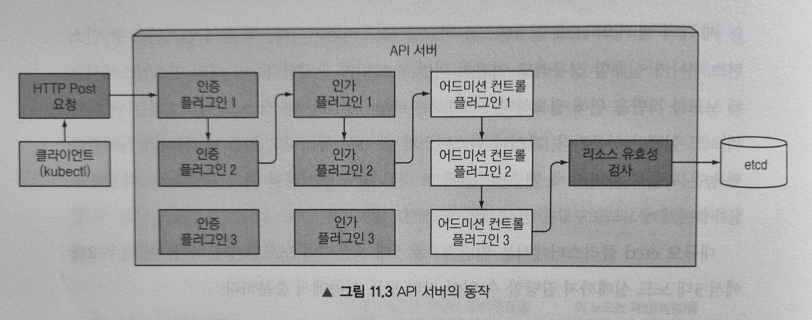
</figure>

**인증 플러그인으로 클라이언트 인증**

먼저 API 서버는 요청을 보낸 클라이언트를 인증하는데, 하나 이상의 플러그인에 의해 수행됩니다. 이는 HTTP 요청을 검사해 수행되는데, 인증 방법에 따라 인증서 혹은 HTTP헤더에서 정보를 가져옵니다. 플러그인은 클라이언트 사용자의 이름, 사용자 ID, 속해있는 그룹 정보를 추출하고 이 데이터는 다음 단계인 인가 단계에서 이를 사용됩니다.

**인가 플러그인을 통한 클라이언트 인가**

API 서버는 요청한 작업이 요청한 리소스를 대상으로 수행할 수 있는지를 판별합니다. 예를 들어 파드 생성 시 요청한 네임스페이스 안에 파드를 생성할 수 있는지 등을 결정합니다.

**어드미션 컨트롤러 플러그인으로 요청된 리소스 확인 및 수정**

리소스를 생성, 수정, 삭제하려는 경우에 해당 요청은 어드미션 컨트롤러로 보내집니다. 이 플러그인은 리소스를 여러 이유로 수정할 수 있는데, 누락된 필드를 초기값으로 설정하거나 재정의할 수 있습니다. 예시는 아래와 같습니다.

- `AlwaysPullImages`: 파드의 imagePulPolicy를 Always로 변경해 파드가 배포될 때마다 이미지를 항상 강제로 가져오도록 재정의합니다.
- `ServiceAccount`: 명시적으로 지정하지 않은 경우 default 서비스 어카운트를 적용합니다.
- `NamespaceLifecycle`: 삭제되는 과정에 있는 네임스페이스와 존재하지 않는 네임스페이스 안에 파드가 생성되는 것을 방지합니다.
- `ResourceQuota`: 특정 네임스페이스 안에 있는 파드가 해당 네임스페이스에 해당된 CPU와 메모리만을 사용하도록 강제합니다.

더 많은 내용은 [공식 문서](https://kubernetes.io/docs/reference/access-authn-authz/admission-controllers/)를 참고하세요.

**리소스 유효성 확인 및 저장**

요청이 모든 어드미션 컨트롤 플러그인을 통과하면 API 서버는 오브젝트의 유효성을 검증하고 etcd에 저장한 뒤 클라이언트에 응답을 반환합니다.

### API 서버가 리소스 변경을 클라이언트에 통보하는 방법

API 서버는 리소스를 etcd에 저장 후 클라이언트에 응답을 반환함과 동시에 관련된 클라이언트(ex. 컨트롤러 매니저의 컨트롤러)들에 통보해줍니다.

<figure>
  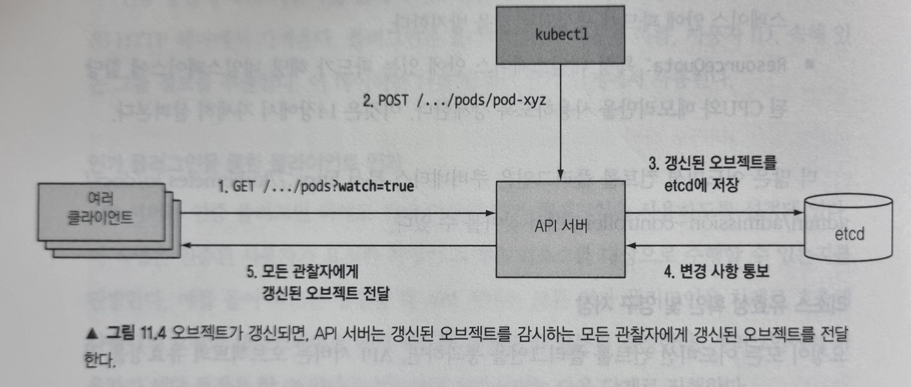
</figure>

그리하여 오브젝트가 갱신될 때마다 API 서버는 오브젝트를 감시하고 있는 연결된 모든 클라이언트에게 오브젝트의 새로운 버전을 보내줍니다.

### 스케줄러

스케줄러는 파드를 어느 노드에 위치시킬지 결정하는 역할을 합니다. 이 과정은 간단하게 API 서버의 감시 메커니즘을 통해 새로 생성될 파드를 기다리고 있다가 할당된 노드가 없는 새로운 파드를 노드에 할당하기만 합니다.

이때 스케줄러는 파드에 노드를 할당함으로써 API 서버로 파드 정의를 갱신하고, API 서버는 Kubelet에 파드가 스케줄링 된 것을 통보합니다. 대상 노드의 Kubelet은 이를 바탕으로 파드의 컨테이너를 생성하고 실행합니다.

**기본 스케줄링 알고리즘**

스케줄러가 노드를 선택하는 것은 크게 두 부분으로 나눌 수 있습니다.

- 모든 노드 중 파드를 스케줄링할 수 있는 노드 목록을 필터링
- 수용 가능한 노드의 우선순위를 정하고 점수가 높은 노드 선택.
  - 만약 동점인 노드가 여러개라면 라운드로빈 적용

<figure>
  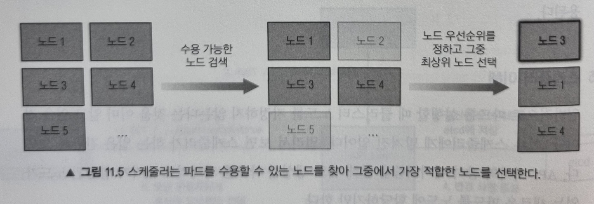
</figure>

**수용 가능한 노드 찾기**

파드를 수용할 수 있는 노드를 찾기 위해, 스케줄러는 미리 설정된 조건 함수 목록에 각 노드를 전달합니다. 그리하여 다음과 같은 조건을 확인합니다.

- 노드가 하드웨어 리소스에 대한 파드 요청을 충족하는가?
- 노드에 리소스가 부족한가?
- 파드를 특정 노드로 스케줄하도록 요청한 경우, 해당 노드인가?
- 노드가 파드 정의에 있는 노드 셀렉터와 일치하는 라벨을 갖고 있는가?
- 파드가 특정 포트를 쓰려는 경우 해당 포트가 노드에서 이미 사용중인가?
  ...등등

이 모든 검사를 통과하면 노드가 파드를 수용할 수 있는 자격을 갖게됩니다.

**파드에 가장 적합한 노드 선택**

위에서 자격을 갖춘 노드가 파드를 실행할 수는 있지만, 최적의 선택이 무엇인지 찾아야합니다. 만약 두 노드 중 하나는 이미 10개의 파드를 실행하고 있고, 다른 노드는 아무런 파드를 실행하고 있지 않은 경우 두 번째 노드에 스케줄하는게 명백히이므로 스케줄러는 두 번째 노드에 스케줄링 하게됩니다.

### 컨트롤러 매니저에서 실행되는 컨트롤러 소개

앞에서 언급한 것처럼, API 서버는 리소스를 etcd에 저장하고 변경 사항을 클라이언트에 통보하는 것 외에 다른 일을 하지 않습니다. 스케줄러도 파드에 노드만 할당합니다. 시스템을 원하는 상태로 수렴되도록 하는 일은 컨트롤러 매니저 안에서 실행되는 컨트롤러에 의해 수행됩니다. 이런 컨트롤러 목록은 다음과 같습니다.

- 레플리케이션 매니저(레플리케이션컨트롤러 리소스의 컨트롤러)
- 레플리카셋, 데몬셋, 잡 컨트롤러
- 디플로이먼트 컨트롤러
- 스테이트풀셋 컨트롤러
- 노드 컨트롤러
- 서비스 컨트롤러
- 엔드포인트 컨트롤러
- 네임스페이스 컨트롤러
- 퍼시스턴트볼륨 컨트롤러
  ...등등

**컨트롤러의 역할과 동작 방식**

컨트롤러는 모두 API 서버에서 리소스가 변경되는 것을 감시하고 각 변경 작업을 수행합니다. 컨트롤러는 감시 메커니즘을 이용해 변경 사항을 통보받지만 모든 이벤트를 놓치지 않고 받는다는 것을 보장하지 않기 때문에 정기적으로 목록을 가져오는 작업을 수행해 누락된 이벤트가 없는지 확인합니다.

지금부터 각 컨트롤러의 기능을 간략히 살펴보겠습니다.

**레플리케이션 매니저**

레플리케이션컨트롤러 리소스를 활성화하는 컨트롤러를 레플리케이션 매니저라고 합니다. 레플리케이션 매니저를 이해하면 나머지 컨트롤러도 쉽게 이해할 수 있으니 빠르게 살펴보겠습니다.

레플리케이션 매니저는 감시 메커니즘을 통해 레플리카 수와 매칭된 실제 파드 수에 영향을 주는 변화를 수신할 수 있습니다. 그리하여 변경으로 인해 컨트롤러가 호출되면 원하는 레플리카 수와 실제 레플리카 수를 다시 확인하고 그에 맞는 동작을 수행합니다.

예를 들어 레플리카 수와 의도한 것보다 적으면 새로운 파드 매니페스트를 생성해 API 서버에 게시합니다.

<figure>
  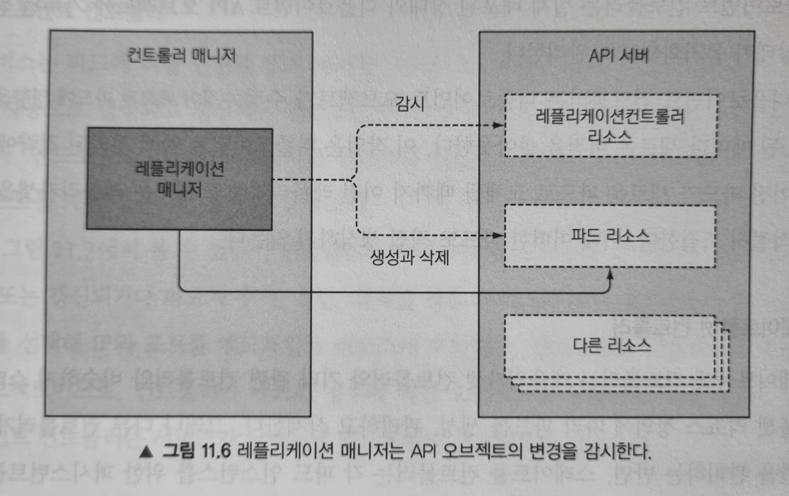
</figure>

이는 모든 컨트롤러의 동작 방식과 동일합니다.

**레플리카셋, 데몬셋, 잡 컨트롤러**

레플리카셋 컨트롤러는 레플리케이션 매니저와 거의 동일한 기능을 수행합니다. 데몬셋과 잡 컨트롤러도 마찬가지로 리소스에 정의된 파드 템플릿으로 파드 정의를 API 서버에 게시해 파드 리소스를 생성합니다.

**디플로이먼트 컨트롤러**

디플로이먼트 컨트롤러는 실제 배포된 상태와 디플로이먼트 API 오브젝트에 기록된 원하는 상태가 동기화되도록 관리합니다. 그래서 디플로이먼트 오브젝트가 수정될 때마다 새로운 버전을 롤아웃합니다.

**스테이트풀셋 컨트롤러**

스테이트풀셋 컨트롤러도 레플리카셋 컨트롤러와 비슷하게 스테이트풀셋 리소스 정의에 따라 파드를 생성, 관리, 삭제합니다. 그러나 다른 컨트롤러가 파드만을 관리하는 반면 스테이트풀셋 컨트롤러는 PVC도 함께 관리합니다.

**노드 컨트롤러**

노드 컨트롤러는 클러스터에서 실행중인 실제 머신 목록과 노드 오브젝트 목록을 동기화합니다. 그래서 노드의 각 상태를 모니터링하고 연결이 끊어진 노드에서 파드를 제거합니다.

**서비스 컨트롤러**

서비스 컨트롤러는 LoadBalancer 유형의 서비스가 생성되거나 삭제될 때 인프라스트럭처에 로드 밸런서를 요청하고 해제하는 역할을 수행합니다.

**엔드포인트 컨트롤러**

서비스는 연결된 파드의 IP와 포트 정보를 포함하는 엔드포인트 목록을 포함한다는 것을 기억하실 겁니다. 엔드포인트 컨트롤러는 라벨 셀렉터와 일치하는 파드의 IP와 포트로 엔드포인트 리스트를 계속 갱신하는 활성 구성요소 입니다.

<figure>
  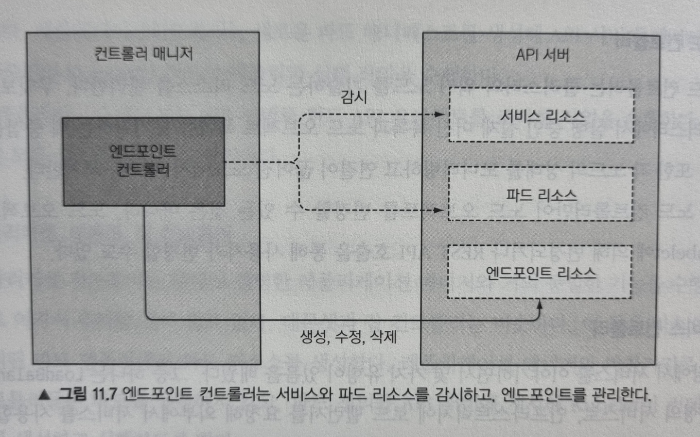
</figure>

위 그림처럼 엔드포인트 컨트롤러는 서비스와 파드를 모두 감시하고, 서비스가 추가 또는 갱신되거나 파드가 추가, 갱신, 삭제될 경우 서비스의 파드 셀렉터와 일치하는 파드를 선택해 IP와 포트를 엔드포인트 리소스에 추가합니다. **엔드포인트 오브젝트는 독립형 오브젝트로, 컨트롤러가 필요한 경우에 직접 오브젝트를 생성합니다**.

**네임스페이스 컨트롤러**

네임스페이스 컨트롤러는 네임스페이스 오브젝트의 삭제 통보를 받으면 해당 네임스페이스에 있는 모든 리소스를 삭제합니다.

**퍼시스턴트볼륨 컨트롤러**

퍼시스턴트볼륨 컨트롤러는 PVC가 생성될 때 요청한 접근모드와 일치하는 퍼시스턴트볼륨을 먼저 찾고, 그 가운데 요청한 용량보다 크지만 선언된 용량이 가장 작은 퍼시스턴트 볼륨을 반환해줍니다. 그리고 PVC가 삭제되면 해당 볼륨은 연결이 끊어지고, 볼륨 회수 정책에 따라 회수됩니다.

---

지금까지 컨트롤 플레인의 구성요소(etcd, API 서버, 스케줄러, 컨트롤러 매니저)의 역할에 대해 알아보았습니다. 지금부터는 워커 노드 구성요소에 대해 알아보겠습니다.

### Kubelet의 역할

Kubelet은 워커 노드에서 실행하는 모든 것을 담당하는 구성요소입니다. 첫 번째 작업은 Kubelet이 실행 중인 노드를 리소스로 만들어 API 서버에 등록하는 것입니다. 그리고 API 서버를 지속적으로 모니터링해 파드가 해당 노드에 스케줄링 되면 파드 컨테이너를 시작합니다. 그런 다음 파드의 상태를 API 서버에 지속적으로 보고하고 파드가 삭제되면 파드의 종료된 것을 서버에 통보합니다.

Kubelet은 API 서버와 통신해 파드 매니페스트를 가져오지만, 다음과 같이 로컬 디렉터리(`/etc/kubernetes/manifest`) 안에 저장된 매니페스트 파일을 기반으로 파드를 실행할 수도 있습니다.

<figure>
  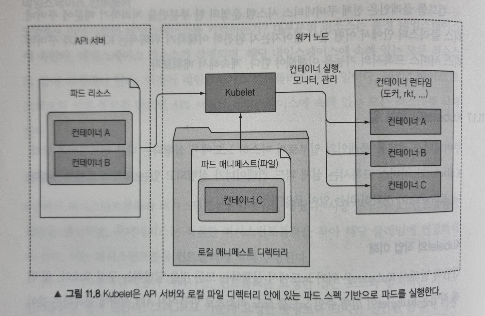
</figure>

이 기능은 컨트롤 플레인 구성요소를 파드로 실행하는 데 사용됩니다. 그리하여 시스템 구성 요소가 기본적으로 실행되지 않고 파드 매니페스트로 실행하고 관리하도록 합니다.

### 쿠버네티스 서비스 프록시의 역할

kube-proxy는 클라이언트가 쿠버네티스 API로 정의한 서비스에 연결할 수 있도록 해주는 역할을 합니다. 그리하여 서비스의 IP와 포트로 들어온 접속을 서비스를 지원하는 파드 중 하나와 연결시켜 줍니다.

**프록시라고 부르는 이유**

kube-proxy의 초기 구현은 userspace에서 동작하는 프록시였습니다. 실제 서버 프로세스가 연결을 수락하고 이를 파드로 전달했습니다. 서비스 IP로 향하는 연결을 가로채기 위해 프록시는 iptables 규칙을 설정해 이를 프록시 서버로 전송했습니다.

<figure>
  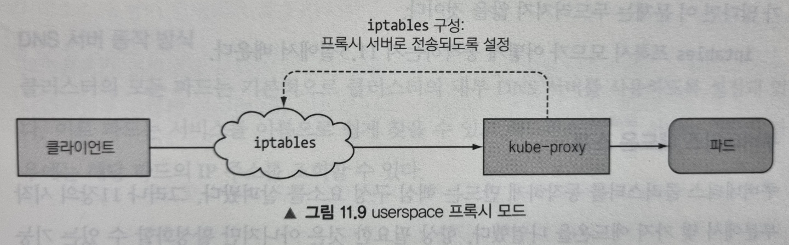
</figure>

이러한 동작 때문에 kube-proxy라는 이름을 얻었지만, 현재는 우수한 구현체에서 iptables 규칙만을 사용해 프록시 서버를 거치지않고 패킷을 무작위로 선택한 백엔드 파드로 전달합니다. 이 모드를 iptables 프록시 모드라고 하며 다음과 같이 동작합니다.

<figure>
  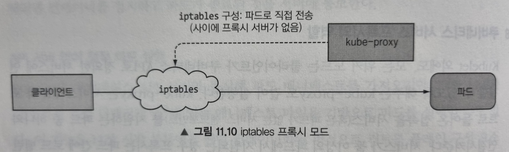
</figure>

두 모드의 가장 큰 차이점은 패킷이 kube-proxy를 통과해 userspace에서 처리되는지 아니면 kernelspace에서 처리되는지 여부로, 성능에 큰 영향을 줍니다.

또 작은 차이는 userspace 프록시 모드는 라운드 로빈 방식으로 파드에 연결하는 반면 iptables 프록시 모드는 파드를 무작위로 선택한다는 것입니다.

---

이렇게 해서 쿠버네티스 클러스터를 동작하게 만드는 핵심 구성요소를 살펴보았습니다. 이제 항상 필요한 것은 아니지만 활성화할 수 있는 기능(애드온)에 대해 알아보겠습니다.

### 쿠버네티스 애드온 소개

쿠버네티스 애드온으로 DNS 조회, 여러 HTTP 서비스 단일 노출, 웹 대시보드 등과 같은 기능이 있습니다. 이러한 다른 리소스와 마찬가지로 YAML 매니페스트를 API 서버에 게시해 파드, 디플로이먼트, 레플리케이션컨트롤러 및 데몬셋으로 배포됩니다.

예를 들어 minikube 에서 DNS 애드온은 디플로이먼트로 배포되어 있습니다.

```sh
$ kubectl get deployment -n kube-system
NAME      READY   UP-TO-DATE   AVAILABLE   AGE
coredns   1/1     1            1           22h
```

애드온은 DNS만 살펴보도록 하겠습니다.

**DNS 서버 동작 방식**

클러스터의 모든 파드는 기본적으로 클러스터의 내부 DNS 서버를 사용하도록 설정돼 있습니다. 그리하여 파드는 서비스를 이름으로 쉽게 찾을 수 있고 헤드리스 서비스 파드인 경우 해당 파드의 IP 주소를 찾을 수 있습니다.

DNS 서버 파드는 kube-dns 서비스로 노출되므로, 해당 파드를 다른 파드와 마찬가지로 클러스터 안에서 이동할 수 있습니다. 해당 서비스의 IP 주소는 클러스터에 배포된 모든 컨테이너가 가지고 있는 `/etc/resolv.conf` 파일 안에 nameserver로 지정돼 있습니다. coredns 파드는 API 서버 감시 메커니즘을 이용하여 서비스와 엔드포인트 변화를 관찰하고 모든 변화를 DNS 레코드에 갱신합니다.

**Note**: 서비스 혹은 엔드포인트 리소스가 갱신되는 시간과 DNS 파드가 통보를 받는 시간 사이에는 DNS 레코드가 유효하지 않을 수 있습니다.

---

여기까지 쿠버네티스 시스템 구성요소를 간략히 살펴보았습니다. 쿠버네티스 클러스터는 관심사의 분리로 느슨하게 결합된 구성 요소로 이러져 있음을 확인할 수 있었습니다. 이제 이러한 구성요소들이 어떻게 연계되어 파드의 컨테이너를 실행하는지 알아보겠습니다.

## 컨트롤러가 협업하는 방법

지금부터 디플로이먼트 리소스를 생성했을 때 파드 컨테이너가 시작하기까지 일어나는 일들에 대해서 정리해보겠습니다.

### 이벤트 체인

디플로이먼트 매니페스트를 kubectl 명령으로 API 서버에 게시한다고 가정해봅시다. API 서버는 디플로이먼트 매니페스트를 etcd에 저장하고 응답을 반환하는데, 이때 연계된 이벤트가 발생하게 됩니다.

<figure>
  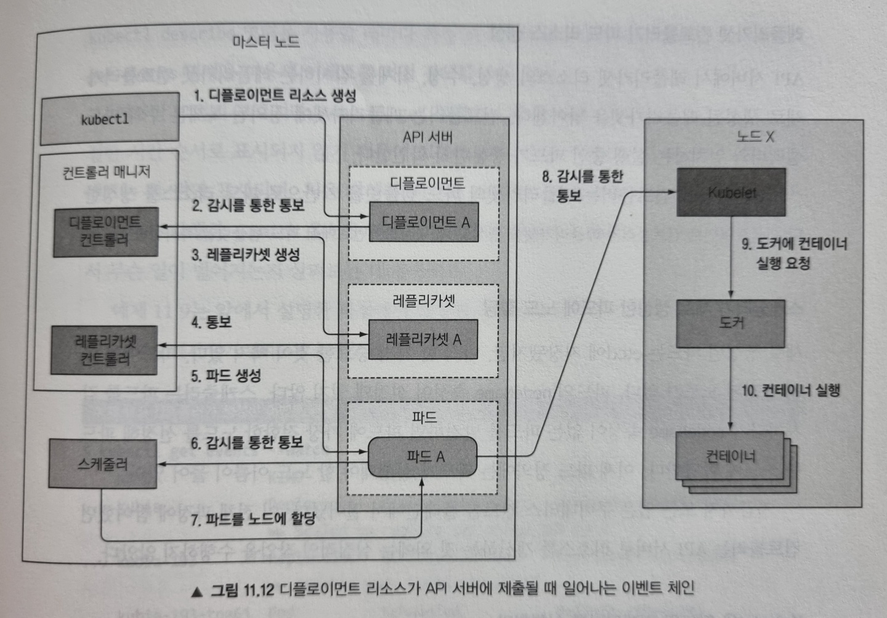
</figure>

위 그림을 순서대로 break down 해보겠습니다.

**디플로이먼트 컨트롤러가 레플리카셋 생성**

디플로이먼트 컨트롤러는 새로운 디플로이먼트 오브젝트가 생성되었단 것을 API 서버로부터 통보 받으면 현재 디플로이먼트 정의를 이용해 레플리카셋을 생성합니다. 그리하여 새로운 레플리카셋 매니페스트를 API 서버에 게시합니다.

**레플리카셋 컨트롤러가 파드 리소스 생성**

API 서버로부터 레플리카셋이 생성되었단 통보를 받은 레플리카셋 컨트롤러는 해당 레플리카셋에 정의된 복제본 수와 파드 셀렉터와 일치하는 실행 중인 파드가 충분한지 확인합니다. 그런 다음 레플리카셋 컨트롤러는 레플리카셋 파드 템플릿을 기반으로 API 서버를 통해 파드 리소스를 생성합니다.

**스케줄러가 새로 생성한 파드에 노드 할당**

스케줄러는 파드를 감시하다가 nodeName 속성이 없는 파드가 생성된 것을 발견하고 파드에 가장 적합한 노드를 선정한 후 파드 정의에 해당 노드 이름을 추가하여 API 서버를 통해 파드 정의를 수정합니다.

**Kubelet은 파드의 컨테이너를 실행합니다**

워커 노드에서 실행중인 kubelet은 API 서버에서 파드 변경 사항을 감시하다가 노드에 스케줄링된 새 파드를 발견하여 파드 정의를 검사하고 도커(또는 사용중인 컨테이너 런타임) 컨테이너를 시작하도록 지시합니다. 컨테이너 런타임은 이제 컨테이너를 시작합니다.

### 클러스터 이벤트 관찰

컨트롤 플레인 구성 요소와 kubelet은 위와 같은 작업을 수행할 때 API 서버로 이벤트를 발송합니다. 다른 쿠버네티스 리소스와 마찬가지로 이벤트 리소스를 만들게 되는데, `kubectl get events` 명령으로 이벤트를 직접 검색할 수 있습니다.

```sh
$ kubectl get events --watch -o wide
LAST SEEN   TYPE     REASON              OBJECT                        SUBOBJECT                 SOURCE                  MESSAGE                                                            FIRST SEEN   COUNT   NAME
32s         Normal   Scheduled           pod/kubia-74967b5695-272lm                              default-scheduler       Successfully assigned default/kubia-74967b5695-272lm to minikube   32s          1       kubia-74967b5695-272lm.1692e938b8939d78
31s         Normal   Pulled              pod/kubia-74967b5695-272lm    spec.containers{nodejs}   kubelet, minikube       Container image "luksa/kubia:v1" already present on machine        31s          1       kubia-74967b5695-272lm.1692e938f75ad83c
31s         Normal   Created             pod/kubia-74967b5695-272lm    spec.containers{nodejs}   kubelet, minikube       Created container nodejs                                           31s          1       kubia-74967b5695-272lm.1692e938fbae3118
31s         Normal   Started             pod/kubia-74967b5695-272lm    spec.containers{nodejs}   kubelet, minikube       Started container nodejs                                           31s          1       kubia-74967b5695-272lm.1692e9390c2bfb38
32s         Normal   Scheduled           pod/kubia-74967b5695-r8r4q                              default-scheduler       Successfully assigned default/kubia-74967b5695-r8r4q to minikube   32s          1       kubia-74967b5695-r8r4q.1692e938bccc6fb4
31s         Normal   Pulled              pod/kubia-74967b5695-r8r4q    spec.containers{nodejs}   kubelet, minikube       Container image "luksa/kubia:v1" already present on machine        31s          1       kubia-74967b5695-r8r4q.1692e9390490ea64
31s         Normal   Created             pod/kubia-74967b5695-r8r4q    spec.containers{nodejs}   kubelet, minikube       Created container nodejs                                           31s          1       kubia-74967b5695-r8r4q.1692e93907959520
31s         Normal   Started             pod/kubia-74967b5695-r8r4q    spec.containers{nodejs}   kubelet, minikube       Started container nodejs                                           31s          1       kubia-74967b5695-r8r4q.1692e93917a4d78c
32s         Normal   Scheduled           pod/kubia-74967b5695-vnjvb                              default-scheduler       Successfully assigned default/kubia-74967b5695-vnjvb to minikube   32s          1       kubia-74967b5695-vnjvb.1692e938b9588160
31s         Normal   Pulled              pod/kubia-74967b5695-vnjvb    spec.containers{nodejs}   kubelet, minikube       Container image "luksa/kubia:v1" already present on machine        31s          1       kubia-74967b5695-vnjvb.1692e938fee6d4e8
31s         Normal   Created             pod/kubia-74967b5695-vnjvb    spec.containers{nodejs}   kubelet, minikube       Created container nodejs                                           31s          1       kubia-74967b5695-vnjvb.1692e9390563e680
31s         Normal   Started             pod/kubia-74967b5695-vnjvb    spec.containers{nodejs}   kubelet, minikube       Started container nodejs                                           31s          1       kubia-74967b5695-vnjvb.1692e93914fee1bc
32s         Normal   SuccessfulCreate    replicaset/kubia-74967b5695                             replicaset-controller   Created pod: kubia-74967b5695-272lm                                32s          1       kubia-74967b5695.1692e938b7c903d8
32s         Normal   SuccessfulCreate    replicaset/kubia-74967b5695                             replicaset-controller   Created pod: kubia-74967b5695-vnjvb                                32s          1       kubia-74967b5695.1692e938b82df0f4
32s         Normal   SuccessfulCreate    replicaset/kubia-74967b5695                             replicaset-controller   Created pod: kubia-74967b5695-r8r4q                                32s          1       kubia-74967b5695.1692e938b8744158
32s         Normal   ScalingReplicaSet   deployment/kubia                                        deployment-controller   Scaled up replica set kubia-74967b5695 to 3                        32s          1       kubia.1692e938b72494ec
```

위 출력 결과는 앞서 설명한 시나리오에서 생성된 이벤트를 보여줍니다. 순서는 조금 섞여있지만, SOURCE 열에는 동작을 수행한 컨트롤러가 표시되고, REASON과 MESSAGE은 컨트롤러가 수행한 작업의 자세한 내용을 제공하는 것을 볼 수 있습니다.

## 실행 중인 파드에 관한 이해(인프라스트럭처 컨테이너)

이제 파드를 하나 띄웠으니 파드를 좀 더 자세히 보도록 하겠습니다. 파드가 컨테이너를 하나만 갖고 있을때, 실제로 컨테이너는 하나만 실행될까요?

이를 알아보기 위해 다음과 같이 nginx 파드를 하나 실행해봅시다.

```sh
$ kubectl run nginx --image=nginx
```

그리고 파드가 실행 중인 노드에 접속해 도커 컨테이너 목록을 확인해보겠습니다. 여기서는 minikube 를 쓰고 있기 때문에 `minikube ssh` 로 접속할 수 있습니다. 그리하여 `docker ps` 명령을 실행하면 다음과 같이 실행중인 컨테이너 목록이 나타납니다.

```sh
docker@minikube:~$ docker ps
CONTAINER ID   IMAGE                  COMMAND                  CREATED          STATUS          PORTS     NAMES
f026976c3484   nginx                  "/docker-entrypoint.…"   5 seconds ago    Up 4 seconds              k8s_nginx_nginx_default_82624abd-a273-4ab4-9581-98dfe4bb9f7b_0
b47e4faffac3   k8s.gcr.io/pause:3.2   "/pause"                 19 seconds ago   Up 18 seconds             k8s_POD_nginx_default_82624abd-a273-4ab4-9581-98dfe4bb9f7b_0
...
```

방금 실행한 nginx 컨테이너를 볼 수 있습니다. 그런데 다른 컨테이너도 있는 걸 볼 수 있습니다. COMMAND 가 "/pause" 인 이 컨테이너를 자세히 보면 nginx 컨테이너가 실행되기 몇 초 전에 생성되었단 것을 알 수 있습니다. 이 컨테이너는 무엇일까요?

이 pause 컨테이너는 파드의 모든 컨테이너를 함께 담고 있는 컨테이너 입니다. 파드의 모든 컨테이너가 동일한 네트워크와 리눅스 네임스페이스를 공유하는데, 퍼즈 컨테이너는 이러한 네임스페이스를 모두 보유하는게 유일한 목적인 인프라스트럭처 컨테이너 입니다. 파드의 다른 사용자 정의 컨테이너는 파드 인프라스트럭처 컨테이너의 네임스페이스를 사용합니다.

<figure>
  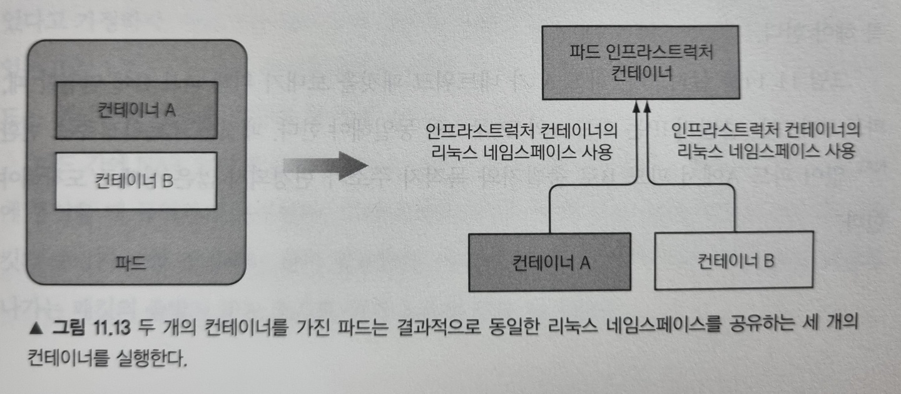
</figure>

실제 애플리케이션 컨테이너는 종료되고 다시 시작할 수 있는데, 이를 위해선 이전과 동일한 리눅스 네임스페이스의 일부가 돼야 합니다. 인프라스트럭처 컨테이너의 라이프사이클은 파드의 라이프사이클과 똑같기 때문에 이를 가능하게 합니다. 이 컨테이너는 파드가 스케줄링될 때 시작해서 파드가 삭제되기 전 까지 실행됩니다. 만약 인프라스트럭처 컨테이너가 그 중간에 종료되면, kubelet이 인프라스트럭처와 파드의 모든 컨테이너를 다시 생성합니다.

---

## 파드 간 네트워킹

쿠버네티스에서 파드가 고유한 IP 주소를 가지고 다른 모든 파드와 NAT 없이 플랫 네트워크로 서로 통신할 수 있단 것을 알고 계실 겁니다. 이는 쿠버네티스에서 해주는 것이 아닌 시스템 관리자 또는 컨테이너 네트워크 인터페이스(CNI) 플러그인에 의해 제공됩니다.

### 네트워크는 어떤 모습이어야 하는가

파드 간의 네트워킹이 어떻게 이뤄지는 이해를 돕기 위해 아래 그림을 살펴봅시다.

<figure>
  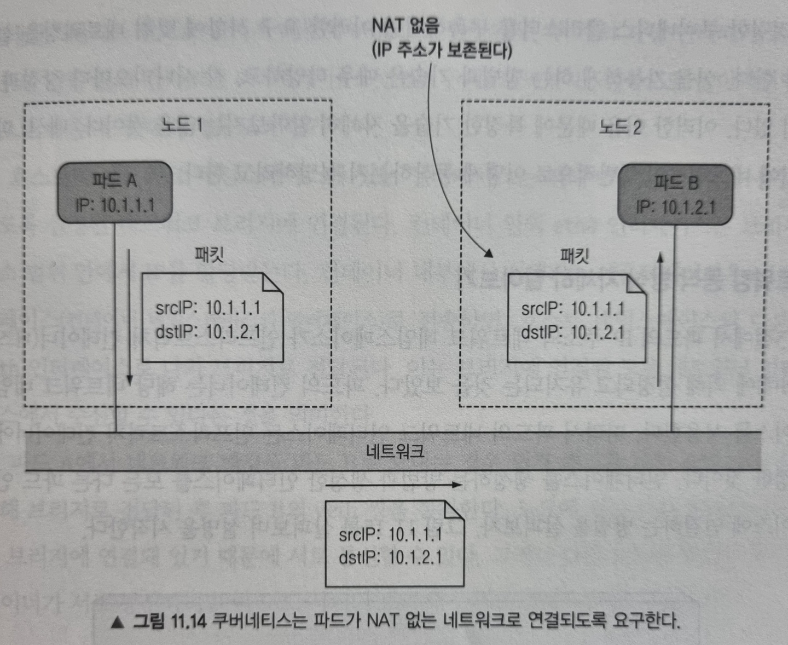
</figure>

파드 A가 파드 B에 네트워크 패킷을 보내는데, 이때 source IP와 destination IP가 변경되지 않습니다. 마치 파드 내부에서 실행중인 애플리케이션의 네트워킹이 동일한 네트워크 스위치에 접속한 시스템에서 실행되는 것처럼 간단하고 정확하게 이뤄지도록 해줍니다.

그러나 파드가 인터넷에 있는 서비스와 통신할 때는 패킷의 출발지 IP를 변경하는 것이 필요합니다. 파드의 IP는 private이기 때문입니다. 그리하여 외부로 나가는 패킷의 source IP는 호스트 워커 노드의 IP로 변경됩니다.

쿠버네티스 클러스터를 구축하기 위해선 이러한 네트워크 요구사항에 맞춰 네트워크를 설정해야 하니다. 이를 가능하게 하는 방법과 기술은 매우 다양하고 시나리오마다 장단점이 있기 때문에, 여기서는 파드 사이에 네트워킹이 일반적으로 어떻게 이뤄지는지 소개해드리겠습니다.

### 네트워킹 동작 방식 자세히 알아보기

위에서 파드의 IP 주소와 네트워크 네임스페이스가 인프라스트럭처 컨테이너(pause)에 의해 설정되고 유지되는 것을 보았습니다. 파드의 컨테이너는 해당 네트워크 네임스페이스를 사용합니다. 따라서 파드의 네트워크 인터페이스는 인프라스트럭처 컨테이너에서 설정한 것입니다. 인터페이스를 생성하는 방법과 생성한 인터페이스를 모든 다른 파드 인터페이스에 연결하는 방법을 살펴보겠습니다.

<figure>
  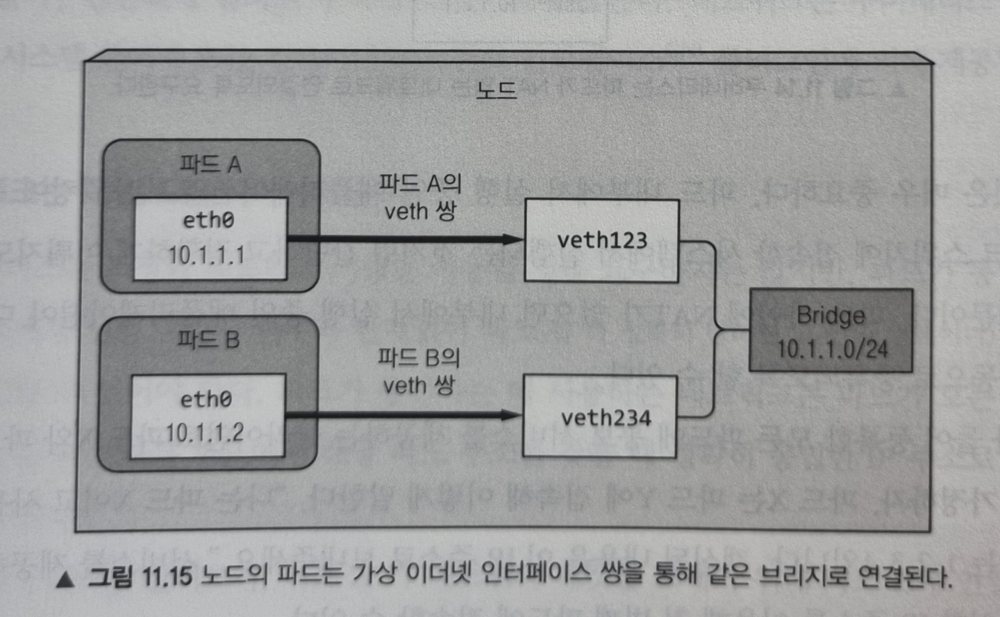
</figure>

**동일한 노드에서 파드 간의 통신**

인프라스트럭처 컨테이너가 시작되기 전에, 컨테이너를 위한 가상 이더넷 인터페이스 쌍(veth 쌍)이 생성됩니다. 이 쌍의 한쪽 인터페이스는 호스트 네임스페이스(노드에서 ifconfig를 실행할 때 나오는 vethXXX 목록)에 남아있고, 다른 쪽 인터페이스는 컨테이너의 네트워크 네임스페이스 안으로 옮겨져 이름이 eth0으로 변경됩니다. 두 가상 인터페이스는 서로 연결되어 있어서 한쪽으로 들어가면 반대쪽으로 나옵니다.

호스트의 네트워크 네임스페이스에 있는 인터페이스는 컨테이너 런타임이 사용할 수 있도록 설정된 네트워크 브리지에 연결됩니다. 컨테이너 안의 eth0 인터페이스는 브리지의 주소 범위 안에서 IP를 할당받습니다. 그리하여 컨테이너 내부에서 실행되는 애플리케이션은 eth0 인터페이스로 전송하면 호스트 네임스페이스의 veth 인터페이스로 나와 브리지로 전달됩니다. 즉, 브리지에 연결된 모든 네트워크 인터페이스에서 수신할 수 있게 됩니다.

**서로 다른 노드에서 파드 간의 통신**

서로 다른 노드 사이에 브리지를 연결하는 방법은 여러 가지가 있습니다. 이는 오버레이, 언더레이 혹은 일반적인 3계층 라우팅을 통해 가능하고 앞으로 살펴보겠습니다.

<figure>
  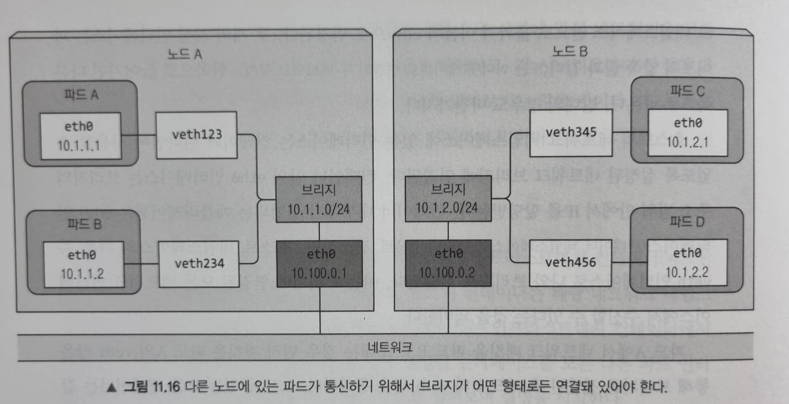
</figure>

위 그림은 3계층 네트워킹으로 두 노드에서 노드 간 통신을 가능하게 하려면 노드의 물리 네트워크 인터페이스도 브리지에 연결해야 한다는 것을 보여줍니다. 노드 A의 라우팅 테이블은 10.1.2.0/24로 향하는 모든 패킷이 노드 B로 전달되도록 설정해야 하고, 노드 B에서는 10.1.1.0/24로 향하는 패킷이 노드 A로 전달되도록 설정하는 것이 필요합니다.

이 경우 다른 노드에 있는 컨테이너로 패킷을 보낼 때 먼저 veth 쌍을 통과한 다음 브리지를 통해 노드의 물리 어댑터로 전달됩니다. 그 다음 회선을 통해 다른 노드의 물리 어댑터로 전달되고, 노드의 브리지를 지나 목표 컨테이너의 veth 쌍을 통과합니다.

이것은 두 노드가 라우터 없이 같은 네트워크 스위치에 연결된 경우에만 동작합니다. 그렇지 않다면 라우터는 패킷이 참조하는 파드의 IP가 프라이빗 대역에 속하기 때문에 패킷을 삭제합니다. 물론 노드 사이에 있는 라우터가 패킷을 전달하도록 설정할 수 있지만 이는 복잡도를 증가시킵니다. 그래서 SDN(Software Defined Network)을 사용하는 것이 더 쉽습니다. SDN을 이용하면 하부 네트워크 토폴로지가 아무리 복잡해지더라도 노드들이 같은 네트워크에 연결된 것으로 볼 수 있습니다.

### 컨테이너 네트워크 인터페이스 소개

컨테이너를 네트워크에 쉽게 연결하기 위해서, 컨테이너 네트워크 인터페이스(CNI, Container Network Interface) 프로젝트가 시작됐습니다. CNI는 쿠버네티스가 어떤 CNI 플러그인이든 설정할 수 있게 해줍니다. 어떤 플러그인이 있는지는와 자세한 내용은 [공식 홈페이지](https://kubernetes.io/docs/concepts/cluster-administration/addons/)를 참고하세요.

네트워크 플러그인을 설치하는 방법은 데몬셋과 다른 자원 리소스를 가지고 있는 YAML을 배포하면 됩니다. 이 YAML 파일은 각 플러그인 프로젝트 페이지에서 제공됩니다. kubelet을 시작할 때 --network-plugin=cni 옵션을 주고 시작하면 노드의 CNI 인터페이스에 연결할 수 있습니다.

## 서비스 구현 방식

[쿠버네티스 서비스(Service) 개념정리](https://blog.eunsukim.me/posts/kubernetes-service-overview) 포스팅에서 서비스의 기능과 사용법에 대해 다루었습니다. 여기서는 서비스의 동작 방식을 이해하는데 초점을 맞추어 살펴보겠습니다.

### kube-proxy

서비스와 관련된 모든 것은 각 노드의 kube-proxy에 의해 처리됩니다. 초기에는 kube-proxy가 실제 프록시로서 연결을 기다리다가, 들어온 연결을 위해 해당 파드로 가는 새로운 연결을 생성했습니다. 이를 userspace 프록시 모드라고 합니다(예전 방식). 나중에 성능이 더 우수한 iptables 프록시 모드가 이를 대체했습니다(현재 기본값).

kube-proxy가 iptables를 이용하는 것에 대해 자세히 알아보기 전 한 가지 짚고 넘어가야 할 것이 있습니다. 서비스의 IP 만으로는 아무것도 나타내지 못 한다는 것인데, 이 IP 주소는 가상이기 때문에 어떠한 네트워크 인터페이스에도 할당되지 않고 패킷이 노드를 떠날 때 네트워크 패킷 안에 source 혹은 destination IP 주소로 표시되지 않습니다. 이게 [서비스에 핑을 보낼 수 없는 이유](https://blog.eunsukim.me/posts/kubernetes-service-overview#dns%EB%A5%BC-%EC%9D%B4%EC%9A%A9%ED%95%9C-%EC%84%9C%EB%B9%84%EC%8A%A4-%EB%94%94%EC%8A%A4%EC%BB%A4%EB%B2%84%EB%A6%AC)입니다.

### kube-proxy가 iptables를 사용하는 방법

API 서버에서 서비스를 생성하면, 가상 IP 주소가 바로 할당됩니다. 곧이어 API 서버는 워커 노드에서 실행 중인 모든 kube-proxy에 새로운 서비스가 생성됐음을 통보합니다. 각 kube-proxy는 실행 중인 노드에 해당 서비스 주소로 접근할 수 있도록 만듭니다. 이는 서비스의 IP/포트 쌍으로 향하는 패킷을 가로채서, 목적지 주소를 변경해 패킷이 서비스를 지원하는 여러 파드 중 하나로 리디렉션 되도록 iptables 규칙을 설정함으로써 이뤄집니다.

kube-proxy는 API 서버에서 서비스가 변경되는 것을 감지하는 것 외에도 엔드포인트 오브젝트가 변경되는 것을 같이 감시합니다. 엔드포인트는 서비스를 지원하는 모든 파드의 IP/포트 쌍을 가지고 있습니다.

<figure>
  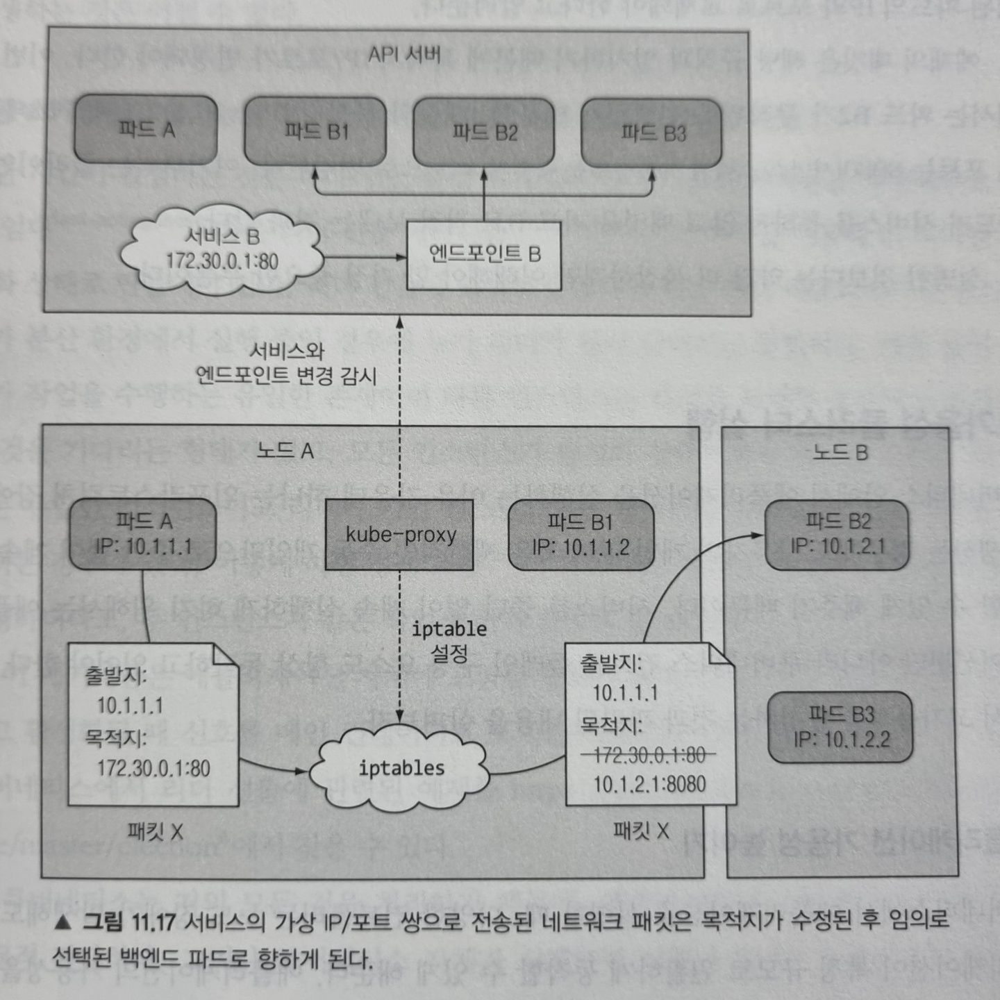
</figure>

위 그림은 kube-proxy가 하는 일과 클라이언트 파드가 전송한 패킷이 서비스 지원 파드 중 하나에 도달하는 방법을 보여줍니다. 파드 A가 패킷을 보내면 목적지는 서비스의 IP와 포트로 지정됩니다. 패킷이 네트워크로 전송되기 전에 노드 A의 커널이 노드에 설정된 iptables 규칙에 따라 먼저 처리하는데, 커널은 IP가 172.30.0.1이고 포트가 80이라면 임의로 선택된 파드의 IP와 포트로 교체돼야 한다고 알려줍니다. 그리하여 파드 B2가 무작위로 선택되어 패킷의 목적지 IP/포트는 파드 B2의 IP/포트로 변경됩니다. 그 이후는 서비스를 통하지 않고 파드가 직접 패킷을 보내는 것과 같습니다.

## 고가용성 클러스터 실행

쿠버네티스를 쓰는 이유 중 하나는 장애가 발생해도 자동으로 중단 없이 계속 실행할 수 있게 해주기 때문입니다. 서비스를 중단 없이 계속 실행하기 위해선 쿠버네티스 컨트롤 플레인 구성 요소도 항상 동작해야 하는데, 이를 달성하기 위한 방법을 살펴봅시다.

### 애플리케이션 가용성 높이기

애플리케이션의 가용성을 높이기 위해선 디플로이먼트 리소스로 애플리케이션을 실행하고 적절한 레플리카 수를 설정하기만 하면 됩니다.

**수평 스케일링이 불가능한 애플리케이션을 위한 리더 선출**

중단 시간을 줄이기 위해선 애플리케이션을 수평으로 확장할 수 있어야 하는데, 애플리케이션이 그런 경우에 속하지 않을 때도 일단은 디플로이먼트를 활용해야 합니다. 그래서 장애가 발생했을 때 빠르게 새 레플리카로 교체하도록 합니다. 그러나 이떄 컨테이너를 시작하느라 짧은 중단이 발생하게 됩니다.

이를 피하려면 비활성화된 복제본을 만들어두고 빠른 임대(fast-acting lease) 또는 리더 선출(leader-election) 메커니즘을 이용해 단 하나만 활성 상태로 만등어야 합니다. 이렇게 하면 race condition으로 예측할 수 없는 시스템 동작이 발생하더라도 두 인스턴스가 같은 작업을 하지 않도록 할 수 있습니다.

이 메커니즘은 애플리케이션 자체에 포함될 필요는 없고 리더 선출 작업을 수행할 때 신호를 메인 컨테이너로 보내는 사이드카 컨테이너를 활용할 수 있습니다.

이처럼 쿠버네티스는 거의 모든 것을 처리하기 때문에, 애플리케이션의 가용성을 높이는 것은 비교적 간단합니다. 그런데 쿠버네티스 자체가 실패하면 의미가 없으니 안되겠죠. 이러한 구성요소의 가용성을 높이는 방법을 알아보겠습니다.

### 쿠버네티스 컨트롤 플레인 구성요소의 가용성 높이기

컨트롤 플레인 구성요소의 가용성을 높이기 위해 관련된 내용을 살펴봅시다. 아래 그림은 고가용성 클러스터를 도식화한 그림입니다.

<figure>
  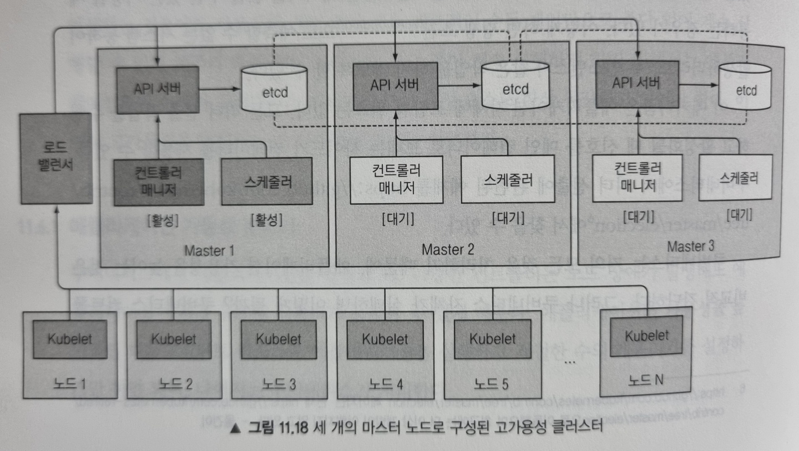
</figure>

**etcd 클러스터 실행**

etcd는 처음부터 분산 시스템으로 설계됬기 때문에 여러 노드에 걸쳐 실행하도록 하여 가용성을 높일 수 있습니다. 필요한 수의 머신에서 etcd를 실행하고 서로를 인식할 수 있게 하면 됩니다.

**여러 API 서버 인스턴스 실행**

API 서버는 상태를 저장하지 않기(stateless) 때문에 필요한 만큼 많은 API 서버를 실행할 수 있고 서로 인지할 필요도 없습니다. 일반적으로 모든 etcd 인스턴스에 API 서버를 함께 띄웁니다.

**컨트롤러와 스케줄러의 고가용성 확보**

여러 복제본을 동시에 실행할 수 있는 API 서버와는 달리 컨트롤러 매니저나 스케줄러는 여러 인스턴스를 실행하는게 쉬운 일이 아닙니다. 컨트롤러와 스케줄러는 상태를 감시하고 상태가 변경될 때 반응하기 때문에 여러 인스턴스가 같은 동작을 수행할 수 있기 때문입니다.

이런 이유로 컨트롤러 매니저나 스케줄러 같은 구성요소는 여러 인스턴스를 실행하기보단 한 번에 하나의 인스턴스만 활성화되게 해야 합니다. 다행히 이는 자체적으로 수행됩니다(--leader-election 옵션으로 제어되며 디폴트로 true 입니다). 각 구성 요소는 선출된 리더일 때만 활성화되며 리더만 실제로 작업을 수행하고 나머지는 대기하고 현재 리더가 실패할 경우를 기다립니다.

**컨트롤 플레인 구성요소에서 사용되는 리더 선출**

리더를 선출하기 위해 구성 요소가 서로 대화할 필요가 없는 것이 흥미로운 점인데, 리더 선출 메커니즘은 API 서버에 오브젝트를 생성하는 것만으로 완벽하게 동작합니다.

API 서버가 낙관적 동시성 제어를 한다고 했던 것을 기억하실겁니다. 이로 인해 여러 인스턴스가 동시에 자신의 이름을 리소스(엔드포인트)에 기록하려고 노력하지만 단 하나의 인스턴스만 성공한다는 것을 보장합니다. 그리하여 이름을 기록한 인스턴스가 리더로 선정됩니다.

이렇게 리더가 되면 주기적으로 리소스를 갱신해서 다른 모든 인스턴스에게 리더가 살아 있음을 알려줘야 합니다. 리더가 장애가 생기면 다른 인스턴스는 리소스가 한동안 갱신되지 않은 것을 확인하고, 자신의 이름을 리소스에 기록해 리더가 되려고 시도합니다.

## Recap

이번 포스팅에서는 쿠버네티스 내부 동작을 자세히 이해할 수 있도록 정리하였습니다. 여기서 다룬 내용을 정리하면 다음과 같습니다.

- 쿠버네티스 클러스터를 이루는 각 구성 요소와 역할
- API 서버, 스케줄러, 컨트롤러 매니저 안에서 실행되는 다양한 컨트롤러 소개와 Kubelet이 함께 동작해 파드를 생성하는 방법
- 인프라스트럭처 컨테이너가 파드의 모든 컨테이너를 하나로 묶는 방법
- 네트워크 브리지로 같은 노드에서 실행중인 파드가 통신하는 방법과 서로 다른 노드에서 브리지를 연결해 다른 노드에 있는 파드가 통신하는 방법
- kube-proxy가 노드에 iptables 규칙을 설정해 같은 서비스 안에 있는 파드 사이에 로드밸런싱을 수행하는 방법
- 클러스터 가용성을 높이기 위해 컨트롤 플레인의 각 구성 요소의 인스턴스를 여러 개 실행하는 방법

## References

- Kubernetes in Action
